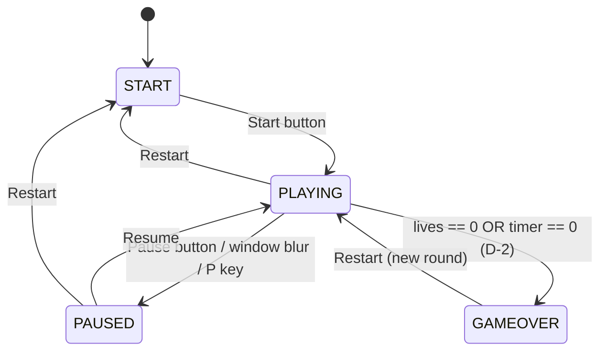

# Phase 2 — Architect: Architecture & Technology

## Stack
Vanilla HTML5 + CSS3 + ES2020 JavaScript. Canvas 2D for the play field (smooth per-pixel motion, star/bomb shapes drawn with paths); regular DOM for HUD, buttons, overlays (accessibility: real buttons, live regions). No build step.

## File structure
```
projects/catch-the-falling-stars/
├── index.html        # markup: canvas, HUD, overlay screens, buttons
├── css/style.css     # night-sky theme, focus states, 44px buttons
└── js/game.js        # single module: pure logic + engine + DOM/canvas glue
```
`game.js` internal layering (top→bottom, lower layers never touch DOM):
1. **Pure logic** — `rectsOverlap`, `fallSpeedForScore`, `applyCatch`, `clampBasketX`, `sanitizeHighScore` — exported via `if (typeof module !== 'undefined') module.exports = {...}` (NFR-7).
2. **Engine** — spawner, entity update, collision resolution, timer, state machine.
3. **Adapter** — canvas rendering, DOM HUD, input listeners, localStorage wrapper, rAF loop.

## Game state machine

Rules: input and spawning only in PLAYING; timer decrements only in PLAYING; entering PAUSED stores nothing time-based (delta-time loop simply skips updates); leaving PAUSED resets `lastFrameTime` so no giant delta jump.

## Game loop (requestAnimationFrame, delta-time)
```mermaid
flowchart TD
    A[rAF tick] --> B{state == PLAYING?}
    B -- no --> R[render only] --> A
    B -- yes --> C[dt = clamp(now - last, 0..50ms)]
    C --> D[update timer; 0 → GAMEOVER]
    D --> E[move basket: key velocity or mouse target (D-3)]
    E --> F[spawn? probability scaled by dt & score]
    F --> G[advance entities by fallSpeedForScore(score) * dt]
    G --> H{entity vs basket AABB overlap?}
    H -- star --> I[+1 / golden +5]
    H -- bomb --> J[-1 life]
    G --> K{entity past bottom?}
    K -- star --> L[-1 life]
    K -- bomb --> M[despawn, no penalty]
    I & J & L & M --> N{lives == 0?}
    N -- yes --> O[GAMEOVER: compare & persist high score]
    N -- no --> P[render canvas + HUD]
    P --> A
```
`dt` is clamped to 50 ms so a background tab or debugger pause can never teleport entities through the basket (tunnelling guard); collision is swept implicitly by the clamp because max step < basket height.

## Collision detection
Axis-aligned bounding boxes (AABB) via pure `rectsOverlap(a, b)`. Entities are small and speeds are clamped, so AABB per frame is sufficient; star hitbox is slightly smaller than its sprite (forgiving art, honest hitbox).

## Difficulty curve
`fallSpeedForScore(score) = BASE + GAIN * score`, capped:
```
speed(px/s) = min(140 + 9 * score, 460)
```
Linear and capped — reaches the cap near score 35, keeping the last stretch of a 60s round hard but physically reactable (~0.9s screen traversal at cap on a 560px field). Spawn interval also tightens: `max(1100 - 18*score, 450)` ms. Golden star probability 12%, bomb probability 18% (rates chosen so expected score pressure ≈ risk).

## localStorage schema (D-4)
- Key `ctfs.highScore` → decimal integer string.
- Read through `sanitizeHighScore(raw)`: non-numeric / negative / non-finite → 0.
- All access wrapped in try/catch; on failure a session-only in-memory fallback is used and HUD notes "(this session)" (NFR-5).

## Security & a11y posture (built-in, art. 4)
No eval/Function, no innerHTML with dynamic data (`textContent` only), no inline handlers, no external requests. HUD score/lives/timer in an `aria-live="polite"` region; lives shown as `♥ x2 lives`, bombs marked with 💣 shape + label — never colour alone.
