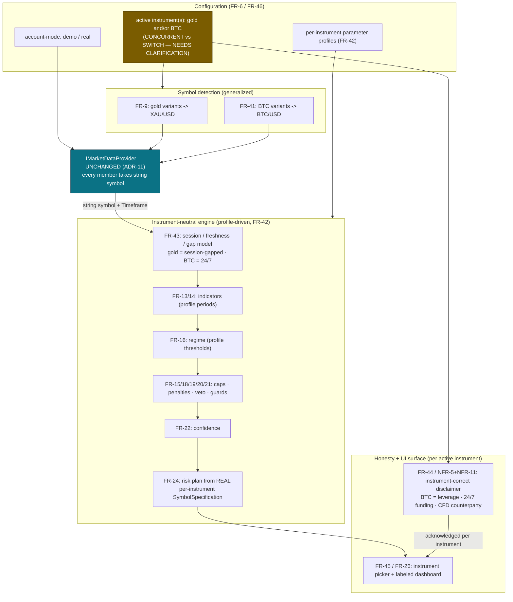

# BTC/USD Second-Instrument — Brief Scope Amendment (Architecture Addendum)

**Project:** gold-signal-analyzer · **Date:** 2026-07-26
**Type:** SCOPE-CHANGE brief amendment. Spec-first, IDed requirements only. **No code in this task.**
**Author:** Solution Architect · **Preceding decision:** CEO — **APPROVED, conditioned** on the one
`[NEEDS CLARIFICATION]` carried in §7 below.

> **This document appends to the audit trail; it does not rewrite it.** `brief.md`
> (FR-1..FR-35 / NFR-1..NFR-10), `phase-1-ceo.md`, `phase-2-arch.md`, all Cycle-2 phase docs, and
> `CYCLE2-SLICE1-CORRECTION.md` are left **byte-for-byte unchanged**. New requirements are assigned
> **fresh IDs continuing the existing sequence**; amendments to existing requirements are recorded
> here as *amendment notes against their IDs*, not as edits to the source rows. This matches the
> `CYCLE2-SLICE1-CORRECTION.md` precedent (append/reference, never overwrite).

> **Build status when this was written:** nothing beyond Cycle-1 Foundation + the read-only data-port
> seam (Cycle-2 Slice-1) exists. Indicators, regime, scoring, risk, UI dashboards, disclaimer, session
> logic — all **Roadmap**. That is precisely why this amendment lands *now*: it makes the not-yet-built
> phases **instrument-aware from the first line of code**, rather than building them gold-only and
> retrofitting a second instrument later (the expensive, error-prone path). Every requirement below is
> therefore **Cycle = Roadmap (R)** unless stated otherwise. This amendment authorizes **no
> implementation**.

---

## 1. Business framing (CEO)

**Objective.** Amortize one already-designed analysis engine across **two uncorrelated markets** — a
session-gapped precious metal (XAU/USD) and a 24/7 cryptocurrency (BTC/USD). Because the engine is
still unbuilt, the *incremental engine cost of a second instrument is near-zero if it is built
instrument-aware now*, and materially expensive if bolted on after a gold-hardcoded build. This is the
cheapest possible moment to make the change.

**Product positioning (CEO recommendation this amendment builds on).**
- The **engine goes instrument-NEUTRAL under the hood** — instrument is a parameter, never a constant.
- The **PRODUCT stays "Gold Signal Analyzer," gold-first**, with **BTC/USD as an explicit,
  clearly-labeled, first-class second instrument** — **not** a rebrand, **not** an "experimental" or
  "beta" mode. BTC is genuinely analyzed to the same standard as gold, using **BTC's own parameters**.
- A **rename is a future decision only if a 3rd+ instrument lands.** Out of scope here.

**Hard new requirement — instrument-AWARE honesty / disclaimer surface (NON-NEGOTIABLE under NFR-5).**
NFR-5 and FR-35 (spec §40) are currently **gold-worded**. BTC/USD on an Exness account is a
**crypto-CFD traded via a forex broker** — it carries **leverage, 24/7 funding / overnight (swap)
costs, and CFD counterparty risk** that a gold disclaimer does **not** honestly cover. Showing a
gold-worded (or generic) disclaimer while BTC is the active instrument would violate the integrity
standard. An **instrument-correct disclaimer, shown and acknowledged per active instrument**, is
mandatory.

**Account-mode (demo/real).** Must be a **changeable FR-6 configuration setting**, never hardcoded
(confirmatory item — folded into the FR-6 amendment in §5).

**CEO decision.** **APPROVED**, conditioned on resolving the concurrent-vs-switch clarification in §7.

**CEO `[NEEDS CLARIFICATION]` carried forward (do NOT guess).** **CONCURRENT** (gold + BTC both live
in one session) vs. **MODE-SWITCH** (one active instrument at a time). CEO recommends
**switch-active-instrument** as the simpler default, but requires user confirmation before it is
committed, because the choice changes the UI model, the MT5 subscription/streaming load, and the
disclaimer-acknowledgement flow. The requirements below are **designed so the choice is deferred**
wherever possible (see the CONCURRENT/SWITCH markers on FR-42, FR-43, FR-44, FR-45).

> **→ RESOLVED 2026-07-26 (user decision): CONCURRENT.** The user **overrode** the CEO's MODE-SWITCH
> recommendation. Gold and BTC are analyzed **simultaneously** (both visible/analyzed at once — no
> instrument switcher). Downstream implications now worked through in **§10.1** and reflected as
> appended resolution notes on FR-43, FR-44, and FR-45. (Original CEO recommendation text above left
> intact for the audit trail.)

---

## 2. Verification evidence — `IMarketDataProvider` needs NO change (re-read this task)

**I independently re-read** `src/GoldSignalAnalyzer.Application/Ports/IMarketDataProvider.cs` (the
byte-exact §9 port, FR-36, corrected per `CYCLE2-SLICE1-CORRECTION.md`). **Confirmed:** every
symbol-bearing member takes the instrument as a **plain `string symbol`** — there is **no
gold-specific member, no `XAU`/`gold` literal, no instrument enum** anywhere on the port. The port is
already instrument-neutral by construction, so **a second instrument requires zero port changes.**

Line evidence (verbatim signatures):

| Line(s) | Member | Symbol parameter |
|---|---|---|
| 32 | `string ProviderName { get; }` | (provider identity — instrument-agnostic) |
| 43–44 | `Task<IReadOnlyList<MarketSymbol>> GetAvailableSymbolsAsync(CancellationToken cancellationToken)` | returns **all** broker symbols — already multi-instrument |
| 46–48 | `Task<SymbolSpecification> GetSymbolSpecificationAsync(string symbol, CancellationToken cancellationToken)` | **`string symbol`** |
| 50–55 | `Task<IReadOnlyList<Candle>> GetHistoricalCandlesAsync(string symbol, Timeframe timeframe, DateTimeOffset from, DateTimeOffset to, CancellationToken cancellationToken)` | **`string symbol`** |
| 57–59 | `IAsyncEnumerable<MarketTick> StreamTicksAsync(string symbol, CancellationToken cancellationToken)` | **`string symbol`** |
| 61–64 | `IAsyncEnumerable<Candle> StreamCandlesAsync(string symbol, Timeframe timeframe, CancellationToken cancellationToken)` | **`string symbol`** |

This confirms the orchestrator's pre-finding. The architectural consequence is recorded as **ADR-11**
(§6). The instrument-awareness work is therefore **entirely above the port** (config, detection,
indicator/scoring/risk parameter sets, session model, disclaimer, UI) — the read-only data seam is
untouched.

---

## 3. ID landscape (why new IDs start where they do)

The brief's published tables end at **FR-35 / NFR-10 / ADR-4 (headline)**, but Cycle-2 work already
consumed higher IDs across the repo. Verified maxima **actually in use**:

- **FR-36 … FR-40 are taken** — FR-36 (§9 byte-exact port), FR-37 (.NET bridge client / DPAPI
  `WindowsCredentialStore`), FR-38 (Python read-only bridge / RM2 allowlist), FR-39 (bridge server
  protocol), FR-40 (Connection Wizard model). See `phase-2-cycle2-arch.md`, `CYCLE2-RESUME.md`.
- **NFR-10** is the highest NFR. **ADR-10** is the highest ADR (`phase-2-cycle2-arch.md`).
- **AC** ids follow the `AC-<FR#>.<n>` convention (e.g. `AC-36.2`), so acceptance criteria below are
  numbered against their owning FR (`AC-41.1`, `AC-41.2`, …) — no free-standing AC collisions.

**Therefore new IDs in this addendum begin at FR-41, NFR-11, ADR-11.** No collision with any existing
ID in the repository.

---

## 4. New requirements (FR-41 … FR-46, NFR-11)

All **Cycle = R (Roadmap)** — specified now for traceability, built in the phase noted. All acceptance
criteria are machine-checkable and assignable into a future test suite.

### FR-41 — BTC/USD symbol detection across broker variants (parallel to FR-9)
| Field | Value |
|---|---|
| **Requirement** | Detect BTC/USD across Exness/broker symbol variants (`BTCUSD`, `BTCUSDm`, `BTCUSD.a`, `BTCUSD.c`, `BTCUSD.pro`, `BTCUSD.raw`, `XBTUSD`, and similar suffixed forms) via `GetAvailableSymbolsAsync`, with **manual user selection** and **mapping to a normalized `BTC/USD`** identity. **No hardcoded assumption** that the broker symbol is literally `BTCUSD`. Structurally identical to FR-9 (gold), sharing one generalized detector. |
| **Priority** | Must |
| **Cycle / phase** | R — lands with the instrument/connection layer (Cycle-2 later slice / spec Phase 2–3, alongside FR-9). |
| **AC-41.1** | Given a broker symbol list containing one or more BTC variants, the detector lists **all** candidates and lets the user select one. |
| **AC-41.2** | The selected broker symbol is persisted and mapped to normalized `BTC/USD`; **no `BTCUSD` (or any variant) string is hardcoded** as the assumed symbol (assertable by source scan + a mapping-round-trip test). |
| **AC-41.3** | The same detection code path serves gold (FR-9) and BTC (FR-41) — a single instrument-parameterized detector, proven by a test that runs it for both instrument profiles with no gold/BTC branch on a literal symbol. |
| **AC-41.4** | If the account exposes **no** BTC variant, the app reports "BTC/USD not available on this account" and does **not** fabricate or silently substitute a symbol (NFR-5). |

### FR-42 — Instrument is a first-class parameter across the entire analysis pipeline (umbrella)
| Field | Value |
|---|---|
| **Requirement** | The analysis pipeline — indicators (FR-13/14), regime classification (FR-16), category caps + penalties + veto (FR-15/18/19/20), classification/guards (FR-21), confidence (FR-22), risk plan / position sizing (FR-24) — takes an **instrument profile** as an explicit input. Each instrument (gold, BTC) supplies **its own parameter set** (indicator periods where they differ, volatility/regime thresholds, category weights/caps, veto/guard constants, session model, contract specs). **BTC must never inherit gold's constants.** Configuration-driven, not hardcoded (Constitution principle 1). |
| **Priority** | Must |
| **Cycle / phase** | R — governs spec Phases 4–5 (indicators, scoring) and Phase 6 (risk). Must be honored from the first line of pipeline code. |
| **AC-42.1** | The pipeline entry point accepts an instrument-profile parameter; there is **no** gold constant reachable from a code path that runs for BTC (assertable by source scan for `XAU`/`gold`/hardcoded-metal-constants inside pipeline code). |
| **AC-42.2** | **Differentiation test:** feeding the *identical raw candle series* through the pipeline under the **gold profile** vs the **BTC profile** yields **different** output wherever the profiles' parameters differ — i.e. BTC output is **not gold-identical**. (Guards against a stub that ignores the profile.) |
| **AC-42.3** | Each instrument profile is loaded from configuration (FR-6 / FR-46), not compiled-in; adding a future instrument requires a new profile, not a pipeline edit. |
| **AC-42.4** | Every profile field consumed by the pipeline is **traceable in the explanation output** (NFR-6) — the explanation states which instrument profile produced the numbers. |
| **CONCURRENT/SWITCH note** | Pipeline is a pure function of `(instrument profile, candle data)`; it is **agnostic** to whether one or both instruments are live. The concurrent-vs-switch decision does **not** change this FR — it only changes how many profiles are evaluated per tick upstream. |

### FR-43 — Instrument-parameterized session / freshness / gap model (24-7 vs session-gapped)
| Field | Value |
|---|---|
| **Requirement** | The session, data-freshness, stale, and gap logic (relates to **FR-12** / spec §10, §13) is **parameterized per instrument**. Gold keeps its **session-gap handling** (weekend/daily-break gaps are normal, not staleness). BTC is **24/7**: no session-gap logic may fire, and a normal 24/7 quiet period must **not** be misreported as "market closed" or as a data gap artifact. Staleness thresholds are per-instrument. |
| **Priority** | Must |
| **Cycle / phase** | R — spec Phase 3 (data normalization / freshness), consumed by the veto (FR-12/FR-20). |
| **AC-43.1** | Under the **BTC (24/7)** session model, **no** "market closed" / weekend-gap / session-gap artifact is ever emitted across a simulated continuous week (assertable with a fixed 24/7 dataset). |
| **AC-43.2** | Under the **gold** session model, weekend/daily-break gaps are still classified as expected session gaps (not staleness), preserving FR-12 behavior unchanged. |
| **AC-43.3** | The stale/veto threshold values are read from the instrument profile (FR-42); gold's thresholds are never applied to BTC and vice-versa. |
| **AC-43.4** | A genuine BTC data outage (no ticks past the BTC staleness threshold) **still** triggers `DATA STALE — SIGNAL GENERATION PAUSED` (FR-12 honesty preserved for both instruments). |
| **→ RESOLVED 2026-07-26 — CONCURRENT (§10.1)** | Because both instruments run **simultaneously**, session/freshness/stale/gap/veto state is tracked **independently per instrument**. BTC being fresh does **not** imply gold is fresh, and vice-versa; each instrument carries its **own** stale/veto state and its own "market closed / 24-7 quiet" classification. A stale/veto on one instrument must **never** suppress or falsely stale the other. |
| **AC-43.5 (added, CONCURRENT)** | With both instruments live, a simulated BTC outage that vetoes BTC **must not** veto, pause, or restate the freshness of gold in the same session (and vice-versa) — assertable by driving one instrument stale while the other streams normally and confirming exactly one instrument's veto fires. |

### FR-44 — Instrument-correct disclaimer content + per-instrument acknowledgement
| Field | Value |
|---|---|
| **Requirement** | Extends **FR-35** (spec §40). Each supported instrument has its **own disclaimer content**, shown and **acknowledged per active instrument** before that instrument's signals are used. The **BTC/USD disclaimer must explicitly disclose**: crypto-CFD traded via a forex broker (Exness), **leverage**, **24/7 funding / overnight (swap) costs**, **CFD counterparty risk**, and extreme-volatility risk — in addition to the shared "analysis only / no guaranteed profit / not financial advice" language (NFR-5). Gold retains its exact §40 wording. |
| **Priority** | Must |
| **Cycle / phase** | R — text can be authored early (like FR-35); enforcement lands with the UI/onboarding (spec Phase 6). |
| **AC-44.1** | When **BTC is the active instrument**, the displayed disclaimer contains the BTC-specific disclosures (leverage, 24/7 funding/swap, CFD counterparty risk) and **contains no gold-only wording**. |
| **AC-44.2** | When **gold is the active instrument**, the exact §40 gold wording is shown; **no BTC/crypto-CFD wording appears**. |
| **AC-44.3** | Acknowledgement is recorded **per instrument**; a user who acknowledged gold has **not** implicitly acknowledged BTC. BTC signals are withheld until the BTC disclaimer is acknowledged. |
| **AC-44.4** | No generic/shared "one disclaimer covers everything" surface is shown for any instrument whose specific risks it does not cover (NFR-5 / NFR-11). |
| **CONCURRENT/SWITCH note** | If **SWITCH**: the active instrument's disclaimer gates that instrument. If **CONCURRENT**: **both** disclaimers must be acknowledged before **both** instruments stream, and the dashboard must label each instrument's panel with its own risk surface. Flagged as design-deferred pending §7. |
| **→ RESOLVED 2026-07-26 — CONCURRENT (§10.1)** | The **CONCURRENT** branch is now the committed model: **both** the gold (§40) disclaimer **and** the BTC disclaimer must be acknowledged (each **per instrument**, AC-44.3) before that instrument's panel streams signals. An instrument whose disclaimer is unacknowledged shows its panel in a **gated/locked** state (no signals) while the other instrument may still stream — acknowledgement is not all-or-nothing across instruments. **Content-approval note:** the BTC disclaimer **text** (`BTC-DISCLAIMER-DRAFT.md`) is **→ RESOLVED 2026-07-27 (§10.2): APPROVED**, no edits requested. It is now authoritative BTC source text parallel to §40; **AC-44.1/AC-44.4 may now be verified against it** once the disclaimer surface is built (spec Phase 6). |

### FR-45 — Instrument selection surfaced in the UI (instrument picker)
| Field | Value |
|---|---|
| **Requirement** | Extends **FR-26** (dashboard) and **FR-29** (§30 screens). The user can **choose which instrument(s)** the app analyzes via an explicit **instrument picker**, with gold as the default first-run instrument (gold-first positioning). The active instrument is always **visibly labeled** on the dashboard so a user never misreads BTC output as gold or vice-versa. |
| **Priority** | Must |
| **Cycle / phase** | R — spec Phase 6 (dashboard / connection wizard / screens); placeholder may appear in the Cycle-1 shell navigation (FR-29). |
| **AC-45.1** | An instrument picker exists and lets the user select gold and/or BTC (per the §7 model); default first-run selection is **gold**. |
| **AC-45.2** | The dashboard **always** displays the active instrument's normalized identity (`XAU/USD` or `BTC/USD`) prominently; no signal/panel is rendered without its instrument label. |
| **AC-45.3** | Selecting an instrument whose disclaimer is unacknowledged routes the user through FR-44 acknowledgement before signals appear. |
| **CONCURRENT/SWITCH note** | **SWITCH** → a single-select picker + one active instrument view. **CONCURRENT** → multi-select + a per-instrument panel/tab layout and heavier streaming. This FR's UI model is **explicitly deferred** to the §7 decision; the picker abstraction is specified so either model satisfies it. |
| **→ RESOLVED 2026-07-26 — CONCURRENT (§10.1)** | The UI model is now the **CONCURRENT** branch. FR-45 changes from "picker selects one active instrument, dashboard switches between them" to **"both instruments are visible and analyzed at once"**: the dashboard shows **both** gold and BTC simultaneously (side-by-side panels or per-instrument tabs both visible), **not** a switcher that hides one. The "instrument picker" now governs **which instruments are enabled/subscribed** (multi-select; gold enabled by default first-run), not which single one is displayed. Each panel is independently labeled with its normalized identity (`XAU/USD` / `BTC/USD`) and its own freshness/veto state (FR-43 resolution) and its own disclaimer-gated state (FR-44 resolution). |
| **AC-45.4 (added, CONCURRENT)** | When both instruments are enabled, the dashboard renders **both** instrument panels concurrently (neither is hidden behind the other); each panel independently shows its instrument label, freshness/veto state, and — if its disclaimer is unacknowledged — a gated/locked state instead of signals. |

### FR-46 — Instrument + account-mode configuration persistence (extends FR-6)
| Field | Value |
|---|---|
| **Requirement** | Extends **FR-6** (spec §37 config). Configuration additionally persists: (a) **account-mode `demo` / `real`** as a **user-changeable setting** (never hardcoded); (b) the **selected/active instrument(s)** and each instrument's **broker-symbol mapping** (FR-9 / FR-41); (c) each instrument's **parameter-profile selection** (FR-42). Export/import continues to emit **non-sensitive settings only** — never secrets (NFR-1). |
| **Priority** | Should |
| **Cycle / phase** | R (config model stub may begin in Cycle-1 alongside the FR-6 stub). |
| **AC-46.1** | Account-mode is a readable/writable config value with both `demo` and `real` valid; changing it does not require a code change or recompile. |
| **AC-46.2** | Active-instrument selection and per-instrument broker-symbol mapping persist across restarts. |
| **AC-46.3** | Config export contains account-mode + instrument selection/mapping but **no** secret (credential, token, password) — verifiable by the existing export-secret-scan test discipline (NFR-1). |
| **AC-46.4** | Startup config validation (NFR-9, fail-loud) rejects an invalid instrument profile or an unmapped active instrument rather than silently defaulting. |

### NFR-11 — Instrument-aware integrity / honesty (extends NFR-5)
| Field | Value |
|---|---|
| **Requirement** | The integrity guarantees of **NFR-5** are enforced **per active instrument**. No honesty-bearing surface (disclaimer, risk labeling, volume labeling, "not a probability" framing, market-closed/stale messaging) may display **gold-specific or generically-mismatched** content while a different instrument is active. Specifically: a gold-worded disclaimer is **never** shown for BTC; BTC risk disclosures (leverage, 24/7 funding, CFD counterparty) are **never** omitted; no BTC 24/7 quiet period is presented as "market closed." |
| **Cycle / phase** | R (discipline established now; enforcement with UI + pipeline). |
| **AC-11.1 (NFR-11)** | Automated surface-audit: for each active instrument, no rendered honesty surface contains another instrument's wording (assertable by mapping each instrument to a required/forbidden phrase set). |
| **AC-11.2 (NFR-11)** | BTC's disclaimer/risk surface always includes the crypto-CFD-via-forex-broker disclosures (ties FR-44). |
| **AC-11.3 (NFR-11)** | The "score is not a win-probability," "tick vs world volume," and "analysis-only / no guaranteed profit" guarantees (NFR-5) hold identically for BTC output — proven by re-running the NFR-5 checks under the BTC profile. |

---

## 5. Amendment notes against existing requirements (source rows NOT edited)

These are **notes recorded here**; the rows in `brief.md` remain unchanged (append/reference precedent).

| Existing ID | Amendment note | Cycle |
|---|---|---|
| **FR-6** (config) | Extended by **FR-46**: add user-changeable `demo`/`real` account-mode and persisted active-instrument selection + per-instrument symbol mapping + profile selection. | R |
| **FR-9** (gold symbol detection) | Now understood as **one instance of a generalized, instrument-parameterized detector**; **FR-41** is its BTC parallel and shares the code path (AC-41.3). No change to gold behavior. | R |
| **FR-13, FR-14** (indicators / MTF) | Indicator computation takes the instrument profile (FR-42); periods/labels that differ per instrument come from the profile, not constants. Gold results unchanged under the gold profile. | R |
| **FR-15, FR-18, FR-19, FR-20** (caps / weighting / penalties / veto) | Category caps, weights, penalty and veto constants are **per-instrument** profile values (FR-42). BTC uses its own; no gold cap/veto constant applies to BTC. | R |
| **FR-16** (regime classification) | BTC uses its **own volatility-regime thresholds and session model** (FR-42/FR-43); gold's regime constants never applied to BTC. | R |
| **FR-21** (classification / guards) | Winning-margin, opposite-score caps, HTF-confirmation, cooldown, dedupe thresholds are per-instrument profile values. `75` still never rendered as "75% probability" for either instrument (NFR-5/NFR-11). | R |
| **FR-22** (confidence) | Confidence computed with the instrument's profile; remains independent of Buy/Sell for both instruments. | R |
| **FR-24** (risk plan / position sizing) | Uses **BTC's REAL MT5 `SymbolSpecification`** (contract size, tick value, lot step, and BTC-CFD leverage/margin), never gold's. Default risk %, min R:R, and max-open-position defaults are **per-instrument** config values (see §7 clarification on BTC risk defaults). **→ RESOLVED 2026-07-26 (§10.3): BTC risk defaults = SAME AS GOLD (0.5% risk, min 1.5 R:R), applied per-instrument.** **→ RESOLVED 2026-07-27 (§10.1a): under CONCURRENT mode the "one open position" cap default is CONFIRMED `per-instrument` (max 1 gold + max 1 BTC), final — no longer tentative.** | R |
| **FR-26** (dashboard) | Extended by **FR-45**: dashboard shows an instrument picker and always labels the active instrument. **→ RESOLVED 2026-07-26 (§10.1, CONCURRENT):** dashboard shows **both** instruments **simultaneously** (both panels visible/analyzed at once), not a switcher hiding one; the picker now selects **which instruments are enabled**, each panel independently labeled. | R |
| **FR-29** (§30 screens) | Instrument-selection surface is reachable; the disclaimer screen is instrument-aware (FR-44). Placeholder acceptable in the Cycle-1 shell. | R (placeholder) |
| **FR-35** (disclaimer, §40) | Extended by **FR-44**: disclaimer is per active instrument; gold keeps exact §40 wording; BTC has its own crypto-CFD disclosure content, acknowledged separately. | R |
| **NFR-5** (integrity / honesty) | Extended by **NFR-11**: honesty guarantees enforced **per active instrument**; no gold-worded or mismatched honesty surface for a non-gold instrument. | R |
| **FR-12** (data freshness / stale) | Session/stale/gap logic parameterized per instrument by **FR-43**; gold gap handling unchanged, BTC 24/7 model added; genuine BTC staleness still vetoes signals. | R |

---

## 6. New ADR

### ADR-11 — `IMarketDataProvider` port is unchanged for a second instrument
**Status:** Accepted. **Context:** BTC/USD is added as a real second analyzed instrument. **Decision:**
The read-only §9 port (`IMarketDataProvider`, FR-36) requires **no change**, because instrument is
already expressed as a plain `string symbol` on every symbol-bearing member and `GetAvailableSymbolsAsync`
already returns *all* broker symbols. **Evidence** (re-read this task): `GetSymbolSpecificationAsync(string symbol, …)`
(lines 46–48), `GetHistoricalCandlesAsync(string symbol, …)` (lines 50–55), `StreamTicksAsync(string symbol, …)`
(lines 57–59), `StreamCandlesAsync(string symbol, …)` (lines 61–64) — no gold-specific member, no
`XAU`/`gold` literal on the interface. **Consequence:** All instrument-awareness work lives **above the
port** (config, detection, pipeline parameter profiles, session model, disclaimer, UI). The provider
implementations (`MetaTrader5MarketDataProvider`, `NullMarketDataProvider`, roadmap) are called with the
normalized→broker symbol string; no new provider abstraction is introduced. **Alternatives rejected:**
(a) an instrument enum on the port — rejected, would couple the transport seam to product scope and
break byte-exact §9 (FR-36 / `CYCLE2-SLICE1-CORRECTION.md`); (b) a per-instrument provider subtype —
rejected, unnecessary given the string symbol already discriminates. **Relationship:** does not disturb
ADR-7's superseded/streaming resolution; strengthens the "thin seam, heavy services" principle.

---

## 7. `[NEEDS CLARIFICATION]` — carried to the user (do NOT guess)

> **STATUS UPDATE (2026-07-26): ALL FOUR MARKERS BELOW ARE NOW ANSWERED by the user.** The original
> question text is preserved verbatim (non-destructive audit trail). Each marker's resolution is
> recorded in **§10 — Clarification Resolutions**. Do not re-treat any of these as open.
>
> **STATUS UPDATE (2026-07-27): the two items that were still open as of 2026-07-26 are now also
> RESOLVED.** (i) The BTC disclaimer wording is **APPROVED** — `BTC-DISCLAIMER-DRAFT.md` is now
> authoritative BTC source text (§10.2). (ii) The FR-24 position-cap scope under CONCURRENT is
> **CONFIRMED per-instrument, final** (§10.1a). Only item 4's exact broker symbol string remains
> genuinely pending (non-blocking; collected in `phase-6-ceo.md`, see §10.4).

1. **[NEEDS CLARIFICATION — CEO, blocking the UI/streaming/ack model] CONCURRENT vs MODE-SWITCH.**
   Should the app run **gold and BTC both live in one session (CONCURRENT)**, or **one active
   instrument at a time (MODE-SWITCH)**? CEO recommends **MODE-SWITCH** as the simpler default. The
   choice changes: the UI layout (single view vs multi-panel — FR-45), MT5 subscription/streaming load
   (one vs two live symbol streams — FR-8/FR-43), and the disclaimer-acknowledgement flow (gate active
   instrument vs gate both — FR-44). FR-42/FR-43 are designed to be **agnostic** to this; FR-44/FR-45
   are **deferred** on it. **Confirm before these are committed.**
   **→ RESOLVED 2026-07-26 (user decision): CONCURRENT. User overrode the CEO's MODE-SWITCH
   recommendation. See §10.1.**

2. **[NEEDS CLARIFICATION — BTC disclaimer exact wording]** Gold's disclaimer has *exact §40 spec
   wording*. There is **no equivalent authoritative source text for the BTC crypto-CFD disclaimer**.
   FR-44 specifies the **required content** (leverage, 24/7 funding/swap, CFD counterparty risk), but
   the **exact wording must be authored and user-approved** before it ships. Should the architect draft
   it for CEO/user review, or will the user supply authoritative text (as with §40)?
   **→ RESOLVED 2026-07-26 (user decision): architect drafts it for user review. Draft delivered as
   `BTC-DISCLAIMER-DRAFT.md` — NOT YET APPROVED, NOT spec-final. See §10.2.**

3. **[NEEDS CLARIFICATION — BTC risk-plan defaults, FR-24]** FR-24's gold defaults are 0.5% risk, min
   R:R 1.5, one open position. Given BTC's higher volatility and leverage, does the user want the
   **same defaults** for BTC, or **BTC-specific** defaults (e.g. lower risk %)? FR-42/FR-46 make these
   per-instrument config values; the *default* value is the open question.
   **→ RESOLVED 2026-07-26 (user decision): SAME AS GOLD — 0.5% risk, min 1.5 R:R, applied
   per-instrument. See §10.3. NOTE: the *position-cap scope* under CONCURRENT mode (per-instrument vs
   combined total) is a NEW open sub-question — tentative default `per-instrument`, pending final user
   confirmation. See §10.1a.**

4. **[NEEDS CLARIFICATION — non-secret environment input, Phase-6 style]** Which **exact BTC broker
   symbol** does the user's Exness account expose (`BTCUSD`, `BTCUSDm`, `BTCUSD.a`, …), and is BTC/USD
   actually enabled on that account? This is the BTC analogue of the §44 non-secret checklist item for
   the gold symbol — **collect in `phase-6-ceo.md`**, do not assume. FR-41 detection handles variance
   at runtime, but the confirmed symbol is needed before Cycle-2 BTC live-read.
   **→ PARTIALLY RESOLVED 2026-07-26 (user decision): normalized identity confirmed as `BTC/USD` (the
   FR-41 mapping target, same role `XAU/USD` plays for gold). The exact broker-specific symbol string
   is STILL PENDING — user will supply it later from their MT5 Market Watch (deferred-collection
   pattern, spec §44). Non-blocking. See §10.4.**

None of the above blocks writing this spec amendment; items 1–3 must be resolved **before the
respective roadmap phase builds**, and item 4 before BTC live connectivity.
**(All four are now answered as of 2026-07-26 — see §10 — with the two genuinely-open items above
explicitly flagged.)**

---

## 8. Traceability & cycle placement (for future test suites)

- **FR-41** → data/connection layer (spec Phase 2–3, alongside FR-9). Tests: symbol-detection +
  mapping round-trip + shared-detector.
- **FR-42** → indicator/scoring/risk pipeline (spec Phases 4–6). Tests: differentiation test (AC-42.2)
  + no-gold-constant source scan.
- **FR-43** → data-freshness/session layer (spec Phase 3). Tests: 24/7 no-gap dataset + gold gap
  preservation + BTC genuine-staleness veto.
- **FR-44 / NFR-11** → onboarding/UI (spec Phase 6). Tests: per-instrument disclaimer content +
  per-instrument acknowledgement gating.
- **FR-45** → dashboard/screens (spec Phase 6; placeholder Cycle-1). Tests: picker + active-instrument
  label + unacknowledged-routing.
- **FR-46** → config (Cycle-1 stub → Phase 6). Tests: account-mode read/write + persistence +
  export-secret-scan.
- **ADR-11** → recorded; enforced by the existing `MarketDataPortShapeTests` (the port shape must stay
  byte-exact §9 with no instrument-specific member).

A roadmap requirement above that cannot be found in the test suite when its phase is built is treated
as **unverified** (Constitution principle 3), identically to the brief's own traceability rule.

---

## 9. Instrument threading through the pipeline (diagram)

*Gold path is preserved unchanged; BTC flows through the same components with **its own** profile.
The port (teal) is unchanged per ADR-11; the concurrent-vs-switch decision (amber) is deferred.*

> **Diagram note (2026-07-26):** the amber "CONCURRENT vs SWITCH — NEEDS CLARIFICATION" node above is
> now **resolved to CONCURRENT** (§10.1). The diagram body is left unedited for the audit trail; read
> the `SEL` node as *"active instruments: gold AND BTC, both live"* rather than *"and/or."*

---

## 10. Clarification Resolutions (user decisions, 2026-07-26)

> **Non-destructive record.** Everything above this section is the **original architect draft** (with
> the sole additions of the inline `→ RESOLVED` pointers, which reference back here). This section is
> the **authoritative resolution log** for the four §7 markers. It is a **spec update only** — every
> requirement touched remains **Cycle = R (Roadmap)**; **this authorizes no implementation** and **no
> code changes were made in this task.** Two items below are explicitly **still open** (§10.1a and
> §10.2) and must not be read as settled.

### 10.1 — Q1 CONCURRENT vs MODE-SWITCH → **CONCURRENT** (user decision; overrides CEO)
The user selected **CONCURRENT** and **overrode** the CEO's earlier MODE-SWITCH recommendation
(recorded in §1 and §7.1; original CEO text preserved there). Gold and BTC are analyzed
**simultaneously** — there is **no instrument switcher**. Downstream implications, now worked through:

- **FR-45 / FR-26 (UI).** Changes from "picker + single active instrument, switch between them" to
  **"both instruments visible and analyzed at once."** The dashboard shows **both** panels
  concurrently (neither hidden); the picker now selects **which instruments are enabled/subscribed**
  (multi-select, gold default first-run), not which single one is displayed. New **AC-45.4** added.
- **FR-43 (session / freshness / gap).** Tracked **independently per instrument**. BTC being fresh
  does not imply gold is (and vice-versa); each instrument holds its **own** stale/veto and
  market-closed/24-7-quiet state, and one instrument's veto **must never** suppress or falsely stale
  the other. New **AC-43.5** added.
- **FR-44 (disclaimer / acknowledgement).** The CONCURRENT branch is committed: **both** disclaimers
  must be acknowledged, **each per instrument**; an unacknowledged instrument shows a **gated/locked**
  panel (no signals) while the other may still stream — not all-or-nothing.
- **FR-30 + signal history + notification cooldown/dedupe (Roadmap) — IMPLICATION ONLY, DO NOT BUILD
  NOW.** Under CONCURRENT these become **per-instrument**, not global: signal history is kept per
  instrument, and notification cooldown/dedupe windows are scoped per instrument (a gold alert must not
  reset or suppress a BTC alert, and vice-versa). Flagged here as a design implication to honor **when
  that phase is eventually built** (aligns with the FR-21 amendment note already recording cooldown/
  dedupe as per-instrument profile values). No work now.
- **Streaming load.** CONCURRENT means **two** live symbol streams (FR-8/FR-43) rather than one —
  a capacity/perf implication for the connection layer, to be honored when that phase is built.

### 10.1a — NEW open sub-question raised by CONCURRENT: FR-24 position-cap scope → **CONFIRMED `per-instrument`**
CONCURRENT mode creates an ambiguity that MODE-SWITCH did not: FR-24's **"one open position"** default —
is it **one position per instrument** (max 1 gold **+** max 1 BTC simultaneously) or **one total
combined cap** across both? The architect floated **per-instrument** as the working default and the
user did not object at the time, so it was recorded as a tentative default pending confirmation. This
is the only genuinely-new decision the CONCURRENT choice forced open.
**→ RESOLVED 2026-07-27 (user decision): per-instrument, final.** Max 1 gold position **and** max 1
BTC position may be open simultaneously (not a combined total). FR-24's position-cap default is now a
**closed decision**, not tentative.
**Status: RESOLVED (per-instrument, final).**

### 10.2 — Q2 BTC disclaimer → **APPROVED** (user decision, 2026-07-27)
The user asked the architect to draft the BTC-specific disclaimer (there is no user-authored BTC
equivalent to gold's authoritative §40). Draft delivered as **`BTC-DISCLAIMER-DRAFT.md`** (same
directory). It covers gold's honesty principles (educational decision-support only; never implies
guaranteed profit; a 0–100 score is **never** a win-probability) **plus** BTC/crypto-CFD-specific risk
(24/7 market with no session-close safety window; materially higher volatility than gold; leveraged
CFD via a forex-style broker — overnight swap/funding charges, CFD counterparty risk, faster/larger
drawdowns).
**→ RESOLVED 2026-07-27 (user decision): APPROVED as-is, no edits requested.** `BTC-DISCLAIMER-DRAFT.md`
is now the **authoritative BTC source text** — the §40 analogue for BTC/USD. FR-44's acceptance
criteria (**AC-44.1 / AC-44.4**) **may now be verified against it** once the disclaimer surface is
built (spec Phase 6). The file's own banner has been updated from DRAFT to APPROVED to match.
**Status: RESOLVED (approved).**

### 10.3 — Q3 BTC risk-plan defaults → **SAME AS GOLD** (user decision)
BTC uses the **same** risk defaults as gold: **0.5% risk per trade, minimum 1.5 R:R**, applied
**per-instrument** (per the FR-42/FR-46 per-instrument config model). The real MT5 contract specs are
still read from **BTC's own** `SymbolSpecification` per FR-24's original acceptance criteria (contract
size, tick value, lot step, BTC-CFD leverage/margin) — the *defaults* are simply duplicated per
instrument now rather than singular. (Ties to the FR-24 position-cap sub-question in §10.1a.)
**Status: RESOLVED.**

### 10.4 — Q4 BTC symbol → **normalized identity `BTC/USD` confirmed; exact broker string PENDING**
`BTC/USD` is confirmed as the **normalized instrument name/identity** — the FR-41 mapping **target**,
the same role `XAU/USD` plays for gold. The **exact broker-specific symbol string** (e.g. `BTCUSDm`,
`BTCUSD.a`) is **not yet provided**; the user will supply it later from their own MT5 Market Watch,
following the same **deferred-collection pattern** as the gold symbol under spec §44. FR-41 detection
handles broker variance at runtime; the confirmed string is needed **before** BTC live-read, collected
in `phase-6-ceo.md`.
**Status: PARTIALLY RESOLVED — normalized identity settled; broker-string lookup still pending
(non-blocking).**

### 10.5 — Traceability & scope guard for this resolution
- All requirements touched (FR-24, FR-26, FR-30, FR-43, FR-44, FR-45, and the FR-21 cross-reference)
  remain **Cycle = R (Roadmap)**. Nothing here is built now.
- New acceptance criteria added by this resolution: **AC-43.5**, **AC-45.4** (both Roadmap, testable
  when their phase is built; unfound-in-suite ⇒ unverified, per Constitution principle 3).
- **No source rows in `brief.md` were edited**; original §7 marker text and original CEO recommendation
  text are preserved verbatim above. This section and the inline `→ RESOLVED` pointers are the only
  additions to the addendum.
- **`BTC-DISCLAIMER-DRAFT.md`** is the sole new deliverable; it is a **draft awaiting sign-off**, not
  spec-final text.
