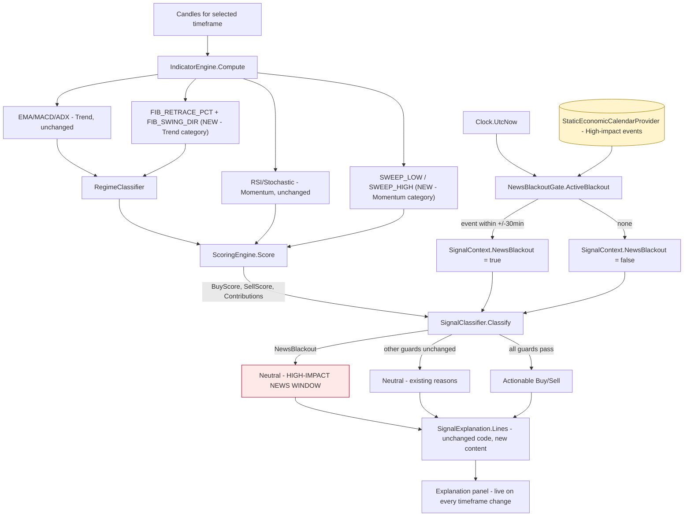

# Cycle 10 Spec — News Blackout Guard, Fibonacci Retracement, Liquidity Sweep (FR-44/FR-45/FR-46)

**Project:** gold-signal-analyzer
**Cycle / slice:** Option A from the Cycle-10 news-factor proposal (`cycle10-news-factor-proposal.md`)
— a deterministic economic-calendar blackout veto — plus two new pure technical indicators the
owner asked for directly: Fibonacci retracement and liquidity-sweep detection.
**Branch / worktree:** `agents/mt5-connectivity-bridge-gold-signal`
**Date:** 2026-08-07
**Owner:** vision1068 (human) — explicitly chose Option A and asked for Fib + liquidity sweep to be
added, with the breakdown visible live in the app on every timeframe change.

> Extends Cycles 1-9. Builds on the same evidence/veto machinery Cycle 9 used for the HTF guard —
> new indicators feed the SAME `ScoreContribution` pipeline `SignalExplanation` already renders, and
> the news gate is a hard veto in the SAME shape as the existing `DataStale`/HTF guards. No UI
> changes are required for the breakdown to show live: `SignalExplanation.Lines()` already prints
> every `ScoreContribution` and every terminal veto reason, and the sample/live paths already rerun
> the full pipeline on every timeframe change (Cycle 8, FR-39/FR-40).

## Scope decisions (binding — the D10-# record)

- **D10-1 — News stays a deterministic calendar veto, not a sentiment score (Option A only).**
  Per the Cycle-10 proposal, Option C (LLM/NLP headline sentiment as a score contributor) is
  explicitly rejected this cycle — it would break NFR-11 determinism and risk INV-4/INV-5
  (an opinion dressed as a fact). Option A only: a fixed, timestamped economic-calendar seam that
  vetoes to Neutral inside a blackout window around a **High**-impact scheduled event (FOMC, CPI,
  NFP-style releases). No headline text, no interpretation, ever enters the classifier.
- **D10-2 — Calendar is a read-only, swappable seam; NOT a live news feed this cycle.** Mirrors the
  Cycle-1 MT5-bridge pattern: `IEconomicCalendarProvider` is the seam; `StaticEconomicCalendarProvider`
  (a fixed in-memory list) is the only implementation this cycle. A future cycle can swap in a real
  calendar API behind the same interface without touching `NewsBlackoutGate` or `SignalClassifier`.
  **Out of scope this cycle**, matching the proposal: headline text, sentiment, live API keys/secrets.
- **D10-3 — Blackout window is symmetric and configurable, default ±30 minutes, High-impact only.**
  Medium/Low-impact calendar entries never block — only `EventImpact.High`. Rationale: false-blocking
  on routine data prints would make the guard noisy enough to be ignored; the window exists for the
  handful of releases that reliably move gold sharply (rate decisions, CPI, NFP).
- **D10-4 — Fail-open on an empty/missing calendar (D10-4a), fail-safe on the veto itself (D10-4b).**
  No calendar data → `ActiveBlackout` returns `null` → no veto (D10-4a) — an unpopulated calendar
  must never silently freeze the whole app, which would be a worse failure mode than the guard it
  replaces. But once an event genuinely falls inside the window, the veto is a **hard** Neutral, same
  strength as `DataStale` (D10-4b) — no partial credit, no fabricated "reduced confidence" instead.
- **D10-5 — Fibonacci retracement reuses the existing Trend category; liquidity sweep reuses the
  existing Momentum category. No new `IndicatorCategory` this cycle.** A dedicated "Structure"
  category was considered and rejected: `ScoringEngine.Normalize()`'s denominator
  (`maxWeighted = Σ cap × weight` across categories) is a **fixed constant** independent of whether a
  category ever fires (the existing, currently-inert `Volume` category already proves this — see
  the Cycle-10 proposal's volume finding). Adding a fifth category would shrink every existing score's
  normalization scale project-wide and require re-deriving dozens of hardcoded expected-score literals
  across the existing test suite for a category that, like Volume, may rarely fire on real data. Both
  new indicators are wrapped in the same `Try()`/omit-on-insufficient-data pattern as every existing
  indicator (`IndicatorEngine.cs:48`), so short candle series (most existing unit-test fixtures)
  simply never trigger them — **zero regression risk to any pre-existing test's expected numbers.**
  *(Flagged for Plan-Review: if real usage shows Fib/sweep are getting starved out by EMA/MACD/ADX
  competing for the same 30-point Trend cap, a dedicated category is a clean follow-up cycle.)*
- **D10-6 — Fibonacci direction is derived from swing order, not asserted.** Over a lookback window,
  the swing high/low are the window's actual highest-high/lowest-low. If the low occurred *before*
  the high, the leg is up (retracement = pullback from the high); if the high occurred first, the leg
  is down (retracement = bounce off the low). This is a factual read of the candle sequence — no
  opinion, no lookahead (only the completed lookback window is used).
- **D10-7 — Fibonacci "golden pocket" confirmation, not a full Fib strategy.** This cycle scores ONE
  rule: retracement inside the classic 38.2%–61.8% zone confirms continuation in the leg's direction
  (up-leg pullback into the pocket → Buy points; down-leg bounce into the pocket → Sell points).
  Extension levels (127%/161.8%), multiple simultaneous swings, and Fib-based risk-plan levels are
  explicitly **out of scope**.
- **D10-8 — Liquidity sweep = wick-through-and-close-back-inside a prior N-bar extreme.** A sweep of
  the prior low (last candle's Low < prior-window Low, but Close > prior-window Low) is read as a
  stop-hunt below resting sell-side liquidity followed by rejection — bullish (Buy). The mirror
  (sweep of the prior high, close back below it) is bearish (Sell). Only the single most recent
  completed candle is checked against the prior window (excluding itself) — no multi-candle pattern.
- **D10-9 — Both new indicators require their own warm-up window and fail-safe like every other
  indicator.** Fibonacci needs `lookback` candles (default 50); liquidity sweep needs `lookback + 1`
  (default 20 + the current candle). Insufficient data → the reading is simply absent (caught by the
  existing `Try()` wrapper) — never a fabricated retracement or a fabricated sweep.
- **D10-10 — The breakdown requires NO new UI wiring.** `SignalExplanation.Lines()` (unchanged this
  cycle) already renders every `ScoreContribution` (which now includes Fib/sweep when they fire) and
  the final `Decision:` line (which now can read the news-blackout reason). Because `App.xaml.cs`'s
  `RunSample` already reruns the whole pipeline on every `TimeFrameSelectionViewModel.Changed` event
  (Cycle 8), and `LiveSignalCoordinator.RefreshAsync` already reruns it every live poll, the new
  evidence lines and the new veto reason appear live, automatically, the moment they fire — exactly
  the "show it in the app whenever I change the timeframe" behaviour the owner asked for.

## Permanent invariants (re-asserted; verified this cycle)

- **INV-1** No order execution surface added. The calendar is a static in-memory list; Fib/sweep are
  pure functions over candles already held. **To verify:** 0 order verbs in new files.
- **INV-2/INV-3** No credential. The calendar seam takes no API key this cycle (D10-2). **To verify:**
  reflection/secret-scan guards unchanged and still pass.
- **INV-4** No fabricated data. Empty/insufficient inputs omit the reading/veto rather than inventing
  one (D10-4a, D10-9). The calendar is explicitly labelled non-live (D10-2).
- **INV-5** Full traceability, no invented commentary. Every Fib/sweep point is a `ScoreContribution`
  with raw/cap/capped/weight/note, same as every existing rule (D10-10); the news veto is a named
  reason string, not a silent suppression.
- **NFR-11** Determinism preserved. `FibonacciRetracement`/`DetectLiquiditySweep` are pure functions
  of the candle list; `NewsBlackoutGate.ActiveBlackout` is a pure function of `(calendar, now)` — same
  inputs, same output, every time.

## Data flow (diagram-first — Constitution §6)

## Requirements (this slice)

| ID | Requirement | Acceptance criteria |
|----|-------------|--------------------------------------|
| **FR-44** | A pure `NewsBlackoutGate.ActiveBlackout(now)` returns the active High-impact `EconomicEvent` when `now` falls within `±window` of its `TimeUtc`, else `null`. `SignalContext.NewsBlackout` (new, default `false`, appended last) forces `SignalClassifier` to Neutral with a new `ReasonNews` when `true`, checked alongside `DataStale`. Both the live coordinator and the sample path compute this from a shared `IEconomicCalendarProvider` + the injected clock and set the context before analysis. | **AC-44.1** No events / no High-impact events → `ActiveBlackout` returns null. **AC-44.2** `now` inside the window of a High event → returns that event; outside → null. **AC-44.3** Medium/Low-impact events never trigger a blackout even when `now` is exactly at `TimeUtc`. **AC-44.4** `SignalClassifier`: `NewsBlackout=true` → Neutral(ReasonNews) regardless of scores; `NewsBlackout=false` → unaffected (existing regression tests stay green under the new default). **AC-44.5** Live coordinator: a refresh during a blackout window returns `SignalAllowed=false`-equivalent (Neutral, ReasonNews), candles still returned (not fabricated-empty), poll does not crash. |
| **FR-45** | A pure `Indicators.FibonacciRetracement(candles, lookback=50)` returns swing high/low, swing direction, and retracement % of the last close within that leg, or `null` on insufficient data. `IndicatorEngine` emits `FIB_RETRACE_PCT`/`FIB_SWING_DIR` (Trend category) when computable. `ScoringEngine` gains rule R7: retracement in [0.382, 0.618] scores in the swing's direction. | **AC-45.1** A clean up-leg (low then high) with the last close retraced into the pocket → Buy points; the down-leg mirror → Sell points. **AC-45.2** Retracement outside the pocket → no Fib contribution. **AC-45.3** Fewer than `lookback` candles → indicator omitted, no exception escapes `IndicatorEngine`. **AC-45.4** Degenerate window (swing high == swing low) → omitted, never a divide-by-zero. |
| **FR-46** | A pure `Indicators.DetectLiquiditySweep(candles, lookback=20)` compares the last candle against the prior `lookback` candles' high/low. `IndicatorEngine` emits `SWEEP_LOW`/`SWEEP_HIGH` (Momentum category, 1/0) when computable. `ScoringEngine` gains rule R8: a low-sweep scores Buy, a high-sweep scores Sell. | **AC-46.1** Last candle's low pierces the prior window's low and closes back above it → `SWEEP_LOW=1` → Buy points. **AC-46.2** Mirror for `SWEEP_HIGH`/Sell. **AC-46.3** No sweep (last candle inside the prior range) → both 0, no contribution. **AC-46.4** Fewer than `lookback+1` candles → omitted, no exception. |
| **FR-47** | The breakdown (all evidence lines + the active veto reason) is visible in the app on every timeframe change, with no new UI code. | **AC-47.1** `SignalExplanation.Lines()` output contains the new Fib/sweep evidence lines when they fire, using the exact existing line format. **AC-47.2** A blackout-forced Neutral shows `Decision: Neutral — HIGH-IMPACT NEWS EVENT WINDOW — NEUTRAL.` in the same explanation text, same place the HTF/margin/opposite reasons already appear. |
| **NFR-13** | No regression to any pre-existing test's expected numeric literals. | Full existing suite (265 tests as of Cycle 9) passes unchanged; new tests are additive only. |
| **NFR-14** | Determinism (FR-24) preserved for the two new indicators and the news gate. | Pure functions, no shared mutable state, same inputs → same outputs — covered by exact-value assertions in new tests. |

## Out of scope (this slice)

- **Live news/calendar API integration** (D10-2) — the calendar stays a static in-memory seam.
- **Headline sentiment / LLM-derived scoring** (Option C, D10-1) — explicitly rejected this cycle.
- **A dedicated "Structure" scoring category** (D10-5) — reuse Trend/Momentum for now.
- **Fibonacci extension levels, multi-swing detection, Fib-based risk-plan/SL-TP levels** (D10-7).
- **Multi-candle liquidity-sweep patterns** (D10-8) — single most-recent-candle check only.
- **An "upcoming events" always-visible UI panel** — the news gate surfaces only when it actually
  vetoes (via the existing Explanation/Decision line); a proactive "next event in Xh" display is a
  reasonable follow-up but is new UI surface, not part of Option A as scoped.

## Verification evidence (this cycle — real command output)

- **C# unit/integration:** `dotnet test -c Release` → **Passed, Failed: 0, Total: 289** (265 Cycle-9
  baseline + 24 new FR-44/45/46 tests). One regression was caught and fixed during this cycle:
  `HtfConfirmationTests.Confirm_returns_null_on_tie` (a perfectly flat HTF series) briefly failed
  because `FibonacciRetracement` defaulted an ambiguous tie (swing high and low landing on the same
  candle) to a fabricated `Sell` direction; fixed to return `null` (D10-6 amended) and pinned with a
  new regression test, `Fibonacci_returns_null_when_swing_high_and_low_land_on_same_candle`.
- **WPF Release build:** `dotnet build GoldSignalAnalyzer.Wpf.csproj -c Release` → **0 Warning, 0 Error**.
- **Manual engine-level proof:** a hand-built candle series (steady up-leg warm-up, pullback into the
  golden pocket, closing liquidity sweep) run through `SignalAnalysisService.Analyze` produced, in the
  live explanation text: `[BUY +12] FIB_RETRACE … retracement 0.543 in golden pocket, up-leg` and
  `[BUY +10] LIQUIDITY_SWEEP … swept prior low, closed back above — stop-hunt rejection`, each with the
  same raw/cap/capped/weight fields every other indicator carries. Re-running the identical series with
  `NewsBlackout: true` changed only the decision line, from `OPPOSING SCORE TOO HIGH — NEUTRAL` to
  `HIGH-IMPACT NEWS EVENT WINDOW — NEUTRAL` — confirming the veto is checked ahead of the score guards
  and does not disturb the underlying evidence.
- **Live app smoke test:** the Release exe launched, ran in sample mode, the Explanation panel
  expanded via UI Automation showing the unchanged evidence format, and a runtime timeframe switch
  (H1→M15) triggered a clean recompute with no crash. Fib/sweep evidence lines did not fire in this
  run because the built-in demo series (`SampleCandleSeries`) is a pure monotonic ramp with no pullback
  or wick — the correct behaviour (see AC-45.2/AC-46.3), not a defect; the engine-level proof above
  confirms the rules do fire correctly against data that actually contains those patterns.
- **Structural safety:** 0 order verbs in new files (`grep` over `News/`, the Indicators additions,
  and the ScoringEngine/SignalClassifier edits); no new `PackageReference`; no new persisted
  config/secret (the calendar is in-memory only).

## `[NEEDS CLARIFICATION]`
None blocking. D10-1..D10-10 resolve the design forks. Two things are explicitly the owner's to
revisit later if real usage warrants them (D10-5's Structure-category follow-up; the "upcoming
events" panel) — noted above, not ambiguities blocking this cycle.
