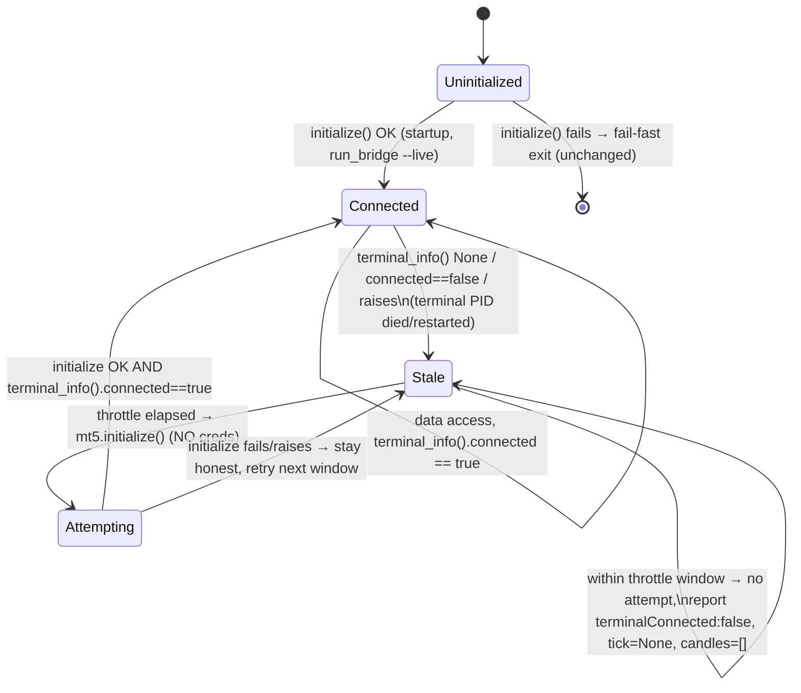

# Cycle 11 — MT5 Bridge Auto-Reconnect (read-only)

**Status:** SPEC (implementation gated behind Plan/QA/Audit; nothing committed).
**Scope:** Python bridge only (`src/bridge/mt5_bridge/market_source.py`). No .NET
change. Orthogonal to the in-flight Cycle 9 (HTF guard) / Cycle 10 (news factor)
work, which touches only .NET `Indicators/Live/Scoring` — zero file overlap.

## 1. Problem (diagnosed live, with evidence, 2026-08-07)

`Mt5MarketDataSource.initialize()` calls `mt5.initialize()` exactly once at
process startup (`run_bridge.py:32`, only under `--live`). That call binds the
MetaTrader5 IPC handle to whatever `terminal64.exe` PID is running at that
instant. Twice in one session the owner's terminal restarted under a **new PID**
(auto-update or crash-relaunch; cause unconfirmed). Each time the original IPC
handle went stale: `terminal_info()` began returning disconnected/None-ish, so
`terminal_connected()` reported `false` and `/tick` `/candles` stopped returning
data. The **only** remediation was manually killing and restarting the whole
bridge process so it re-ran `initialize()` against the now-current terminal.

## 2. Goal

The bridge detects a stale/disconnected terminal handle and **automatically
re-attempts a credential-free Mode A `initialize()`** against the currently
running terminal — no human `kill -9` + restart — while never fabricating data
during the disconnected window.

## 3. Invariants carried forward (hard, from Cycles 5/7 — do not relax)

- **INV-1 (read-only):** reconnect adds NO order/trade verb. It calls only
  `initialize()` (already in the allowed read-only API set). The
  no-order-verb reflection test must stay green.
- **INV-2 / INV-3 (no credentials):** reconnect calls `mt5.initialize()` with
  **no positional and no keyword args** — Mode A attach to an already-logged-in
  terminal. It must NEVER auto-login with stored credentials (none are stored).
- **NFR-5 (no fabrication):** during the disconnected window — including between
  and during failed reconnect attempts — `/health` reports
  `terminalConnected:false`, `/tick` returns None (→ HTTP 404), `/candles`
  returns `[]`. Connected state is reported true **only** after
  `terminal_info().connected` is genuinely true again. No stale/fake data, ever.
- **Testable seam preserved:** reconnect logic is exercised through the injected
  fake `mt5` module (same pattern as the rest of the file), plus an injected
  clock for the throttle — no real terminal needed for the unit gate.

## 4. Requirements

### FR-41 — Auto-reconnect on stale handle
When an already-initialized live source observes the terminal as not connected
(`terminal_info()` returns None / `connected==False` / raises), a subsequent
data access re-attempts `self._mt5.initialize()` against the currently running
terminal. If that call succeeds and `terminal_info().connected` is now true,
the source resumes serving real data with no process restart.

- **AC-41.1:** Given an initialized source whose `terminal_info` reports
  disconnected, when a data access occurs after the throttle interval, then
  `mt5.initialize()` is called again; if it now reports connected,
  `terminal_connected()` returns `True`.
- **AC-41.2:** The reconnect `initialize()` call carries **no** positional and
  **no** keyword args (Mode A; INV-2/INV-3).
- **AC-41.3:** A source that was **never** explicitly `initialize()`-d makes no
  auto-reconnect `initialize()` call (guard on `_initialized`) — auto-reconnect
  only re-attaches a session a human already established, it never opens the
  first one.

### FR-42 — Reconnect throttle
Reconnect attempts are rate-limited to at most one per configured interval, so a
genuinely-down terminal does not cause `initialize()` to be hammered on every
poll/request.

- **AC-42.1:** Multiple data accesses within one throttle interval trigger **at
  most one** reconnect `initialize()` call.
- **AC-42.2:** After the interval elapses (injected clock advanced), the next
  access makes a fresh reconnect attempt.
- **AC-42.3:** Concurrent accesses (many threads, as under `ThreadingHTTPServer`)
  during one outage trigger **exactly one** reconnect `initialize()` — the lock +
  double-check prevents a double-fire race.

> **[NEEDS CLARIFICATION — owner decision before commit]** Exact throttle
> interval and whether exponential backoff is wanted. This spec implements a
> **fixed 5.0-second** minimum interval (matches the .NET `LiveSignalCoordinator`
> 5s poll cadence → at most one reconnect attempt per poll) and **no** backoff,
> as a safe, minimal default. Owner to confirm the value / confirm fixed-vs-backoff.
> Chosen so a genuinely-down terminal yields ≤ 1 `initialize()` attempt / 5s.

### NFR-6 — Honest disconnection (extends NFR-5)
No code path may report connected, or return a tick/candle, unless
`terminal_info().connected` is genuinely true at read time.

- **AC-NFR6.1:** A **failed** reconnect leaves `terminal_connected() == False`,
  `get_tick() == None`, `get_candles() == []`, `list_symbols() == []` — no
  fabrication. Enforced structurally: holds **even if the MT5 API returns
  last-cached ticks/candles/symbols** while disconnected (the source gates on
  `_raw_connected()`, it does not trust the API to return `None`).
- **AC-NFR6.2:** A reconnect `initialize()` that raises is swallowed (logged
  intent, not surfaced as data); the source stays honestly disconnected and
  re-attempts after the next interval.

## 5. Reconnect flow (Constitution #6 — diagram-first)

## 6. Design (backend)

Single private throttled helper in `Mt5MarketDataSource`, called at the top of
`terminal_connected` / `get_tick` / `get_candles` / `list_symbols`:

- New ctor params (all defaulted → `run_bridge.py` and existing tests unchanged):
  `clock=None` (defaults to `time.monotonic`; injectable), and
  `reconnect_min_interval_s=5.0`.
- `_raw_connected()` — `terminal_info()` read wrapped in try/except → bool
  (a dead handle that raises reads as False, never as an error to the caller).
- `_reconnect_if_stale()` — returns early if not `_initialized`, or if already
  connected (cheap fast-path, no lock); else acquires `_reconnect_lock`,
  **double-checks** connection, and — if still stale and outside the throttle
  window — records the attempt time and calls `self._mt5.initialize()` inside
  try/except (swallow on failure).
- **Connection gate on data endpoints (NFR-6, structural):** after
  `_reconnect_if_stale()`, `get_tick` / `get_candles` / `list_symbols` short-circuit
  on `not self._raw_connected()` → `None` / `[]` / `[]`. This does NOT rely on the
  MT5 API returning `None` while disconnected — `copy_rates_from_pos` reads MT5's
  local rate cache and `symbol_info_tick` can return a last-cached tick during a
  broker-link outage, so honesty must be enforced in our code, not assumed of theirs.
- **Thread-safety (FR-42):** the bridge runs under `ThreadingHTTPServer` sharing one
  source, so `_reconnect_lock` (a `threading.Lock`) serializes the
  throttle-check-and-attempt — at most one `initialize()` per interval even under
  concurrent `/health` + `/tick`, and the MT5 library is never re-entered.
- `initialize()` (explicit startup) unchanged: still raises on failure (fail-fast).
  It sets only `_initialized=True` and does NOT seed `_last_reconnect_attempt`, so
  the first stale access after startup reconnects immediately (desired), then the
  throttle governs subsequent attempts.

No new MT5 API beyond `initialize` (already allowed). No new package. No config
surface (throttle is a ctor default; env-tunability deferred unless owner asks).

## 7. Out of scope / explicitly NOT changed

- No `mt5.shutdown()` before re-init. **[NEEDS CLARIFICATION]**: real MT5 usually
  reconnects on a bare repeat `initialize()`; if the owner's real-terminal E2E
  shows a shutdown-first is required, that is a one-line follow-up (and `shutdown`
  is read-only-safe). Default: `initialize()`-only.
- No auto-login, no credential storage (INV-2/3 unchanged).
- No .NET change — `LiveSignalCoordinator` already treats `terminalConnected:false`
  honestly (freshness/veto suppress), so recovery is transparent to it.
- No commit/push — owner go-ahead required (standing project rule).

## 8. Verification plan

- Unit (injected fake mt5 + fake clock): AC-41.1/.2/.3, AC-42.1/.2, AC-NFR6.1/.2.
- Regression: existing 32 Python tests stay green; no-order-verb reflection test
  stays green; read-only-APIs-only test still holds (initialize is allowed).
- Owner manual (cannot be automated here): kill/restart the real `terminal64.exe`
  under the running bridge and confirm `/health` self-heals to
  `terminalConnected:true` without restarting the bridge process.
