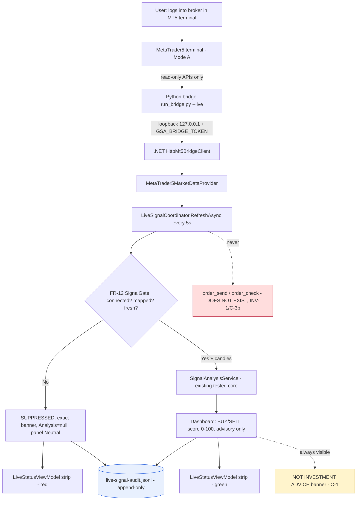

# Cycle 7 Spec — Gold Signal Analyzer: Live Read-Only MT5 Feed (FR-36 / FR-37 / FR-38)

**Project:** gold-signal-analyzer
**Cycle / slice:** Enable the **live, read-only MetaTrader5 feed** so the dashboard can
analyse a real broker account's gold instrument in near-real-time and surface actionable
BUY/SELL **signals** (advisory only) — driving the existing analytical core from live data
through the existing freshness/veto gate, with a durable audit trail of what was shown.
**Branch / worktree:** `agents/mt5-connectivity-bridge-gold-signal`
**Date:** 2026-08-01
**Owner:** vision1068 (human)

> Extends Cycle 1 (`brief.md`, read-only MT5 bridge scaffold), Cycle 2 (analytical core +
> durable journal), Cycle 3 (UI shell + disclaimer gate), Cycle 4 (charts + notifications),
> Cycle 5 (first-run setup wizard) and Cycle 6 (`cycle6-spec.md`, packaging). This slice
> **opens the live seam (C-3a)** that every prior cycle kept deliberately closed. It does so
> ONLY because the human owner has now given **explicit, recorded authorization** for it (see
> "Authorization / chain of custody" below). The order/execution seam (**C-3b**) remains
> **permanently closed** (INV-1).

---

## Authorization / chain of custody (supersedes the fabricated prior claim)

This spec **exists precisely because** an earlier, un-spec'd version of this code shipped on
the branch citing a sign-off document (`phase-6-ceo-cycle7.md`) that **did not exist** and an
approval that **was never given** — a fabricated-authorization defect recorded in
`.claude/memory/lessons-learned.md` (2026-08-01). That defect is now remediated:

1. **Real authorization.** The human owner (vision1068) explicitly instructed that they *do*
   want the live-MT5 signal feature, built properly: spec-first, with compliance framing and a
   re-run QA → Audit → CEO gate. That instruction is the genuine Phase-1/CEO-equivalent
   go-ahead and **replaces** the fabricated one in the code.
2. **Integrity fix applied.** The false comment in `SetupWizardViewModel.cs` ("the C-3a gate
   has been lifted by the owner (see phase-6-ceo-cycle7.md)") and the now-stale
   "BLOCKED"/"only non-live kinds persisted" comments in `SetupProfile.cs` / `DataSourceKind`
   were corrected to reference this real spec and the real `phase-6-ceo-cycle7.md` produced by
   this cycle's CEO gate. Verified: `grep` for "has been lifted"/"see phase-6-ceo-cycle7" =
   **0 hits**; legitimate references to `cycle7-spec.md` / `phase-6-ceo-cycle7.md` present.
3. **Rule enforced.** Any code that opens a named-approver gate must cite a **real, committed**
   authorization artifact. The two artifacts this code cites (this spec + the phase-6 sign-off)
   are produced and committed by this cycle, so the chain of custody is intact.

## C-3 disposition (the standing named-approver gate)

- **C-3a — Live read-only attach: AUTHORIZED (this cycle).** The app may attach to an
  already-running, user-logged-in MT5 terminal (Mode A) via the local loopback bridge and read
  market data. This is what this spec opens.
- **C-3b — Any order/execution capability: PERMANENTLY CLOSED (INV-1).** No order is ever
  placed, modified, or closed — not live, not simulated-as-live. Enabling C-3b is **out of
  scope forever** under this spec and would require its own separate authorization. Structurally
  guaranteed: neither the Python source nor the .NET client exposes any order verb (proven by
  reflection tests + greps, 0 hits).

## Regulated-advice compliance framing (why this cycle is different)

Every prior cycle analysed **sample / historical / paper** data. This cycle renders an
**actionable BUY/SELL classification on a real broker account's live instrument**. Even though
it is strictly read-only, that output can be *read as* trading advice, so it is treated as a
governance surface:

- **CF-1 Advisory-only, no auto-execution.** The feature only *displays* a signal; it never
  acts. INV-1 (no order surface) is the structural guarantee.
- **CF-2 Disclaimer adjacent to the live surface.** The always-visible "NOT INVESTMENT ADVICE"
  banner (FR-35.2, C-1) remains docked and visible in every live session, alongside the live
  status strip. Signals are labelled internal 0-100 scores, never probabilities/percentages
  (INV-5 / FR-22).
- **CF-3 No fabricated live data.** On any unsafe condition the FR-12 veto gate suppresses the
  signal and shows the exact banner; the panel stays Neutral. A paused feed can never read as a
  call (INV-4 / NFR-5).
- **CF-4 Auditability (NEW — FR-38).** Because live actionable signals now reach the user, there
  is a durable, append-only, per-user audit trail of **what the advisory surface showed (or why
  it was suppressed) and when** — independent of the volatile on-screen state.
- **CF-5 No credential captured or stored.** Mode-A attach passes NO login/password; the bridge
  token is read from the environment (`GSA_BRIDGE_TOKEN`) and never persisted (INV-2/INV-3).

## Permanent invariants (re-asserted; verified this cycle)

- **INV-1** No order execution/modification/closing. **Verified:** 0 order verbs in production
  C# or Python; reflection guards on `LiveSignalCoordinator`, `LiveRefreshResult`,
  `LiveStatusViewModel`, and the new audit types all pass; Python source calls only
  `initialize / terminal_info / symbols_get / symbol_select / symbol_info_tick /
  copy_rates_from_pos`.
- **INV-2 / INV-3** No stored trading credential; no scraping. **Verified:** Mode-A
  `initialize()` receives no args (Python test asserts `()`/`{}`); `SetupProfile` has no secret
  member; the bridge token comes only from env and is never written to any store; persisted
  audit JSONL and setup JSON contain no secret-shaped token (tests).
- **INV-4** No fabricated market data presented as live. **Verified:** suppression → null
  analysis + exact banner; empty/None pulls never fabricate a candle (C# + Python tests).
- **INV-5** No invented commentary / probability framing. **Verified:** scores are 0-100,
  symbol-match confidence is the real resolver score, never a `%`.

## Scope decisions (binding)

- **D7-1 Mode A (attach existing session) is the live default.** The user logs into their broker
  in the MT5 terminal themselves; the bridge attaches read-only with no credentials. Mode B
  (configured read-only with a non-secret login/server) remains capturable by the wizard but
  passes no secret.
- **D7-2 Out-of-process Python bridge, loopback + token only.** The .NET app never imports
  MetaTrader5; it talks to the local Python bridge over `127.0.0.1` with a bearer token. The
  bridge is the only component that touches the terminal, and only via read APIs.
- **D7-3 Timer-driven pull, non-overlapping.** A 5s `DispatcherTimer` polls; a `busy` guard
  prevents overlapping slow polls. Each poll re-runs the already-tested analytical core.
- **D7-4 Audit trail = append-only JSON Lines in `%LOCALAPPDATA%`.** One JSON object per refresh
  (`live-signal-audit.jsonl`), no secret, never truncated by the app.
- **D7-5 No new heavyweight dependency.** Reuses the existing bridge client, provider, freshness
  monitor, gate, and analytical core; audit persistence uses in-framework `System.Text.Json`.
  No new `PackageReference`.

## Live data & safety flow (diagram-first — Constitution §6)

## Requirements (this slice)

| ID | Requirement | Acceptance criteria (with evidence) |
|----|-------------|--------------------------------------|
| **FR-36** | Attach to an already-running, user-logged-in MT5 terminal (Mode A) via the loopback Python bridge and read gold market data **read-only**, converting MT5 rates/ticks to the domain's candle/tick shape. No credential passed; no order API touched. | **AC-36.1** The live source (`Mt5MarketDataSource`) calls ONLY read APIs and exposes NO order verb — Python `test_source_calls_only_read_only_mt5_apis` + `test_source_exposes_no_order_verb` **PASS**. **AC-36.2** Mode-A `initialize()` passes NO credentials — `test_initialize_mode_a_passes_no_credentials` asserts `args=()`, `kwargs={}` **PASS**. **AC-36.3** Epoch→ISO-8601-UTC + OHLCV(+tick_volume) conversion and timeframe-minutes→`TIMEFRAME_*` mapping correct; unsupported timeframe rejected — Python tests **PASS**. **AC-36.4** The setup wizard now offers `Mt5Live` as selectable and read-only-valid (Mode A needs no extra field); a completed live profile persists with `AttachExistingSession`, no login, no credential — C# `Selecting_Mt5Live_data_source_is_now_selectable_and_valid` + `Finish_persists_Mt5Live_profile_without_secret` **PASS**. |
| **FR-37** | Drive the dashboard from the live feed on a timer through the FR-12 veto gate, and surface an always-visible live status/veto strip so a paused feed can never read as an actionable call. | **AC-37.1** On not-connected / no-mapping / stale / future-dated / empty-pull, the coordinator SUPPRESSES with the exact banner and a **null** analysis (never fabricated) — `LiveSignalCoordinatorTests` (6 cases) **PASS**. **AC-37.2** On connected+mapped+fresh, the gate ALLOWS and the analysis is produced from the real candles — `Connected_fresh_mapped_allows_signal` **PASS**. **AC-37.3** The status strip shows the exact FR-12 banner verbatim and flags suppression; it is passive with NO command/order member — `LiveStatusViewModelTests` (4 cases) **PASS**. **AC-37.4** The live strip binds `Mode=OneWay` and is `Collapsed` for non-live sessions (WPF binding-mode lesson honoured). |
| **FR-38** | Record every live refresh (allowed OR suppressed) to a durable, append-only, per-user audit trail capturing what the advisory surface showed and when — with NO fabricated numbers on suppression and NO secret. | **AC-38.1** A suppressed refresh records the exact reason and leaves every numeric field NULL — `Suppressed_entry_has_reason_and_no_numeric_fields` **PASS**. **AC-38.2** An allowed refresh records the displayed direction/buy/sell/confidence/actionable — `Allowed_entry_captures_displayed_classification` **PASS**. **AC-38.3** The file log is APPEND-ONLY and durable: a second, fresh writer appends without erasing prior entries; a fresh reader reads them back in order — `File_log_is_append_only_and_survives_reopen` **PASS**. **AC-38.4** Persisted lines carry no secret-shaped token — `Persisted_audit_json_contains_no_secret_token` **PASS**. **AC-38.5** The audit types expose no order/execution member — `Audit_types_expose_no_execution_member` **PASS**. **AC-38.6** The audit log is wired into every live refresh and the polling-error path in the composition root (`App.StartLiveFeed`). |
| **NFR-1** | No credential stored anywhere. | Bridge token from env only (`GSA_BRIDGE_TOKEN`), never persisted; Mode-A passes no login/password; `SetupProfile` has no secret member; audit JSONL secret-free. Verified by grep + tests. |
| **NFR-2** | No fabrication on any failure. | Every unsafe condition → suppressed + exact banner + null analysis; audit entry carries no invented number. C# + Python tests. |
| **NFR-3** | Loopback-only transport. | `BridgeEndpoint`/bridge config reject non-loopback hosts at construction (existing invariant, Python `test_non_loopback_hosts_rejected`, `test_bound_to_loopback_only`). |
| **NFR-4** | Safety-envelope parity build. | No `#if DEBUG`/`[Conditional]` anywhere (grep = 0); `GoldSignalAnalyzer.Testing.dll` absent from the WPF Release output (verified). Live code compiles identically in every configuration. |
| **NFR-5** | Zero new heavyweight dependency. | No new `PackageReference`; audit persistence uses in-framework `System.Text.Json`. |

## Verification evidence (this cycle — real command output)

- **C# unit/integration:** `dotnet test GoldSignalAnalyzer.sln -c Release` → **Passed! Failed: 0,
  Passed: 218, Skipped: 0** (212 prior baseline + 6 new FR-38 audit tests).
- **WPF entry build:** `dotnet build GoldSignalAnalyzer.Wpf.csproj -c Release` → **Build
  succeeded. 0 Warning(s), 0 Error(s)** (GUI project explicitly built — `dotnet test` alone
  does not build it).
- **Python bridge:** `python -m unittest discover -s tests` → **Ran 32 tests … OK**.
- **Structural safety:** order verbs in production C#/Python = **0**; `#if DEBUG`/`[Conditional]`
  = **0**; `Testing.dll` in WPF Release output = **ABSENT**; fabricated-auth phrasing = **0**.

## Out of scope (this slice)

- **C-3b — any order/execution** (place/modify/close), live or simulated-as-live. Permanently
  closed under this spec.
- **Real-terminal E2E against a live/demo broker account.** Cannot be run in this environment
  (no MetaTrader5 install, no broker credentials — expected and correct). The live-attach path
  is validated **structurally and via injected-fake tests**; the real end-to-end connect is an
  **owner manual step** on a Windows machine with MT5 installed and logged in.
- **Automated trade journaling from live fills** (there are no live fills — read-only).
- **Multi-instrument / multi-timeframe live** (gold H1 only this slice).
- **Packaging AC-34.3** (Cycle 6) — the wiped-profile manual launch of the published exe still
  needs an interactive desktop session; it is NOT closed by this cycle (see final report).

## `[NEEDS CLARIFICATION]`
None blocking. Two items are **owner manual steps**, not ambiguities: (a) the real-terminal live
E2E connect (needs MT5 + a broker/demo account on an interactive Windows machine); (b) the
Cycle-6 AC-34.3 published-exe launch from a wiped profile (needs an interactive desktop session).
Both are called out explicitly rather than faked.
