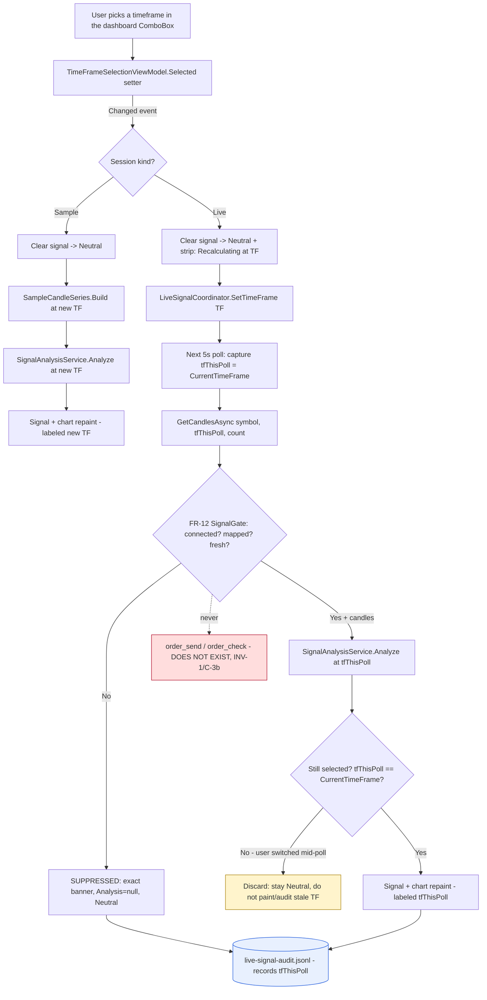

# Cycle 8 Spec — Gold Signal Analyzer: Runtime Timeframe Selector (FR-39 / FR-40)

**Project:** gold-signal-analyzer
**Cycle / slice:** Add a **runtime timeframe selector** to the dashboard so the user can switch
the analysis timeframe (M1 / M5 / M15 / M30 / H1 / H4 / D1) at any time, and have the signal +
chart **recalculate** against the selected timeframe — for BOTH the non-live sample path and the
Cycle-7 live MT5 path — without ever showing a prior-timeframe result mislabeled as the new one.
**Branch / worktree:** `agents/mt5-connectivity-bridge-gold-signal`
**Date:** 2026-08-05
**Owner:** vision1068 (human)

> Extends Cycle 1 (read-only bridge scaffold), Cycle 2 (analytical core + journal), Cycle 3 (UI
> shell + disclaimer gate), Cycle 4 (charts + notifications), Cycle 5 (setup wizard), Cycle 6
> (packaging) and Cycle 7 (`cycle7-spec.md`, live read-only MT5 feed). This slice is a **UI/UX +
> live-refresh** change on top of the already-authorized live seam (C-3a). It opens **no new
> seam**: it does not touch credentials, transport, or the order surface (C-3b stays permanently
> closed, INV-1). All Cycle-7 authorization/chain-of-custody remains as recorded in
> `cycle7-spec.md` / `phase-6-ceo-cycle7.md`.

---

## Business framing (owner request, verbatim)

> "in my application I can change the timing in the graph by default it is showing H1, or M1 or D1
> can you give me the option to change it then based on that the calculation should be recalculated
> and show the results accordingly"

Today the analysis timeframe is **hardcoded to `TimeFrame.H1`** in two places in
`App.xaml.cs` — the non-live sample path (`OnStartup`) and the live path (`StartLiveFeed`,
`const TimeFrame liveTimeFrame = TimeFrame.H1`). The user wants to change it at runtime and have
everything downstream (signal score, risk plan, chart) recompute for the chosen timeframe.

## Scope decisions (binding — the D-# record, resolved without owner ping)

- **D8-1 — Expose the full curated standard set, default H1.** The selector offers all seven
  timeframes the domain enum and the Python bridge already support
  (`M1, M5, M15, M30, H1, H4, D1` — see `_TIMEFRAME_ATTR_BY_MINUTES` in `market_source.py`, which
  maps every one). The owner named M1/H1/D1 as *examples*; exposing the full standard set costs
  nothing (the bridge/provider already accept a `TimeFrame` on `GetCandlesAsync`) and is more
  useful. **Default stays H1** so existing behaviour is unchanged on first paint.
- **D8-2 — The selector is a runtime dashboard control, not first-run wizard config.** It lives at
  the top of the dashboard (above the Current Signal panel), always visible in both sample and live
  sessions, as a passive `ComboBox` bound to a testable VM. It is a *runtime toggle*, not
  first-run configuration, so it deliberately does **not** touch the setup wizard or the persisted
  `SetupProfile` (which stays byte-for-byte and keeps its no-secret guard unchanged).
- **D8-3 — On switch, the prior signal is cleared BEFORE the new one appears (INV-4).** A timeframe
  change immediately blanks the signal panel to Neutral; the new-timeframe result is painted only
  after it is actually computed at the new timeframe. A prior-timeframe signal is never shown under
  the new timeframe's label — this is the core safety property of this cycle.
- **D8-4 — Sample path regenerates candles at the selected timeframe's interval.** The demo series
  is rebuilt with the selected timeframe's minute-spacing and timeframe label so its timestamps are
  honest; it remains explicitly **not live** (INV-4) and is illustrative only.
- **D8-5 — Live path re-pulls at the new timeframe through the SAME gate.** The live coordinator
  gains `SetTimeFrame(TimeFrame)` (mutates its options; freshness state is preserved because it is
  keyed on **tick recency**, not candle timeframe — verified below). The next 5s poll re-pulls
  candles at the new timeframe via `MetaTrader5MarketDataProvider.GetCandlesAsync(…, timeFrame, …)`
  and re-runs `SignalAnalysisService`. A switch therefore **cannot bypass** the FR-12 freshness/veto
  gate — a stale/not-connected feed still suppresses after a switch exactly as before.
- **D8-6 — Runtime-only, no persistence of the selected timeframe (this slice).** The choice resets
  to the H1 default on relaunch. Persisting it would mean adding a field to the guarded
  `SetupProfile` and a migration path for existing profiles; that is deferred (out of scope below)
  to keep this slice tight and leave the persisted, no-secret-guarded profile untouched.

## Permanent invariants (re-asserted; verified this cycle — nothing loosened)

- **INV-1** No order execution/modification/closing. The selector adds a `ComboBox` and a
  `SetTimeFrame` method only — no order verb. **Verified:** 0 order verbs in production C#/Python;
  the coordinator/status/selector reflection guards still pass (`settimeframe`/`currenttimeframe`
  contain no forbidden substring).
- **INV-2 / INV-3** No credential captured/stored/transmitted. This slice touches no credential,
  no transport, no `SetupProfile`. **Verified:** the no-secret reflection guard and persisted-JSON
  scan are unchanged and still pass; nothing new is persisted.
- **INV-4** No fabricated / mislabeled market data. A timeframe switch clears the signal and only
  ever displays a result actually computed at the currently-selected timeframe (D8-3); a live poll
  whose timeframe was superseded mid-flight is **discarded**, never painted. **Verified:** new
  coordinator/selection tests + the superseded-poll guard in the composition root.
- **INV-5** No invented commentary / probability framing. Scores stay 0-100; the selector shows
  timeframe *labels* (M1…D1), never a percentage. **Verified:** unchanged `SignalViewModel`.

## Live-refresh & recalculation flow (diagram-first — Constitution §6)

## Requirements (this slice)

| ID | Requirement | Acceptance criteria (with evidence) |
|----|-------------|--------------------------------------|
| **FR-39** | A runtime timeframe selector on the dashboard offering the curated standard set (M1/M5/M15/M30/H1/H4/D1, default H1), always visible in both sample and live sessions, that recalculates the SAMPLE path's signal + chart when changed — labeling every result at the selected timeframe, never a prior one (INV-4). | **AC-39.1** `TimeFrameSelectionViewModel` exposes exactly the seven curated choices in order, defaults to H1 — `Selector_offers_curated_set_default_h1` **PASS**. **AC-39.2** Setting `Selected` to a new value raises `Changed` exactly once carrying that value; setting the same value is a no-op (no event) — `Selecting_new_timeframe_raises_changed_once` + `Selecting_same_timeframe_is_noop` **PASS**. **AC-39.3** The sample-series factory builds candles at the selected timeframe's minute-spacing and timeframe label, for any timeframe — `Sample_series_uses_selected_timeframe_spacing_and_label` (theory over M1/H1/D1) **PASS**. **AC-39.4** `SignalAnalysisService.Analyze` runs cleanly on a sample series built at any curated timeframe and yields a signal whose data status reflects that series — `Analyze_runs_for_every_curated_timeframe` **PASS**. **AC-39.5** The selector is a passive control — no order/command member — `Selector_exposes_no_order_member` **PASS**. |
| **FR-40** | In a live session, switching the timeframe re-pulls candles at the new timeframe through the SAME FR-12 freshness/veto gate on the next poll and re-runs the analytical core — clearing the signal on switch and never painting/auditing a result whose timeframe was superseded mid-poll (INV-4). Freshness (tick-recency-keyed) is unaffected by the switch, so a switch cannot bypass suppression. | **AC-40.1** `LiveSignalCoordinator.SetTimeFrame` updates `CurrentTimeFrame`, and the next `RefreshAsync` requests candles at the new timeframe — `SetTimeFrame_repulls_candles_at_new_timeframe` (asserts `TestMarketDataProvider.LastRequestedTimeFrame`) **PASS**. **AC-40.2** A switch does not bypass the veto gate: a stale/not-connected feed still suppresses (null analysis, exact banner) after `SetTimeFrame` — `SetTimeFrame_does_not_bypass_stale_suppression` **PASS**. **AC-40.3** `RefreshAsync` snapshots the timeframe at the start of the refresh, so a `SetTimeFrame` during an in-flight poll does not change the timeframe that poll pulls/analyses (no mid-poll mislabel) — `Refresh_uses_timeframe_snapshotted_at_start` **PASS**. **AC-40.4** The live status strip can show a "Recalculating at {TF}" paused state so the switch gap never reads as an actionable call — `MarkRecalculating_shows_paused_recalc_banner` **PASS**. **AC-40.5** The audit trail records the timeframe the refresh actually used (FR-38 wired to the current timeframe, not a const) — verified structurally in the composition root + `LiveSignalAuditEntry.From` already accepting a `TimeFrame` (Cycle-7 tests unchanged, still PASS). |
| **NFR-6** | No new heavyweight dependency; no new persisted state. | No new `PackageReference`; `SetupProfile`/persisted JSON unchanged; selector state is runtime-only. Verified by grep + unchanged Cycle-5/7 guard tests. |
| **NFR-7** | Safety-envelope parity build (unchanged from Cycle 7). | No `#if DEBUG`/`[Conditional]` anywhere (grep = 0); `GoldSignalAnalyzer.Testing.dll` absent from the WPF Release output. |
| **NFR-8** | WPF binding-mode discipline (2026-07-31 lesson). | The `ComboBox.SelectedValue` binds to a genuinely settable VM property (TwoWay is correct here); every read-only VM binding in the new XAML states `Mode=OneWay`. The `App.OnStartup` composition change is covered by the manual wiped-profile E2E pass (owner step). |

## Structural safety confirmations (reviewed, not assumed — per brief)

- **Freshness is timeframe-agnostic.** `DataFreshnessMonitor` classifies on `_clock.UtcNow - lastTickUtc`
  against a fixed `staleAfter` TimeSpan; it never reads a candle timeframe. `RecordTick` is driven by
  the latest tick (or the newest candle's open time as a fallback). Switching timeframe therefore
  leaves freshness/veto behaviour identical — a switch cannot open a bypass. **Confirmed by reading
  `DataFreshnessMonitor.cs` + `LiveSignalCoordinator.RefreshAsync`.**
- **`SignalGate`/`LiveSignalCoordinator` are already timeframe-parametric.** The coordinator passes
  `_options.TimeFrame` straight into `GetCandlesAsync` and `SignalAnalysisService.Analyze`; the only
  change needed is to make that timeframe settable at runtime and snapshotted per refresh.
- **The bridge already maps every curated timeframe.** `market_source.py`
  `_TIMEFRAME_ATTR_BY_MINUTES` covers M1/M5/M15/M30/H1/H4/D1 and *rejects* an unsupported value —
  so no live path can silently pull a wrong/empty series for a curated timeframe.

## Verification evidence (this cycle — real command output; filled at implementation)

- **C# unit/integration:** `dotnet test GoldSignalAnalyzer.sln -c Release` → target **Passed, Failed: 0**
  (218 prior baseline + new FR-39/FR-40 tests).
- **WPF entry build:** `dotnet build GoldSignalAnalyzer.Wpf.csproj -c Release` → **0 Warning, 0 Error**.
- **Python bridge:** `python -m unittest discover -s tests` → **OK** (32, unchanged — no bridge change
  needed; the mapping already supports every curated timeframe).
- **Structural safety:** order verbs in production C#/Python = **0**; `#if DEBUG`/`[Conditional]` = **0**;
  `Testing.dll` in WPF Release output = **ABSENT**; new `PackageReference` = **0**; `SetupProfile`
  persisted-JSON secret scan unchanged = **PASS**.

## Out of scope (this slice)

- **Persisting the selected timeframe across launches** (D8-6). Resets to H1 on relaunch. A later
  slice could add it to `SetupProfile` (non-secret) with a migration default.
- **Per-timeframe multi-series / HTF confluence recompute.** The `SignalContext.HtfDirection` input
  is unchanged; this slice recalculates the single selected timeframe, not a multi-timeframe blend.
- **Any change to the live seam, credentials, transport, or order surface** (C-3b stays closed).
- **Real-terminal live E2E** (needs MT5 + a broker/demo account on an interactive Windows machine)
  and the **Cycle-6 AC-34.3 wiped-profile published-exe launch** — both remain owner manual steps,
  as in Cycle 7. The `App.OnStartup`/`StartLiveFeed` wiring change here is exactly the kind the
  2026-07-31 WPF lesson says must get a manual wiped-profile run before go-live.

## `[NEEDS CLARIFICATION]`
None blocking. The two candidate ambiguities the brief flagged were resolved without an owner ping:
which timeframe set to expose → **D8-1** (full curated standard set, default H1); where the selector
lives → **D8-2** (top of the dashboard, runtime control, not the wizard). Two items remain **owner
manual steps** (not ambiguities): the real-terminal live E2E and the Cycle-6 wiped-profile launch.
