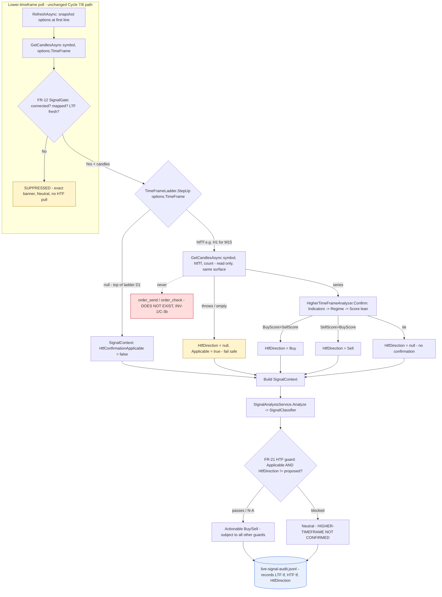

# Cycle 9 Spec — Gold Signal Analyzer: Real Higher-Timeframe (HTF) Confirmation (FR-41 / FR-42 / FR-43)

**Project:** gold-signal-analyzer
**Cycle / slice:** Make the **FR-21 higher-timeframe confirmation guard perform a real check** on both
the live MT5 path and the non-live sample path, by deriving a genuine higher-timeframe
`SignalDirection?` from real (or realistic sample) HTF candle data through the existing analytical
core — replacing the two broken call-site behaviours (live: HTF never populated → guard can never
pass; sample: HTF hardcoded `Buy` → guard is an unconditional pass).
**Branch / worktree:** `agents/mt5-connectivity-bridge-gold-signal`
**Date:** 2026-08-05
**Owner:** vision1068 (human) — explicitly authorized this fix cycle after a prior session found and
explained the bug.

> Extends Cycle 1 (read-only bridge scaffold), Cycle 2 (analytical core + journal, incl. FR-21
> guards), Cycle 3 (UI shell + disclaimer), Cycle 4 (charts + notifications), Cycle 5 (setup wizard),
> Cycle 6 (packaging), Cycle 7 (`cycle7-spec.md`, live read-only MT5 feed, C-3a authorized) and
> Cycle 8 (`cycle8-spec.md`, runtime timeframe selector, FR-39/FR-40). Cycle 8 explicitly deferred
> this work ("Out of scope: … `SignalContext.HtfDirection` input is unchanged … not a
> multi-timeframe blend"). This slice closes that gap. It opens **no new seam**: the HTF read is
> read-only market data pulled through the **same** `MetaTrader5MarketDataProvider` /
> `GetCandlesAsync` surface as the existing LTF read — no new credential, transport, or order verb
> (C-3b stays permanently closed, INV-1). All Cycle-7 authorization/chain-of-custody remains as
> recorded in `cycle7-spec.md` / `phase-6-ceo-cycle7.md`.

---

## The defect (verified against source this cycle, not assumed)

`SignalClassifier.Classify` (`GoldSignalAnalyzer.Application/Scoring/SignalClassifier.cs:84`) guards:

```csharp
if (_cfg.RequireHtfConfirmation && ctx.HtfDirection != proposed) return Neutral(ReasonHtf);
```

`ClassifierConfig.RequireHtfConfirmation` defaults `true` (line 17); `SignalContext.HtfDirection`
defaults `null` (line 8). The two call sites build the context wrongly:

- **Live path** — `App.StartLiveFeed` builds `LiveSignalOptions(… new SignalContext())`
  (`App.xaml.cs:199`); `LiveSignalCoordinator.RefreshAsync` forwards `options.Context` unchanged
  (`LiveSignalCoordinator.cs:140`). Nothing ever sets `HtfDirection`, so it stays `null`. Since
  `null != Buy` and `null != Sell` **always**, the guard **can never pass on the live path, on any
  timeframe, at any score.** Confirmed live: M1, Buy 85 / Sell 0 (both other guards trivially pass)
  → still forced Neutral, reason "HIGHER-TIMEFRAME NOT CONFIRMED — NEUTRAL".
- **Sample path** — `App.OnStartup`'s `RunSample` hardcodes
  `new SignalContext(HtfDirection: SignalDirection.Buy)` (`App.xaml.cs:128`) — an **unconditional
  pass** for any Buy proposal, regardless of the demo data.

**Net:** the FR-21 HTF safety guard performs no real check anywhere — unconditional fail (live) or
unconditional pass (sample). Same root cause: no code path computes an actual higher-timeframe
direction from data and feeds it into `SignalContext.HtfDirection`.

## What "fixed" means (design intent)

Derive `HtfDirection` from a **real higher-timeframe read**: step one rung up the curated ladder,
pull an HTF candle series, run it through the **existing tested analytical core** (IndicatorEngine →
RegimeClassifier → ScoringEngine) and take the higher timeframe's **independent directional lean**
(BuyScore vs SellScore — the same basis the LTF proposal uses). Feed that `SignalDirection?` into the
classifier on **both** paths. Fail safe to Neutral when no HTF read can be obtained.

## Scope decisions (binding — the D-# record, resolved without owner ping)

- **D9-1 — Step-up mapping = next rung on the existing curated ladder.**
  `M1→M5→M15→M30→H1→H4→D1`. A new pure `TimeFrameLadder.StepUp(TimeFrame) → TimeFrame?` returns the
  next-higher curated timeframe, or `null` at the top (D1) / for an unknown value. No new timeframe
  (e.g. W1) is introduced — that would need a `TimeFrame` enum + Python-bridge-map change (out of
  scope, and W1 is not in the curated set the selector exposes).
- **D9-2 — HTF direction = the higher timeframe's independent score lean.** Reuse the existing core:
  `IndicatorEngine.Compute` → `RegimeClassifier.Classify` → `ScoringEngine.Score` on the HTF series,
  then `HtfDirection = BuyScore > SellScore ? Buy : SellScore > BuyScore ? Sell : null`. This mirrors
  exactly how the classifier computes `proposed` for the LTF (`SignalClassifier.cs:73`), so
  "confirmation" means "the higher timeframe leans the same way." It does **not** recursively run
  `SignalClassifier` on the HTF (which would re-invoke the HTF guard → infinite regress); it is a
  pure trend/lean read. A **tie** (or empty/failed read) → `null` → **no confirmation** (fail-safe).
- **D9-3 — Top-of-ladder (D1): HTF confirmation is Not Applicable, treated as satisfied.** At D1
  there is no higher timeframe in the curated set by definition, so the guard is a **no-op** at D1
  (the signal may fire subject to *all other* guards: margin, opposite-cap, vetoes, freshness,
  cooldown). This is expressed **explicitly** via a new `SignalContext.HtfConfirmationApplicable`
  flag (default `true`; set `false` only at the top of the ladder) — it is **not** the old
  accidental `null`. Honest: we do not fabricate an HTF read at D1; we state the guard does not apply.
  *(Flagged for adversarial Plan-Review: an alternative is to block at D1 — rejected as it would make
  the highest user-selectable timeframe permanently unusable.)*
- **D9-4 — Fail-safe on an unobtainable HTF read → Neutral, never fabricated.** If the HTF pull
  throws, returns empty, or yields a tie, `HtfDirection = null` and (for a non-top timeframe)
  `HtfConfirmationApplicable = true`, so the guard blocks → Neutral with `ReasonHtf`. Same
  no-fabrication philosophy as the FR-12 freshness/veto gate (INV-4): missing data suppresses, it
  does not invent. The HTF pull failing does **not** crash the poll.
- **D9-5 — HTF freshness is NOT subjected to the LTF freshness bar.** The LTF freshness/veto gate
  (`DataFreshnessMonitor`/`SignalGate`) is unchanged and still governs whether *any* signal is
  allowed, keyed on LTF **tick recency**. The HTF candle series is confirmation history only; a D1
  candle used to confirm an M5 signal is legitimately a day old, so applying the 90s LTF staleness
  bar to it would be wrong. HTF timestamps are **not** fed into `DataFreshnessMonitor` (that would
  corrupt LTF staleness). The only HTF safety condition is "a usable series was obtained" (D9-4).
- **D9-6 — Pull the HTF series every poll (correctness-first); caching deferred.** Each live poll
  performs one additional read-only `GetCandlesAsync` at the stepped-up timeframe. The bridge is
  loopback (localhost), so the extra call is negligible; pulling every poll keeps the HTF read
  consistent with the poll's snapshot and adds no mutable cache/staleness race to a safety gate. A
  cadence/caching optimization (refresh the HTF read only on its own interval) is an explicit future
  optimization, **out of scope** here.
- **D9-7 — HTF work rides inside Cycle-8's snapshot/discard machinery (INV-4 preserved).** HTF
  derivation happens inside `LiveSignalCoordinator.RefreshAsync`, which already snapshots
  `_options` at its first synchronous line; the HTF timeframe is `StepUp(options.TimeFrame)` from
  that snapshot, so a mid-poll `SetTimeFrame` cannot leak a stale HTF read into a different LTF
  poll's classification. The composition-root superseded-poll discard (Cycle 8) is unchanged.
- **D9-8 — Sample path derives HTF the same structural way (parity), not a constant.** `RunSample`
  builds the HTF sample series at `StepUp(tf)` via `SampleCandleSeries.Build(htfTf)` and derives
  `HtfDirection` with the **same** `HigherTimeFrameAnalyzer` used live. The derivation logic that
  turns "a step-up timeframe + a way to get candles" into a `SignalContext` is a **pure, testable
  helper** kept **out of the WPF composition root** (2026-07-31 / Cycle-8 rule), so App.xaml.cs stays
  dumb. The sample series is still explicitly **not live** (INV-4).
- **D9-9 — HTF read is traceable (INV-5), not a silent side-channel.** The chosen HTF timeframe and
  the derived `HtfDirection` (or "unavailable") are recorded on the live audit trail entry so the
  advisory decision's HTF provenance is auditable, consistent with FR-38 and the deterministic
  `ScoreContribution` traceability of the LTF pipeline. *(Extent of the audit-field change is
  minimal/additive; see FR-43.)*

## Permanent invariants (re-asserted; verified this cycle — nothing loosened)

- **INV-1** No order execution/modification/closing. The HTF read is a read-only `GetCandlesAsync`
  call — the same verb-free market-data surface as the LTF read. **To verify:** 0 order verbs in
  production C#/Python; new types (`TimeFrameLadder`, `HigherTimeFrameAnalyzer`) reflection-clean of
  forbidden substrings.
- **INV-2 / INV-3** No credential captured/stored/transmitted. The HTF pull reuses the existing
  loopback client + env-only token; touches no `SetupProfile`, no new persistence. **To verify:**
  no-secret reflection guard + persisted-JSON scan unchanged and still pass.
- **INV-4** No fabricated / mislabeled market data. An unobtainable HTF read fails safe to Neutral
  (D9-4); the HTF timeframe is snapshotted with the poll (D9-7); the sample HTF series is honest
  spacing and explicitly not-live (D9-8). **To verify:** new coordinator + analyzer + classifier
  tests below.
- **INV-5** No invented commentary / probability framing; full traceability. HTF provenance is
  recorded (D9-9); scores stay 0-100; no percentage framing added. **To verify:** unchanged
  `SignalViewModel`; new audit-field assertion.

## HTF confirmation data flow (diagram-first — Constitution §6)



## Requirements (this slice)

| ID | Requirement | Acceptance criteria (with evidence — filled at implementation) |
|----|-------------|--------------------------------------|
| **FR-41** | A pure `TimeFrameLadder.StepUp(TimeFrame)` returns the next-higher curated timeframe, `null` at D1 and for any unmapped value; and a pure `HigherTimeFrameAnalyzer.Confirm(symbol, htfTimeFrame, htfCandles)` derives a higher-timeframe `SignalDirection?` from the existing core (Indicators→Regime→Score lean), returning `null` on a tie or an empty/absent series (fail-safe). | **AC-41.1** StepUp maps each rung to the next and D1→null and unknown→null — `StepUp_maps_each_rung_and_returns_null_at_top` (theory). **AC-41.2** A clearly bullish HTF series → Buy, a clearly bearish series → Sell — `Confirm_returns_direction_of_htf_lean` (two hand-built series, expected direction documented). **AC-41.3** An empty/null series → null (fail-safe) — `Confirm_returns_null_when_no_htf_series`. **AC-41.4** A flat/tie series → null — `Confirm_returns_null_on_tie`. |
| **FR-42** | The FR-21 guard performs a real check on BOTH paths. `SignalContext` gains `HtfConfirmationApplicable` (default `true`); the guard is skipped only when it is `false` (top-of-ladder). The LIVE coordinator pulls an HTF series at `StepUp(snapshotTimeframe)` each poll and sets `HtfDirection`; the SAMPLE path derives the same way from the stepped-up sample series. Neither path uses the old `null`/hardcoded-`Buy` context. | **AC-42.1** Guard regression — `Applicable=true, HtfDirection=null, proposed=Buy` → Neutral(ReasonHtf) (the exact live bug), and `HtfDirection=Buy, proposed=Buy` → actionable, and `HtfDirection=Sell, proposed=Buy` → Neutral(ReasonHtf) — `Htf_guard_blocks_when_unconfirmed_passes_when_aligned`. **AC-42.2** Top-of-ladder — `Applicable=false, HtfDirection=null, proposed=Buy` → guard skipped, signal may fire — `Htf_guard_is_noop_at_top_of_ladder`. **AC-42.3** LIVE end-to-end — a `TestMarketDataProvider` returning bullish LTF **and** bullish HTF series yields an **actionable Buy** through `RefreshAsync` (proves the live path can now confirm — the reported bug is closed); a bearish HTF against a bullish LTF proposal → Neutral(ReasonHtf) — `Live_refresh_confirms_with_real_htf` + `Live_refresh_blocks_on_conflicting_htf`. **AC-42.4** LIVE fail-safe — HTF pull throwing/empty → Neutral, poll does not crash — `Live_refresh_failsafe_when_htf_unavailable`. **AC-42.5** Snapshot consistency — the HTF timeframe used by a poll is `StepUp` of the timeframe snapshotted at the poll's start; a mid-poll `SetTimeFrame` does not change it — `Htf_uses_timeframe_snapshotted_at_start` (gated `TaskCompletionSource` provider). **AC-42.6** SAMPLE parity — the pure sample-HTF-context helper, given a curated timeframe, builds the stepped-up sample series and returns a context whose `HtfDirection` matches the analyzer's derivation (and `HtfConfirmationApplicable=false` at D1) — `Sample_htf_context_matches_analyzer` (theory). |
| **FR-43** | The HTF read is traceable on the live advisory trail (INV-5): each live audit entry records the LTF timeframe (already present, FR-38), the HTF timeframe used (or none at top-of-ladder), and the derived `HtfDirection` (or "unavailable"). No fabricated field on a suppressed refresh. | **AC-43.1** The audit entry carries the HTF timeframe + HTF direction the refresh used; on a suppressed/failed refresh these are null/none, never invented — `Audit_entry_records_htf_provenance` + `Audit_entry_has_no_htf_fields_when_suppressed`. |
| **NFR-9** | No new heavyweight dependency; no new persisted config. | No new `PackageReference`; `SetupProfile`/persisted JSON unchanged. Grep + unchanged Cycle-5/7 guard tests. |
| **NFR-10** | Safety-envelope parity build (unchanged from Cycle 8). | No `#if DEBUG`/`[Conditional]` anywhere (grep = 0); `GoldSignalAnalyzer.Testing.dll` absent from the WPF Release output; 0 order verbs. |
| **NFR-11** | Determinism (FR-24) preserved. | `HigherTimeFrameAnalyzer.Confirm` is a pure function of its inputs (fresh engine instances per call, no shared mutable state); same inputs → same `HtfDirection`. Covered by the FR-41 tests being exact/deterministic. |
| **NFR-12** | WPF-runtime behaviour the headless suite cannot reach is an owner manual step (2026-07-31 lesson). | Watching the live dashboard flip from a false Neutral to a genuinely HTF-confirmed Buy against a real MT5 terminal is **owner-manual** (C-B), not claimed as verified in-suite. |

## Structural safety confirmations (reviewed, not assumed)

- **The HTF read uses the identical read-only surface as the LTF read.** `GetCandlesAsync(symbol,
  timeFrame, count)` on `IMarketDataProvider` — no new method, no order verb, no new credential. The
  Python bridge already maps every curated timeframe (`_TIMEFRAME_ATTR_BY_MINUTES`), so an HTF pull
  for any `StepUp` result is supported end-to-end with no bridge change.
- **No recursion / no infinite regress.** `HigherTimeFrameAnalyzer.Confirm` runs only
  Indicators→Regime→Score (a lean), never `SignalClassifier`, so the HTF guard is not re-invoked on
  the HTF series.
- **Freshness/veto gate unchanged.** The LTF `SignalGate`/`DataFreshnessMonitor` path is byte-for-byte
  as Cycle 8; the HTF pull happens only *after* the LTF gate has already allowed a signal, and HTF
  timestamps never enter the freshness monitor (D9-5). A switch cannot bypass suppression.
- **Backward compatible.** `SignalContext.HtfConfirmationApplicable` defaults `true`; existing tests
  that pass a matching `HtfDirection` still pass unchanged.

## Verification evidence (this cycle — real command output; filled at implementation)

- **C# unit/integration:** `dotnet test -c Release` → **Passed, Failed: 0** (230 baseline + new
  FR-41/FR-42/FR-43 tests → new total stated at implementation).
- **WPF entry build:** `dotnet build GoldSignalAnalyzer.Wpf.csproj -c Release` → **0 Warning, 0 Error**.
- **Python bridge:** `python -m unittest discover` → **OK** (32, unchanged — no bridge change needed).
- **Structural safety:** order verbs in production C#/Python = **0**; `#if DEBUG`/`[Conditional]` = **0**;
  `Testing.dll` in WPF Release output = **ABSENT**; new `PackageReference` = **0**; `SetupProfile`
  persisted-JSON secret scan unchanged = **PASS**.

## Out of scope (this slice)

- **HTF caching / slower-cadence refresh** (D9-6) — future optimization.
- **Adding W1/MN1 or any timeframe above D1** — would need enum + bridge-map changes.
- **Making `RequireHtfConfirmation`, the confirmation basis, or a confirmation margin
  user-configurable** — the guard defaults and score-lean basis are fixed this cycle.
- **Any change to the live seam, credentials, transport, or order surface** (C-3b stays closed).
- **Real-terminal live E2E** and the **Cycle-6 AC-34.3 wiped-profile published-exe launch** — remain
  owner manual steps (C-B / C-C), as in Cycles 7-8. The `App.OnStartup`/`StartLiveFeed` wiring change
  here is exactly the kind the 2026-07-31 WPF lesson says must get a manual wiped-profile run.

## `[NEEDS CLARIFICATION]`
None blocking. The design forks (step-up mapping, D1 top-of-ladder behaviour, HTF freshness policy,
pull cadence, confirmation basis) are resolved in D9-1…D9-9 above and put to the adversarial Plan
Review Gate for challenge before implementation. Two items remain **owner manual steps** (not
ambiguities): the real-terminal live E2E (C-B) and the Cycle-6 wiped-profile launch (C-C).

---

## Plan Review Gate — adversarial findings & resolutions (2026-08-05)

Both reviewers returned **PASS-WITH-CONDITIONS** (no redesign). Single synthesized verdict:
**PROCEED with the following conditions folded into implementation.** Two new binding decisions
(D9-10, D9-11) arose from the gate.

- **D9-10 — HTF candle count is fixed and warm (QA Blocker 2).** The HTF pull requests the **same
  count as the LTF pull** (live `120`; sample `80`) so every indicator warms up. Under-warming would
  yield a permanent tie → `null` → the guard would block **forever** — the original bug relocated.
  Pinned by `Confirm_returns_direction_when_series_meets_warmup` + the negative
  `Confirm_returns_null_when_series_below_indicator_warmup`.
- **D9-11 — Live-only HTF recency bound (QA Blocker 5).** On the **live** path only, if the newest
  HTF candle's open time is older than a generous multiple of the HTF period (default **10× period**
  — robust to normal weekend/market gaps, but catches a frozen/cached/ancient HTF feed, e.g. a 2024
  D1 lean confirming a 2026 signal), the HTF read is treated as **unavailable** → `HtfDirection=null`
  → fail-safe Neutral. The bound is **not** applied on the sample path (deterministic historical demo
  data). The pure `HigherTimeFrameAnalyzer` stays candle-only; the recency check lives in the live
  coordinator (which gains an `IClock`). The 10× multiple is a documented tunable for QA/Audit to
  challenge in Phase 4/5. Pinned by `Live_refresh_treats_frozen_htf_as_unavailable`.

**Implementation conditions (folded into code + tests this cycle):**
- **IC-1 (QA B1):** extend `TestMarketDataProvider` with a per-timeframe candle map
  (`WithCandles(TimeFrame, …)`, fallback to default) **and** ordered recording of requested
  timeframes — without it the crucial `Live_refresh_blocks_on_conflicting_htf` (bullish LTF proposal
  + bearish HTF → Neutral/ReasonHtf) and the ordered-sequence snapshot proof are unconstructible.
- **IC-2 (QA B4 / Auditor F1):** the HTF `try/catch` is scoped to the HTF pull **only**, so an HTF
  failure degrades to a clean guard-Neutral and never escapes to the timer's generic "Live feed
  error" catch. `Live_refresh_failsafe_when_htf_unavailable` asserts the **result shape**:
  `Analysis` non-null, `Direction==Neutral`, `PrimaryReason==ReasonHtf`, `SignalAllowed==true`
  (the LTF gate allowed), no exception propagated.
- **IC-3 (QA B4):** `AC-42.5` asserts the **ordered** requested-timeframe sequence is exactly
  `[snapshotTF, StepUp(snapshotTF)]` after an interleaved `SetTimeFrame`. The composition-root
  superseded-poll discard (`App.xaml.cs`) remains an **NFR-12 owner-manual** item (not claimed as
  in-suite covered).
- **IC-4 (QA B3 / Auditor F3):** per-rung theory `HtfConfirmationApplicable_is_false_only_at_top_of_ladder`
  (`== (tf==D1)`), plus coordinator `Live_refresh_at_top_of_ladder_marks_htf_not_applicable`. The
  "below-top keeps the HTF guard active" behaviour is covered by the coordinator test
  `Live_refresh_blocks_on_conflicting_htf` (an H1 refresh that pulls the H4 HTF and blocks on a
  conflicting lean) — Phase-4 QA noted this as a naming reconciliation, not a coverage gap.
- **IC-5 (QA rigor):** `AC-42.1` becomes a **both-directions** theory (Sell mirror). `AC-41.2`
  asserts the derived lean equals `sign(BuyScore − SellScore)` computed independently on the same
  candles (tie the coarse `SignalDirection?` to its numeric basis). `AC-41.1` includes an
  unmapped-enum value (`(TimeFrame)999`) → null. The `HtfConfirmationApplicable` field is appended
  **last** on the `SignalContext` record (positional-arg safety). The existing regression
  `ScoringAndVetoTests.Htf_not_confirmed_is_neutral` MUST stay green under the new default
  (`HtfConfirmationApplicable=true` keeps the guard active) — named in the regression evidence.
- **IC-6 (FR-43 carrier — QA / Auditor F3):** the HTF provenance carrier is a nested nullable
  `HtfConfirmation` record on `LiveRefreshResult` (fields: `Applicable`, `TimeFrame?`, `Direction?`,
  `Available`), `null` when the refresh was gate-suppressed before any HTF read. `LiveSignalAuditEntry`
  gains additive `HtfTimeFrame`/`HtfDirection` string fields recording **three distinguishable
  states** — *not-applicable (D1)* = `"none"`/`"n/a"`, *unavailable (failed/empty/tie/frozen)* =
  `htfTf`/`"unavailable"`, *confirmed/conflicting* = `htfTf`/`"Buy"|"Sell"` — never one ambiguous
  null. Tests: `Audit_entry_records_htf_provenance` (D1 + non-top + unavailable cases),
  `Audit_entry_has_no_htf_fields_when_suppressed`. The INV-1 name-based reflection guard stays green
  (`Htf*` names contain no forbidden order substring).
- **IC-7 (Auditor F2/F5):** no code comment written this cycle cites `phase-6-ceo-cycle9.md` until
  that file exists and is committed — grep-verified at the verification gate (2026-08-01 lesson).
- **IC-8 (QA):** `Htf_pull_does_not_affect_ltf_freshness` — the HTF `GetCandlesAsync` never feeds
  `DataFreshnessMonitor.RecordTick`, so HTF history cannot corrupt LTF staleness.

**CEO-gate conditions (carried to Phase 6 — governance visibility, not code):**
- **CC-1 (Auditor F4):** the CEO decision must explicitly record that this cycle **behaviourally
  activates the live advisory surface for the first time** — today the bug forces Neutral on every
  live poll, so the surface has **never actually advised**; after Cycle 9 it emits actionable
  BUY/SELL on a real broker instrument. Re-affirm CF-1…CF-5 and revisit Cycle-7 condition C-C
  (disclaimer clause) now that signals actually fire.
- **CC-2 (Auditor C-2):** the D1 HTF-guard-disable (D9-3) must appear as an explicit, named,
  owner-visible CEO condition: *"at D1, signals fire without higher-timeframe confirmation, by design
  (no higher curated timeframe exists)."*
- **CC-3 (Auditor C-4 / NFR-12):** the owner-manual real-terminal E2E (C-B) is **strengthened** — it
  must now confirm a genuine live actionable **HTF-confirmed** BUY/SELL appears (not merely that
  suppression works), plus the Cycle-6 wiped-profile launch (C-C), since `App.OnStartup`/
  `StartLiveFeed` and the sample call site change (the exact composition-root the 2026-07-31 WPF
  lesson requires a manual run for).
