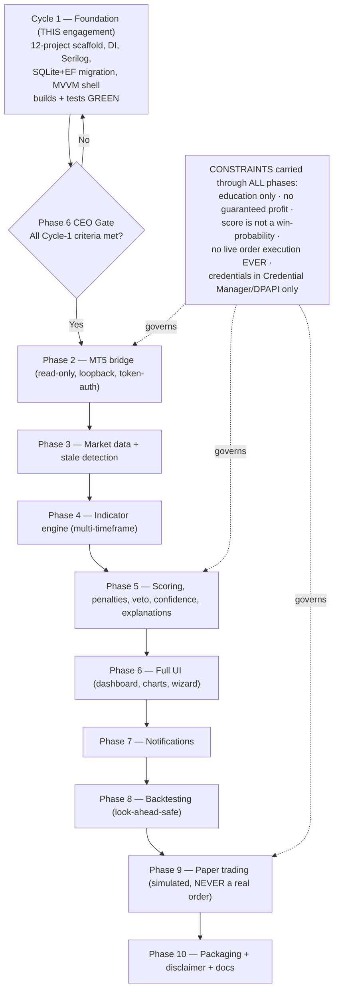

# Phase 1 — CEO Business Framing

**Project:** gold-signal-analyzer
**Cycle:** Cycle 1 — Foundation ONLY (spec §41 Phase 1)
**Author:** CEO, AI-Cognitive-Lab
**Date:** 2026-07-24
**Decision gate this feeds:** Phase 6 CEO sign-off checks this cycle against the Success Criteria below.

---

## 1. Business Objective

Gold Signal Analyzer gives one trader a private, desktop-only "second opinion" on XAU/USD gold: transparent Buy / Sell / Neutral signals scored 0–100 in which **every point of the score is explained and auditable**, computed from that trader's own genuine MT5 broker data — never mock prices, never a claim of guaranteed profit, and never a real order. The value is confidence-through-transparency: the tool tells the trader *why* conditions look bullish, bearish, or unclear, so they decide better. Foundation-first is the right sequencing because a tool that will emit trade signals on a live security and touch broker credentials must be built on a spine that is testable, auditable, and secure *before* any live data or scoring code exists. Cycle 1 buys us a clean, green, provably-structured skeleton so every later phase (MT5 bridge → data → indicators → scoring → UI → paper trading) slots into a seam that already enforces our honesty and security constraints, instead of retrofitting them under pressure.

---

## 2. Strategic Risks

**(a) Regulatory / liability risk — signals on a real security.**
The tool outputs directional calls on a tradeable instrument. If it ever reads as investment advice or implies assured returns, it creates personal and reputational liability. Mitigation is a hard product constraint carried from spec §1/§40/§43 and NFR-5: this is **educational decision-support only** — never claim guaranteed profit, never present a 0–100 score as a win-probability (a `75` is not "75% chance"), never label tick volume as world volume, never fabricate a market fact. The mandatory acknowledged disclaimer (FR-35) gates use. Foundation de-risks this by establishing the disclaimer text and the honesty discipline *before* a single score can be produced.

**(b) Crossing into live order execution.**
The single most dangerous failure mode is the tool moving from analysis to placing/modifying/closing real trades. This is scoped **out permanently, all cycles** (spec §1/§43, brief §2). The phased approach de-risks it structurally: Cycle 1 has no connectivity at all, and the MT5 seam (`IMarketDataProvider`, ADR-4) is defined as read-only market data — there is deliberately no order-execution capability anywhere in the roadmap to "accidentally" enable. Paper trading, when it arrives, simulates fills and never submits an MT5 order (FR-32).

**(c) Credential handling (Exness / MT5).**
Mishandled broker credentials are a real-money exposure. Mitigation (NFR-1/2/3): no secret ever in source, config, SQLite, logs, or GitHub; credentials only via Windows Credential Manager / DPAPI; the future local bridge binds loopback-only and is token-authenticated; account numbers masked, passwords never displayed. Foundation de-risks this by installing the masking helper, log-masking discipline, and `.gitignore` secret coverage now — so the codebase is incapable of leaking a secret before the code that would hold one is written. We also never store Exness Personal Area / email / OTP credentials at all (brief §2).

*Net:* Foundation-first converts three "trust me" risks into structural guarantees — the skeleton makes the safe path the only path.

---

## 3. Success Criteria — THIS Cycle (the Phase 6 gate)

Phase 6 approves Cycle 1 only if **all** of these are verifiably true (actual command output, not "should work"):

1. **Builds green.** `dotnet build` succeeds across the full solution.
2. **Tests green.** `dotnet test` passes, including the smoke tests below.
3. **All 12 projects present with correct dependency direction** (FR-1): Domain references nothing outward; Desktop→Application→Domain; no violation of the clean-architecture rule.
4. **DI resolves** (FR-2): a smoke test resolves the composition root with no missing-registration exception.
5. **Migration applies** (FR-4): EF Core initial migration applies to a scratch SQLite DB and creates the expected tables, asserted by a test.
6. **MVVM shell navigates** (FR-5, FR-29): the WPF shell switches active views across the spec §30 screens represented as navigable placeholders.
7. **Secrets hygiene** (NFR-1/7): no secret-bearing file path introduced; `bin/`/`obj/`/`*.user`/local-secrets gitignored; masking helper exists; no config field that would hold a password.
8. **Credible diagrammed roadmap** for spec phases 2–10 exists (documentation only, no code), with the honesty and no-live-execution constraints visibly carried forward.

A Cycle-1 requirement not traceable into the test suite is treated as **unverified** regardless of appearance (brief §7).

---

## 4. Success Criteria — Overall Product (forward-looking)

- Live XAU/USD signals are backed **only** by genuine MT5 data; signal generation pauses on stale/invalid data.
- Every signal carries a fully auditable breakdown — each contribution, penalty, veto, and confidence value visible and data-derived (no LLM-invented facts).
- Buy and Sell scores are independently computed (never `Sell = 100 − Buy`); no score is ever presented as a win-probability.
- Backtesting is look-ahead-safe; paper trading simulates execution and **never** submits a real order.
- Credentials remain in Credential Manager / DPAPI only; nothing sensitive reaches source, logs, or GitHub.

---

## 5. Business KPIs (personal analysis tool)

| KPI | Target | Why it matters |
|-----|--------|----------------|
| **Signal auditability** | 100% of score contributions explained/traceable | This is the core value proposition — transparency over black-box calls. |
| **Live orders placed** | **Zero, ever** | The permanent safety invariant; any non-zero value is a critical failure. |
| **Paper-trade journal completeness** | 100% of required §33 fields captured per simulated trade | Makes the tool's track record honest and reviewable. |
| **Credential leakage incidents** | Zero | No secret in source/logs/GitHub across all cycles. |

*(For Cycle 1, KPIs 2 and 4 are already meaningful — the correct value is zero, and the scaffold must not make either impossible to hold. KPIs 1 and 3 activate when scoring and paper-trading phases land.)*

---

## Cycle Roadmap — Foundation first, then phased build

---

## Final Decision

**APPROVED to proceed to Phase 2 (Architecture) for Cycle 1 — Foundation only.**

**Business justification:** Foundation-first is the disciplined, low-risk way to build a tool that will eventually emit signals on a live security and handle broker credentials. Building the auditable, secure, testable skeleton now — and proving it green — makes our three top risks (liability, live execution, credential leakage) structural non-events rather than things we hope to police later. The remaining nine phases are explicitly roadmap this cycle. This approval authorizes architecture and the scaffold only; it does not authorize any live-connectivity, scoring, or trading capability, and it re-affirms the permanent no-live-execution invariant.
