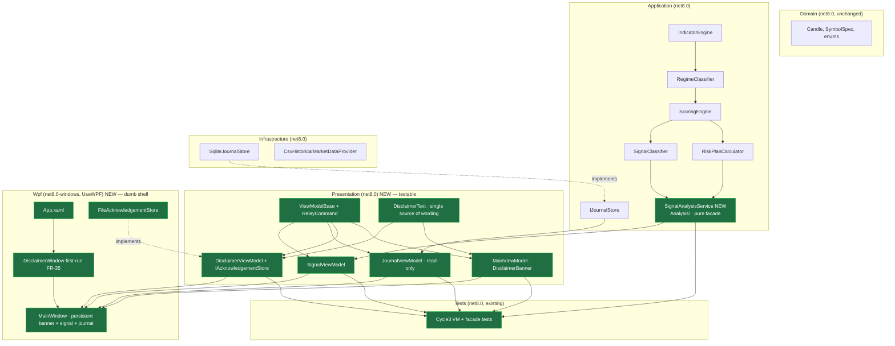

# Cycle 3 — Architecture Phase (UI / Dashboard Shell)

**Project:** gold-signal-analyzer · **Branch:** `agents/mt5-connectivity-bridge-gold-signal`
**Date:** 2026-07-30 · **Spec:** `cycle3-spec.md` · **Builds on:** Cycle 2 analytical core

## Decision 1 — WPF is retained (no switch)

The owner/CEO framing assumes WPF. I evaluated the fork and **keep WPF**:
- **Feasible here:** SDK 8.0.100 + `Microsoft.WindowsDesktop.App 8.0.0` runtime are
  installed; `net8.0-windows` + `<UseWPF>true</UseWPF>` builds on this box.
- **Right fit:** Windows-only desktop tool that sits next to a Windows MT5 terminal;
  a rich local desktop shell with a durable local SQLite journal is the natural home.
  A web/Blazor/MAUI pivot would add hosting/runtime surface for zero benefit to a
  single-user local tool and would fight the existing `SqliteJournalStore` design.

No reason found to overrule the WPF assumption. **Flag: none.**

## Decision 2 — Testable-VM / dumb-XAML split (the load-bearing choice)

The analytical core's entire discipline is command-output-verifiable logic. WPF
views cannot be instantiated headlessly in a plain `net8.0` test run, and the
existing `GoldSignalAnalyzer.Tests` project is `net8.0` (cross-platform), which
**cannot reference a `net8.0-windows` WPF project**. Resolution:

- **`GoldSignalAnalyzer.Presentation` (`net8.0`, NO `UseWPF`)** holds every
  view-model and all UI logic. `INotifyPropertyChanged` (System.ComponentModel) and
  `ICommand` (System.Windows.Input, shipped in the base `System.ObjectModel`
  assembly) are both available in plain `net8.0` — so full MVVM needs no WPF
  reference. The existing `net8.0` test project references Presentation and tests it
  headlessly.
- **`GoldSignalAnalyzer.Wpf` (`net8.0-windows`, `UseWPF=true`)** is a thin XAML shell
  (App + MainWindow + first-run DisclaimerWindow) whose code-behind only wires a
  view-model as `DataContext`. No logic to unit-test lives here.

This mirrors the project's own lessons-learned rule: "layer UI so its pure logic is
testable; ship a dumb shell."

## Decision 3 — A pure `SignalAnalysisService` facade in Application

There is currently **no composition point** that turns a candle series into a
`SignalClassification` — the stages (`IndicatorEngine` → `RegimeClassifier` →
`ScoringEngine` → `SignalClassifier`, plus `RiskPlanCalculator`) are each pure but
un-wired. The shell needs one call that yields "the current signal to display."
Add `Application/Analysis/SignalAnalysisService` — a pure, headless-reusable facade
that composes the existing stages and returns a `SignalAnalysis` DTO. It lives in
Application (not Presentation) because it is application orchestration, is fully
unit-testable, and could feed a future headless/notification path. It constructs a
**fresh** `SignalClassifier` per call (cooldown/dedupe is a notification concern,
Phase 7 — a display facade must be deterministic per FR-24), and builds a `RiskPlan`
only for an actionable signal.

## Component boundaries (diagram-first, Constitution §6)

## Project/reference plan
- **NEW `GoldSignalAnalyzer.Presentation`** (`net8.0`) → refs Domain, Application.
  (Does NOT ref Infrastructure — it binds to the `IJournalStore` interface, not the
  SQLite concretion, and NEVER refs `GoldSignalAnalyzer.Testing`.)
- **NEW `GoldSignalAnalyzer.Wpf`** (`net8.0-windows`, `UseWPF`, `OutputType=WinExe`)
  → refs Presentation, Application, Infrastructure (to construct `SqliteJournalStore`
  + `CsvHistoricalMarketDataProvider` at composition root only). Contains a
  `FileAcknowledgementStore : IAcknowledgementStore`.
- **`GoldSignalAnalyzer.Tests`** (existing `net8.0`) → add ref to Presentation.
- Add both new projects to `GoldSignalAnalyzer.sln`.

## Safety posture (unchanged, re-verified in Phase 5)
Presentation/Wpf add **no** order path (there is none in the graph to reach),
**no** secret member, **no** network egress. The shell is read-only display; even
paper open/close is out of scope this slice. INV-1…INV-5 preserved by construction.
