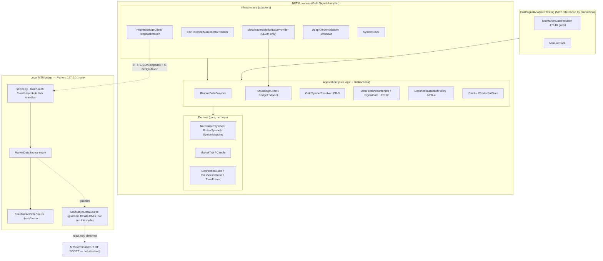
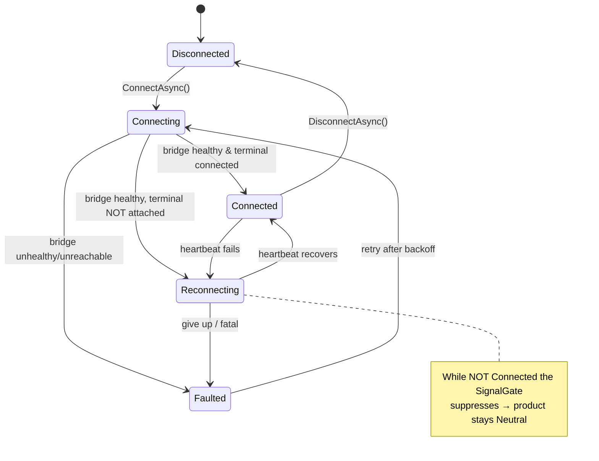
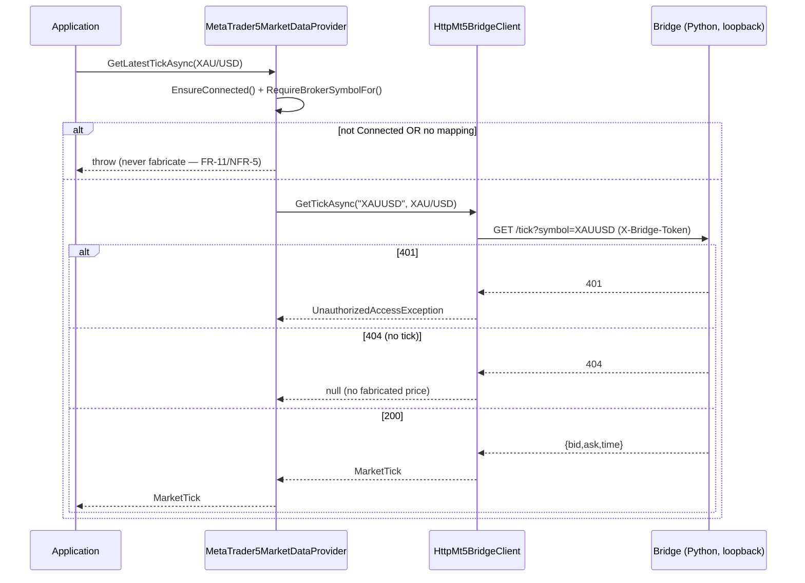
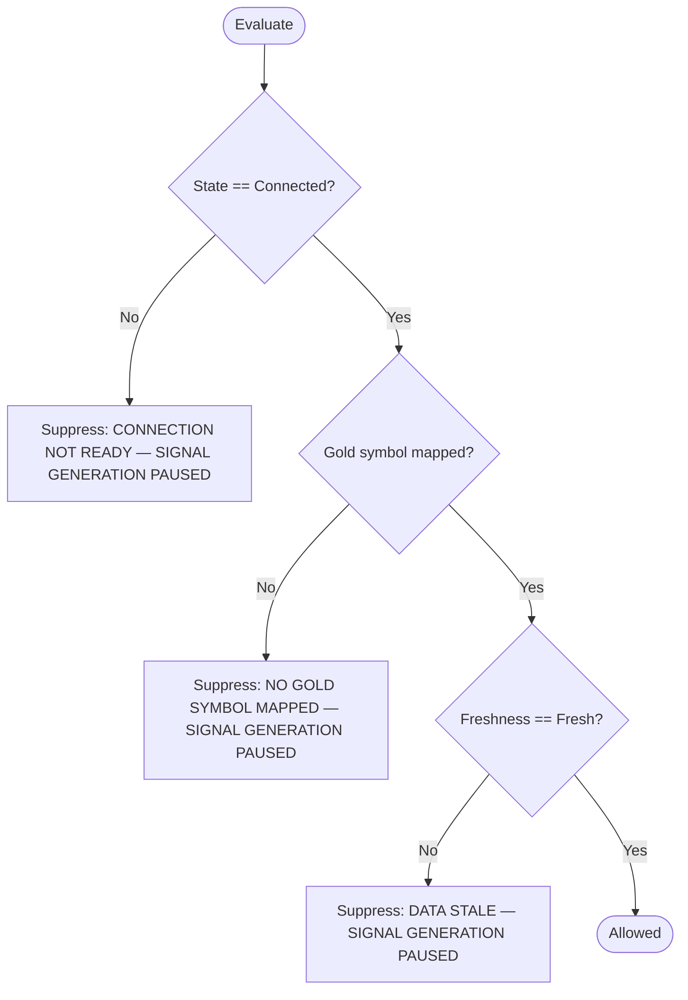

# Phase 2 — Architect: Architecture & Technology

## Technology choices
| Concern | Choice | Justification |
|---|---|---|
| Platform | **.NET 8, C# 12** | Windows desktop target; long-term-support; strong async + records + nullable. |
| Style | **Clean Architecture** (Domain ← Application ← Infrastructure) | Pure calc/logic isolated → unit-testable with no terminal (NFR-10). Dependencies point inward only. |
| Bridge | **Python + stdlib `http.server`**, localhost-only | The `MetaTrader5` package is Python-only and Windows-only; isolating it out-of-process keeps MT5 out of the .NET process and lets the terminal integration evolve independently (FR-8). Stdlib means the scaffold runs with zero pip installs. |
| Transport | **HTTP/JSON over loopback**, token header | Simple, debuggable, easy to authenticate and to bind to 127.0.0.1 (NFR-2). |
| Secrets | **Windows DPAPI** via `ICredentialStore` | OS-protected at rest; nothing in source/config (NFR-1). |
| Tests | **xUnit** (.NET) + **unittest** (Python) | Native, no extra infra; deterministic via injected clock/RNG. |

## Component / layer view

The only path to a real terminal runs **B4 → Terminal**, which is a guarded
seam not exercised this cycle. The .NET process never links MT5.

## Connect + heartbeat + reconnect state machine (NFR-4)

## Latest-tick request flow (happy path, live seam)

## Signal-gate veto decision (FR-12)

## Boundaries & invariants enforced structurally
- **Fabrication (R-1/NFR-5):** live seam throws unless Connected + mapped; freshness defaults to `Unknown` (= not fresh); future-dated ticks → `Stale`.
- **Secrets (R-2/NFR-1):** `Mt5ConnectionOptions` has no secret member (test-enforced); token only from env; DPAPI at rest.
- **Loopback (NFR-2):** `BridgeEndpoint` and `BridgeConfig` refuse non-loopback at construction.
- **Test-provider gating (FR-10/NFR-10):** `TestMarketDataProvider` lives in a separate assembly the production projects do not reference — physically absent from a Release build.

## Gate 1 (Spec Consistency) — PASS
Every FR has an ID + acceptance criteria (brief.md); no `[NEEDS CLARIFICATION]`
open; scope in/out explicit; CEO objective and this architecture agree.
→ Proceed to Plan Review Gate (Phase 2.5).
