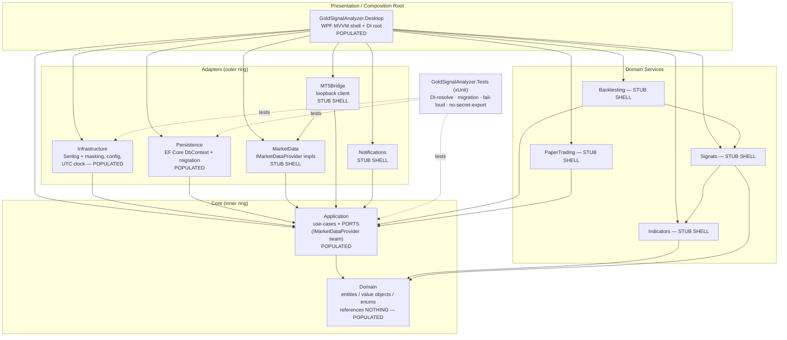
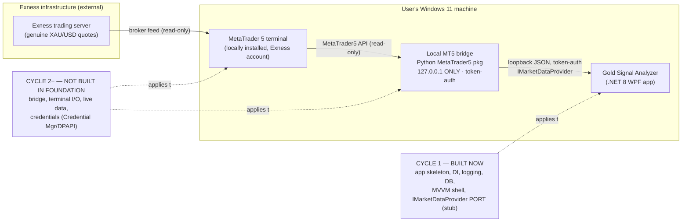
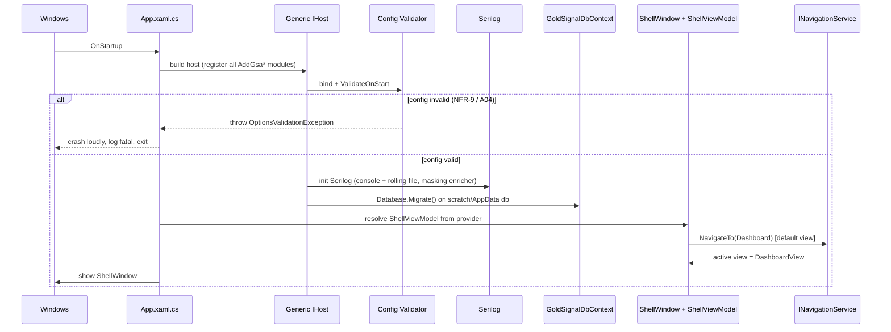

# Phase 2 — Architecture & Foundation Design

**Project:** gold-signal-analyzer
**Cycle:** Cycle 1 — Foundation ONLY (spec §41 Phase 1)
**Author:** Solution Architect, AI-Cognitive-Lab
**Date:** 2026-07-24
**Feeds:** Phase 3 (this is the design Phase 3 builds) and the Phase 6 CEO gate.
**Inputs read:** `brief.md` (IDed spec), `phase-1-ceo.md` (objective/risks/criteria), `.claude/protocols/secure-coding.md`, CLAUDE.md Constitution.

> **Scope boundary (non-negotiable, carried from CEO Phase 1):** Foundation is a **structural skeleton only**. Nothing here connects to a real MetaTrader 5 terminal, retrieves live data, computes a score, or places an order. All live-MT5 connectivity is **Cycle 2+**. Foundation's job is to make the safe, auditable, secret-free path the *only* path before a single line of scoring or connectivity code exists.

---

## 1. Architecture Overview

Gold Signal Analyzer is a single-user Windows 11 desktop application built on **clean (onion) architecture** with a strict inward-only dependency rule. The pure, auditable core (`Domain`) references nothing outward; every adapter (persistence, market data, bridge, notifications) points inward and is substitutable; the WPF `Desktop` project is the composition root that wires the graph via Microsoft DI.

Three cross-cutting invariants are structural in Foundation, not policed later:

| Invariant | Structural mechanism established in Foundation |
|---|---|
| **No secret ever persisted in plaintext** | Config model has *no* credential fields (Section 9); export serializes a whitelist DTO that has no secret property to emit; Serilog masking enricher scrubs sensitive property names; credential store is a deferred interface with **zero** Cycle-1 implementation. There is no file, config key, or log path in Foundation capable of holding a secret. |
| **No live order execution, ever** | The only outward integration seam is `IMarketDataProvider` — **read-only market data** (Section 8). There is deliberately no order/trade-execution port anywhere in the graph to "accidentally" implement. |
| **No fabricated data / honesty** | `Domain` is the only source of truth for values; market-data adapters are unimplemented in C1, so the app cannot present a fabricated price. Disclaimer text (FR-35) and the "score is not a probability" discipline are documented now. |

---

## 2. Solution Structure — `GoldSignalAnalyzer.sln`

Twelve production projects + one test project (13 total). All target `net8.0` except `Desktop` which targets `net8.0-windows` with `<UseWPF>true</UseWPF>`.

| # | Project | Layer | Cycle-1 state | Purpose |
|---|---------|-------|---------------|---------|
| 1 | **GoldSignalAnalyzer.Domain** | Core (innermost) | **POPULATED** | Pure entities, value objects, enums, domain exceptions. References **nothing**. `Candle`, `Tick`, `Timeframe`, `SymbolSpec`, `SignalDirection` (Buy/Sell/Neutral), `SymbolMapping`. |
| 2 | **GoldSignalAnalyzer.Application** | Core | **POPULATED** | Use-case orchestration + **ports** (interfaces). Home of `IMarketDataProvider` (§9 seam), repository interfaces, `IClock`, `ICredentialStore` (deferred interface). References Domain only. |
| 3 | **GoldSignalAnalyzer.Infrastructure** | Adapter (cross-cutting) | **POPULATED** | Serilog config + masking, config binding & fail-loud validation, `SystemClock : IClock` (UTC), config export service. Implements Application ports. |
| 4 | **GoldSignalAnalyzer.Persistence** | Adapter | **POPULATED** | EF Core `GoldSignalDbContext`, initial migration, representative tables, repository implementations. |
| 5 | **GoldSignalAnalyzer.MarketData** | Adapter | **STUB SHELL** | Will host `MetaTrader5MarketDataProvider`, `CsvHistoricalMarketDataProvider`, `TestMarketDataProvider` (FR-10). C1: project + a `NullMarketDataProvider` that safely reports "not connected" so DI resolves. **No terminal I/O.** |
| 6 | **GoldSignalAnalyzer.MT5Bridge** | Adapter | **STUB SHELL** | Will host the loopback bridge client (FR-8). C1: empty shell, no code that opens a socket. |
| 7 | **GoldSignalAnalyzer.Indicators** | Domain service | **STUB SHELL** | Pure indicator math (FR-13). C1: project + namespace only; references Domain. |
| 8 | **GoldSignalAnalyzer.Signals** | Domain service | **STUB SHELL** | Scoring/veto/confidence/explanation (FR-16..23). C1: shell; references Domain, Indicators. |
| 9 | **GoldSignalAnalyzer.Backtesting** | Domain service | **STUB SHELL** | Look-ahead-safe engine (FR-31). C1: shell. |
| 10 | **GoldSignalAnalyzer.PaperTrading** | Domain service | **STUB SHELL** | Simulated fills, never a real order (FR-32). C1: shell. |
| 11 | **GoldSignalAnalyzer.Notifications** | Adapter | **STUB SHELL** | Toast/sound/email/Telegram (FR-30). C1: shell; no channel tokens. |
| 12 | **GoldSignalAnalyzer.Desktop** | Presentation / composition root (outermost) | **POPULATED** | WPF MVVM shell, 17 placeholder views+VMs, navigation service, **DI composition root** in `App.xaml.cs`. References all projects for wiring. |
| 13 | **GoldSignalAnalyzer.Tests** | Test | **POPULATED** | xUnit smoke tests: DI resolves, migration applies to scratch DB, config fail-loud, config-export-emits-no-secret. |

**"Stub shell" contract:** the `.csproj` exists, is in the solution, compiles green, carries the correct inward references, and contains at most a namespace anchor / marker interface. It has **no** logic that connects, computes, or fabricates. This satisfies FR-1 ("all 12 projects, `dotnet build` succeeds") while honoring the "Foundation talks to nothing" constraint.

### 2.1 Exact project-to-project reference graph

Dependency direction is **inward only**. Domain is a sink (no outgoing references). Desktop is the composition root (may reference everything).

```
Domain            → (nothing)
Application       → Domain
Indicators        → Domain
Signals           → Domain, Indicators
Backtesting       → Domain, Application, Indicators, Signals
PaperTrading      → Domain, Application
MarketData        → Domain, Application
MT5Bridge         → Domain, Application, MarketData
Persistence       → Domain, Application
Notifications     → Domain, Application
Infrastructure    → Domain, Application
Desktop           → Application, Domain, Infrastructure, Persistence, MarketData,
                    MT5Bridge, Indicators, Signals, Backtesting, PaperTrading, Notifications
Tests             → Domain, Application, Infrastructure, Persistence, Indicators, Signals
```

**One-line summary:** `Domain ← Application ← {Indicators, Signals, Backtesting, PaperTrading, MarketData, MT5Bridge, Persistence, Notifications, Infrastructure} ← Desktop (composition root)`; Domain references nothing; Tests references the inner layers.

**Dependency-rule enforcement (FR-1 acceptance):** Domain's `.csproj` has zero `ProjectReference`. A smoke test (`ArchitectureTests`) reflects over `Domain`'s referenced assemblies and asserts none belong to the solution's outer projects, so a future accidental outward reference fails the suite rather than review.

### (a) Clean-architecture project/component relationship graph



*Every arrow points inward toward Domain. Domain has no outgoing arrow — the clean-architecture rule made visible.*

---

## 3. Data-Flow Architecture (spec §4) — connectivity deferred to Cycle 2+

The end-to-end data path is documented for the roadmap, but **only the rightmost box (the app skeleton) is built in Foundation.** Everything left of "local MT5 bridge" is Cycle 2+ and touches nothing now.

### (b) Data-flow: Exness → MT5 terminal → local bridge → Gold Signal Analyzer



**Reading of the diagram:** In Foundation, the `App` box exists with the `IMarketDataProvider` *port* defined but resolved to a safe `NullMarketDataProvider`. The two boxes to its left (`MetaTrader 5 terminal`, `local MT5 bridge`) and every arrow between the cloud and the app are **Cycle 2+ scope** — no code in Foundation opens a socket, loads the MetaTrader5 package, reads a terminal, or requests a credential. The data path is **read-only** at every hop; there is no return arrow that could carry an order.

---

## 4. DI Composition Root Design

**Location:** `GoldSignalAnalyzer.Desktop/App.xaml.cs`. The WPF `App` builds a `Microsoft.Extensions.Hosting` `IHost` (generic host) on `OnStartup`, exposes the `IServiceProvider`, resolves the shell window + shell VM, and shows it. On `OnExit` the host is disposed (flushes Serilog, closes DbContext).

**Registration style — configuration-driven, modular:** each project exposes an extension method so the composition root reads as a declarative manifest, and each layer owns its own registrations (thin root, no god-method):

```
services.AddGsaConfiguration(hostContext.Configuration)  // Infrastructure: bind + ValidateOnStart (fail loud)
        .AddGsaLogging()                                  // Infrastructure: Serilog + masking enricher
        .AddGsaInfrastructure()                           // IClock->SystemClock (UTC), ICredentialStore (deferred, not registered to a real impl)
        .AddGsaPersistence()                              // GoldSignalDbContext (SQLite), repositories, migrate-on-start
        .AddGsaMarketData()                               // IMarketDataProvider -> NullMarketDataProvider (C1 safe default)
        .AddGsaApplication()                              // use-case services (C1: minimal)
        .AddGsaPresentation();                            // INavigationService, shell VM, 17 placeholder VMs
```

Stub-shell projects (`Indicators`, `Signals`, `Backtesting`, `PaperTrading`, `MT5Bridge`, `Notifications`) expose `AddGsaXxx()` no-ops in C1 so the manifest is complete and Cycle-N wiring is a one-line edit, not a refactor.

**FR-2 acceptance:** `DiCompositionTests` builds the exact same service collection the app uses and calls `provider.GetRequiredService<ShellViewModel>()` (and each placeholder VM); a missing registration throws and fails the test.

### (c) DI bootstrap + navigation sequence



---

## 5. Serilog Configuration & Masking (FR-3, NFR-7, spec §39)

**Configured in:** `Infrastructure/Logging/LoggingConfigurator.cs`, invoked by `AddGsaLogging()`.

**Sinks:**
- **Console** — for dev runs.
- **Rolling file** — `Serilog.Sinks.File`, `rollingInterval: Day`, `retainedFileCountLimit: 14`, `fileSizeLimitBytes` cap.

**Log path (no secret introduced):** `%LOCALAPPDATA%\GoldSignalAnalyzer\logs\gsa-.log` (resolved via `Environment.GetFolderPath(SpecialFolder.LocalApplicationData)`). The directory is per-user, outside the repo, and is **not** committed. The path itself carries no secret. `.gitignore` also excludes `**/logs/` defensively.

**Masking approach (defense in depth — three layers):**
1. **No-secret-by-construction.** Nothing in Foundation *has* a secret to log. Credentials are a Cycle-2 concern living only in Windows Credential Manager/DPAPI. This is the primary control; masking is the backstop.
2. **`SensitiveDataMaskingEnricher : ILogEventEnricher`.** Scans each log event's properties against a **denylist of property names** (`password`, `pwd`, `token`, `apikey`, `secret`, `investorpassword`, `account`, `accountnumber`, `login`, `connectionstring`, `credential`, `path` for sensitive path keys) and replaces the value with `***MASKED***`. Registered globally so *every* sink inherits it — you cannot log to one sink un-masked.
3. **`MaskingHelper` static utility** for values that must appear partially (e.g., account number rendered as last-2 only: `******47`). Callers use `MaskingHelper.MaskAccount(x)` / `MaskingHelper.MaskPath(x)` rather than raw interpolation. The helper exists in C1 (FR-3 acceptance: "masking helper exists") even though nothing sensitive is logged yet.

**Structured event set (spec §39):** logging uses message templates with named properties (`{SymbolMapping}`, `{ConnectionMode}`, `{Timeframe}`) — never string concatenation — so future audit queries are structured. A11y to the auditor: the enricher denylist is a single reviewable list (A09).

**Secure-coding tie-in (A09):** "never log secrets, tokens, or passwords, even partially" — the enricher enforces this at write-time for the whole app, satisfying secure-by-construction rather than review-catch.

---

## 6. SQLite + EF Core (FR-4, NFR-9)

**DbContext:** `GoldSignalAnalyzer.Persistence/GoldSignalDbContext.cs`. EF Core 8 with `Microsoft.EntityFrameworkCore.Sqlite`.

**DB file location:** `%LOCALAPPDATA%\GoldSignalAnalyzer\gsa.db` (per-user AppData; created on first run). **Gitignored** — added to `.gitignore` (see Section 11). The DB is a local, single-user store; it never holds a credential (NFR-1: "no secret in SQLite plaintext"). Only non-sensitive settings, signal history, and paper-trade journals will ever live here.

**Representative tables this cycle (NOT the full §34 schema).** Enough to prove the migration mechanism, per the engagement's explicit "small set of representative tables + the migration mechanism is enough":

| Table | Purpose (C1 = schema stub) |
|---|---|
| `AppSettings` | key/value store for **non-secret** config only (theme, display TZ, chosen symbol mapping). |
| `SignalHistory` | stub columns for a future emitted signal (timestamp UTC, direction, buy/sell score, confidence) — proves a domain-shaped table. |
| `PaperTrade` | stub journal row (opened UTC, symbol, simulated entry/SL/target) — proves the FR-32 journal shape without any execution logic. |
| `__EFMigrationsHistory` | EF-managed; proves migration tracking. |

The full §34 table set + indexes + retention (FR-33) is **roadmap** (Phase 8/9). Representative tables carry no financial-secret columns and no password column anywhere.

**Migration approach:** `dotnet ef migrations add InitialCreate` produces `Migrations/InitialCreate.cs` (checked in). At startup `AddGsaPersistence()` runs `context.Database.Migrate()` against the AppData db (or a scratch path in tests). Design-time factory (`GoldSignalDbContextFactory : IDesignTimeDbContextFactory`) lets the EF CLI create migrations without booting WPF.

**FR-4 acceptance test:** `MigrationTests` points the context at a scratch temp-file SQLite db, calls `Migrate()`, and asserts the four tables exist via `sqlite_master`. Scratch db is deleted on dispose.

**Fail-loud config validation (NFR-9, secure-coding A04):** config is bound with the Options pattern; `IValidateOptions<AppConfiguration>` + `.ValidateOnStart()` runs at host build. Invalid config (bad path, out-of-range threshold, missing required non-secret field) throws `OptionsValidationException` and the app crashes at startup with a fatal log — never fails silently at request time. `ConfigValidationTests` asserts an invalid config throws before the shell shows.

---

## 7. WPF MVVM Shell (FR-5, FR-29)

**MVVM approach:** **CommunityToolkit.Mvvm** (see ADR-5). Source-generator `[ObservableProperty]` and `[RelayCommand]` remove hand-written `INotifyPropertyChanged`/`ICommand` boilerplate; MIT-licensed, Microsoft-maintained, zero heavyweight framework lock-in — aligns with the "thin, testable, no assumptions" principle.

**Components:**
- **`ShellWindow.xaml`** — the single top-level window: a navigation rail/menu bound to the 17 screens + a `ContentControl` whose content is the active view.
- **`ShellViewModel`** — holds `CurrentViewModel`, exposes `NavigateCommand`, lists the nav items.
- **`ViewModelBase`** — inherits `ObservableObject`; adds `Title`, `IsBusy`, and an `OnNavigatedTo()` hook.
- **`INavigationService` / `NavigationService`** (Presentation abstraction, lives in Desktop): `NavigateTo<TViewModel>()` resolves the target VM from the DI container and swaps `CurrentViewModel`. VMs stay testable (they depend on the abstraction, not on WPF navigation). A `DataTemplate` map (VM→View) in `App.xaml` lets WPF render the right view for the current VM.

**The 17 §30 placeholder screens** — each is a navigable `View` + `ViewModel` pair registered in DI, reachable from the shell. Titles below map to the source-spec screen intent (FR-29: "all 17 screens exist and are reachable"); byte-exact §30 titles are reconciled at build against the source spec, but the **count and navigability are locked at 17 now**:

| # | Screen (placeholder) | Traces to |
|---|---|---|
| 1 | Dashboard / Home | FR-26, §27 |
| 2 | Connection Wizard (MT5 setup) | FR-7, §5 |
| 3 | Symbol Selection & Mapping | FR-9, §7 |
| 4 | Advanced Chart | FR-27, §28 |
| 5 | Indicator Panel | FR-28, §29 |
| 6 | Signal Detail / Explanation | FR-23, §24 |
| 7 | Market Regime | FR-16, §16 |
| 8 | Risk Plan | FR-24, §25 |
| 9 | News / Economic Calendar Filter | FR-25, §26 |
| 10 | Notifications Center | FR-30, §31 |
| 11 | Backtesting Setup | FR-31, §32 |
| 12 | Backtest Results / Report | FR-31, §32 |
| 13 | Paper Trading | FR-32, §33 |
| 14 | Trade Journal | FR-32, §33 |
| 15 | Settings | FR-6, §37 |
| 16 | Diagnostics / Logs export | FR-34, §41 |
| 17 | Disclaimer / About | FR-35, §40 |

Each placeholder view shows its title + a "roadmap — not yet implemented (Cycle N)" banner so the shell is honestly demoable without pretending capability exists. **FR-5/FR-29 acceptance:** `NavigationTests` iterates all 17 VM types, resolves each from DI, navigates, and asserts `CurrentViewModel` changes to the requested type.

---

## 8. `IMarketDataProvider` Seam (spec §9)

**Location:** `GoldSignalAnalyzer.Application/Ports/IMarketDataProvider.cs` — a **port in the Application core**, so a Cycle-2 adapter (`MetaTrader5MarketDataProvider` in the MarketData project) implements it without touching Domain (FR-10). It returns **Domain types only** and is **read-only** (no order/trade method exists on the seam — the no-live-execution invariant made structural).

Representative signature landed as an interface stub this cycle (faithful to §9 intent — retrieve genuine live/historical fields of §8, support the three providers of FR-10):

```csharp
public interface IMarketDataProvider
{
    string Name { get; }
    bool IsAvailableInProduction { get; }          // TestMarketDataProvider => false (FR-10 gate)
    Task<ConnectionStatus> ConnectAsync(CancellationToken ct);
    Task<IReadOnlyList<SymbolInfo>> GetAvailableSymbolsAsync(CancellationToken ct);   // FR-9 detection
    Task<SymbolSpec> GetSymbolSpecAsync(string symbol, CancellationToken ct);         // FR-24 real contract specs
    Task<IReadOnlyList<Candle>> GetCandlesAsync(string symbol, Timeframe tf, int count, CancellationToken ct);
    Task<Tick> GetLatestTickAsync(string symbol, CancellationToken ct);              // §8 live fields
    IObservable<Tick> SubscribeTicks(string symbol);
    Task DisconnectAsync(CancellationToken ct);
}
```

> **[NEEDS CLARIFICATION — resolve at Cycle-2 intake, non-blocking for C1]** The byte-exact method list/return shape of source-spec **§9** is not reproduced verbatim in the brief. The signature above is a faithful representation; the first task of Cycle 2 reconciles it against the literal §9 text before the bridge adapter is written. This is deliberately a *stub interface*, so reconciliation is an edit to one file in the Application core, touching no Domain type.

**Cycle-1 implementation:** `MarketData/NullMarketDataProvider.cs` — implements the port, `IsAvailableInProduction => true`, `ConnectAsync` returns `ConnectionStatus.NotConnected`, data methods throw `NotConnectedException` (or return empty). It lets DI resolve and the shell run **without talking to any terminal**. There is **no** `MetaTrader5MarketDataProvider` code in Foundation.

---

## 9. Configuration Model (spec §37) — structurally cannot emit secrets (FR-6, NFR-1)

**Location:** `Application/Configuration/AppConfiguration.cs` (the shape) bound in Infrastructure.

```
AppConfiguration
 ├─ General          : DisplayTimeZone, Theme, StartupScreen
 ├─ Connection       : Mt5TerminalPath (path, NON-secret), ConnectionMode (A|B enum), ServerName (NON-secret)
 ├─ Symbols          : PreferredGoldSymbol, SymbolMappings[]
 ├─ Timeframes       : EnabledTimeframes[]
 ├─ Scoring          : BuyThreshold, SellThreshold, WinningMargin  (validated ranges)
 ├─ Notifications    : ToastEnabled, SoundEnabled, EmailEnabled, TelegramEnabled  (bool toggles ONLY — NO tokens/addresses)
 └─ DataRetention    : SignalHistoryDays, JournalRetentionDays
```

**The model has no credential field by design.** There is no `Password`, `Token`, `ApiKey`, `InvestorPassword`, `TelegramBotToken`, or `EmailPassword` property anywhere. Channel *toggles* are booleans; the actual channel secrets (Cycle 2) live only in Windows Credential Manager/DPAPI, retrieved at send-time via `ICredentialStore`, never bound into config. `Mt5TerminalPath` and `ServerName` are non-secret operational values (spec §44 explicitly classifies these as non-secret environment inputs).

**Export (FR-6, NFR-1):** `Infrastructure/Configuration/ConfigExportService.cs` serializes a dedicated `ConfigExportDto` — a whitelist projection of `AppConfiguration`. Because neither `AppConfiguration` nor `ConfigExportDto` contains a secret property, **export is structurally incapable of emitting one**; there is nothing to leak, not merely a filter that could be misconfigured. Import validates via the same fail-loud validator. **Test (`ConfigExportTests`):** reflect over `ConfigExportDto` and assert no property name matches the secret denylist — a future secret-bearing property added to the DTO fails the build's test gate.

---

## 10. Architecture Decision Records

### ADR-1 — WPF + MVVM over WinUI 3 / Avalonia
**Status:** Accepted. **Context:** Windows-11-only desktop app that will host advanced financial charts and overlays (FR-27/§28). **Decision:** WPF on .NET 8. **Alternatives:** WinUI 3 (newer but thinner ecosystem for the mature charting/indicator libraries this app needs; more churn); Avalonia (cross-platform — unneeded, target is Windows-only, adds abstraction cost). **Consequences:** mature tooling, broad charting-library compatibility, large MVVM knowledge base; Windows-only (acceptable — the app requires a locally installed Windows MT5 terminal anyway).

### ADR-2 — Clean architecture; Domain has zero outward references
**Status:** Accepted. **Context:** the app emits auditable signals on a real security and must be unit-testable without a live terminal (NFR-6, NFR-10). **Decision:** onion architecture, strict inward dependency rule, ports in Application, adapters outward, enforced by an `ArchitectureTests` reflection test. **Alternatives:** layered-with-leaks / MVVM-only single project (fast but untestable core, retrofitting audit/security later under pressure — exactly what CEO Phase 1 warns against). **Consequences:** more projects and wiring boilerplate; justified by the audit/traceability/testability requirement — the pure core can be exercised on fixed datasets with no terminal.

### ADR-3 — SQLite + EF Core over LiteDB / raw SQLite
**Status:** Accepted. **Context:** single-user local store for settings, signal history, paper-trade journals (§34). **Decision:** SQLite via EF Core 8 with migrations, db in per-user AppData, no secret columns. **Alternatives:** LiteDB / raw ADO SQLite (rejected — lose EF migration tooling, design-time factory, and the testable `Migrate()`-to-scratch-db pattern that gives Cycle-1 real command-output evidence). **Consequences:** EF dependency + migration discipline; gain versioned schema evolution and a clean smoke-test surface.

### ADR-4 — MT5 bridge and all live connectivity deferred to Cycle 2
**Status:** Accepted. **Context:** Foundation must not connect to a terminal, must not fabricate data, must not enable order execution. **Decision:** define the read-only `IMarketDataProvider` port now; implement it only as `NullMarketDataProvider`; leave `MarketData`/`MT5Bridge` as stub shells; no MetaTrader5 package reference, no socket, no credential code in Foundation. **Alternatives:** build a "quick mock provider" that returns fake candles (rejected — violates the no-fabricated-data honesty invariant NFR-5 and could be mistaken for real data). **Consequences:** Cycle 1 has no market data and honestly shows "not connected"; the bridge slots into an existing seam in Cycle 2 without touching Domain.

### ADR-5 — CommunityToolkit.Mvvm over Prism / hand-rolled INPC
**Status:** Accepted. **Context:** need MVVM binding + commands with minimal boilerplate and no heavyweight framework. **Decision:** `CommunityToolkit.Mvvm` (`ObservableObject`, `[ObservableProperty]`, `[RelayCommand]`). **Alternatives:** Prism (heavier, opinionated DI/region model — more than a single-window shell needs); hand-rolled `INotifyPropertyChanged` (repetitive, error-prone). **Consequences:** MIT, Microsoft-maintained, source-generator based (no runtime reflection cost), thin dependency; VMs stay POCO-testable.

### ADR-6 — Credentials only in Windows Credential Manager / DPAPI; no secret path in Foundation
**Status:** Accepted. **Context:** NFR-1/2/3 and the CEO's credential-leakage risk. **Decision:** `ICredentialStore` is defined as a **deferred interface with no Cycle-1 implementation**; the config model has no secret field; export cannot emit a secret; the DB and logs have no secret column/path; `.gitignore` covers local-secret and build paths. **Alternatives:** appsettings/env-file secret (rejected — the exact class of mistake that bit doh-flight-checker/market-compass). **Consequences:** Foundation is *incapable* of persisting a plaintext secret; Cycle 2 implements DPAPI/Credential Manager behind the deferred interface.

---

## 11. Security & Secrets Hygiene for the Scaffold (NFR-1/7, CEO risk c)

`.gitignore` (repo root already covers `.env*`, `*.pem`, `*.key`, `secrets.json`) must gain a **.NET section** in Phase 3, no secret path introduced:

```
# === .NET build artefacts ===
bin/
obj/
*.user
*.suo
[Dd]ebug/
[Rr]elease/
# === Gold Signal Analyzer local runtime (per-user, never committed) ===
**/logs/
*.db
*.db-shm
*.db-wal
```

The actual `gsa.db` and logs live under `%LOCALAPPDATA%`, outside the repo tree, so even without the glob they cannot be committed; the glob is defense in depth. **Security test (brief §6):** grep the scaffold + `.gitignore` — no secret-bearing file path; `bin/`/`obj/`/`*.user`/db/logs gitignored; no `appsettings` field that would hold a password (there is no `appsettings` secret section; config binding uses only the non-secret `AppConfiguration`).

---

## 12. Cycle-1 Traceability Map

| Req | Design artefact | Verifying test |
|---|---|---|
| FR-1 | Section 2.1 reference graph; Domain zero-refs | `ArchitectureTests` (Domain outward-ref assertion) |
| FR-2 | Section 4 composition root | `DiCompositionTests` (resolve ShellVM + all VMs) |
| FR-3 | Section 5 Serilog + masking enricher + helper | `LoggingTests` (file written, masking helper masks) |
| FR-4 | Section 6 DbContext + InitialCreate migration | `MigrationTests` (apply to scratch db, tables exist) |
| FR-5 / FR-29 | Section 7 shell + nav + 17 VMs | `NavigationTests` (all 17 resolve + navigate) |
| FR-6 (stub) | Section 9 config model + export DTO | `ConfigExportTests` (no secret property) |
| NFR-9 | Section 6 fail-loud `ValidateOnStart` | `ConfigValidationTests` (invalid config throws at startup) |
| NFR-1/7 | Sections 5, 9, 11 no-secret-by-construction | `ConfigExportTests` + `.gitignore` grep |

---

## 13. Roadmap (documentation only — spec Phases 2–10, NO code in Foundation)

All live-MT5 connectivity is deferred; nothing in Foundation talks to a real terminal. Each phase plugs into a seam Foundation already defines.

### Phase 2 — MT5 Bridge (spec §5–6)
**Scope:** Local bridge (Python MetaTrader5 pkg + a loopback service) bound to `127.0.0.1` only, token-authenticated, with heartbeat + auto-reconnect; the .NET `MT5BridgeClient` in the `MT5Bridge` project. **Seams:** implements/feeds `IMarketDataProvider` (Application port); credentials via `ICredentialStore` (DPAPI/Credential Manager). **Top risk:** exposing the bridge beyond loopback or accepting unauthenticated calls — mitigated by loopback binding + token auth, verified by a rejects-unauthenticated test.

### Phase 3 — Market Data (spec §8–10, §13)
**Scope:** `MetaTrader5MarketDataProvider`, candle building from ticks, UTC normalization, freshness/stale detection and the §10 veto ("DATA STALE — SIGNAL GENERATION PAUSED"). **Seams:** the `IMarketDataProvider` port; `IClock` (UTC); `SignalHistory` retention. **Top risk:** presenting stale/partial data as live — mitigated by stale-detection veto and "no mock in live mode" gating.

### Phase 4 — Indicators (spec §14–15)
**Scope:** populate the `Indicators` project — trend/momentum/volatility/volume indicators computed locally from candles, volume type labelled (real/tick/estimated/unavailable), multi-timeframe. **Seams:** consumes Domain `Candle`; pure functions unit-tested on fixed datasets (NFR-10). **Top risk:** labelling tick volume as world volume (NFR-5) — mitigated by an explicit volume-type enum on every indicator output.

### Phase 5 — Scoring (spec §16–24)
**Scope:** populate `Signals` — market-regime classification, independent Buy/Sell scores (never `Sell = 100 − Buy`), category caps, penalties, hard vetoes, confidence, deterministic explanation. **Seams:** consumes `Indicators`; writes `SignalHistory`. **Top risk:** a score read as a win-probability, or an LLM-invented explanation — mitigated by data-derived-only explanations and a "score ≠ probability" UI/format rule; independence proven by unit test.

### Phase 6 — UI (spec §27–30)
**Scope:** flesh out the 17 placeholder screens into the real dashboard, advanced chart with overlays, indicator panel, connection wizard. **Seams:** the MVVM shell, `INavigationService`, VM-per-screen already in place. **Top risk:** showing account balance/number unmasked or a password field — mitigated by the masking helper (already built) and "no password field anywhere" rule.

### Phase 7 — Notifications (spec §31)
**Scope:** populate `Notifications` — toast + optional sound/email/Telegram, gated by §31 conditions with dedupe + cooldown. **Seams:** channel secrets via `ICredentialStore` only; config toggles already modelled (no tokens in config). **Top risk:** a channel token landing in config/logs — mitigated by store-only secrets and the masking enricher.

### Phase 8 — Backtesting (spec §32)
**Scope:** populate `Backtesting` — chronological, look-ahead-safe engine modelling spread/slippage/commission, full metric set, train/validation/out-of-sample + walk-forward, overfitting warning. **Seams:** consumes `Indicators`/`Signals`; reads historical data via `CsvHistoricalMarketDataProvider`. **Top risk:** look-ahead leakage (future-candle access) — mitigated by a design that only exposes closed candles up to the simulated "now," verified by a look-ahead unit test.

### Phase 9 — Paper Trading (spec §33)
**Scope:** populate `PaperTrading` — genuine live data in, **simulated** execution, full journal (§33 fields), **never** submits an MT5 order. **Seams:** `IMarketDataProvider` (read-only — there is no order port to call); `PaperTrade` journal table. **Top risk:** any path to a real order — structurally impossible: the seam is read-only and no execution capability exists anywhere; verified by "no MT5 order submitted" test.

### Phase 10 — Packaging (spec §41 Phase 10, §42)
**Scope:** MSIX/installer, update mechanism, diagnostic export, user guide; disclaimer acknowledgement gate (FR-35, §40). **Seams:** Diagnostics/Disclaimer screens already exist as placeholders; log/config export services in place. **Top risk:** shipping without the acknowledged disclaimer or leaking diagnostics containing a path — mitigated by the mandatory disclaimer gate and the masking-aware diagnostic export.

---

## 14. Design Risks for the Plan-Review Gate to Scrutinize

1. **`IMarketDataProvider` §9 signature is a faithful reconstruction, not verbatim** (Section 8 `[NEEDS CLARIFICATION]`) — the brief doesn't reproduce literal §9. Landed as a stub interface so reconciliation is a one-file edit in Cycle 2; review should confirm this is acceptable rather than blocking, given C1 builds nothing against it.
2. **17-screen list titles are intent-mapped, not verbatim §30** — the count (17) and navigability are locked; exact titles reconcile at build. Review should confirm the 17 chosen screens cover every §27–§41 UI surface without gaps.
3. **Desktop-as-composition-root references every project** — legitimate for a composition root, but it means the dependency-rule test must target *Domain/Application*, not Desktop. Confirm `ArchitectureTests` scopes the assertion correctly so the root's broad references don't mask a real inward-rule violation elsewhere.
4. **Stub-shell projects add build surface with no behavior** — six empty projects could rot. Review should confirm each carries at least a marker + `AddGsaXxx()` no-op so the composition manifest stays complete and Cycle-N wiring is additive.
5. **Migrate-on-startup against AppData** — convenient for a single-user app, but review should confirm the scratch-db path override for tests is airtight so `MigrationTests` never touches the real user db.

---

*End of Phase 2 — Architecture & Foundation Design. This authorizes the Phase 3 build of the scaffold only; it does not authorize live connectivity, scoring, or trading, and re-affirms the permanent no-live-execution invariant.*
