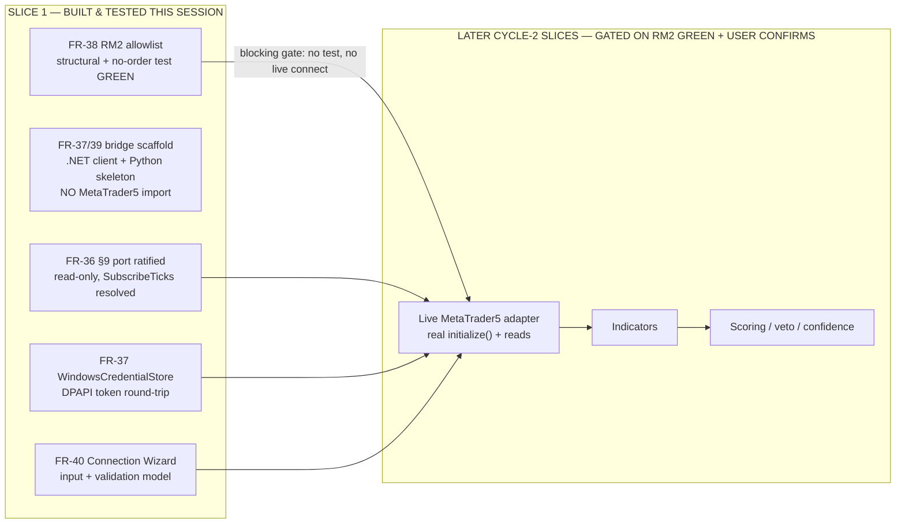
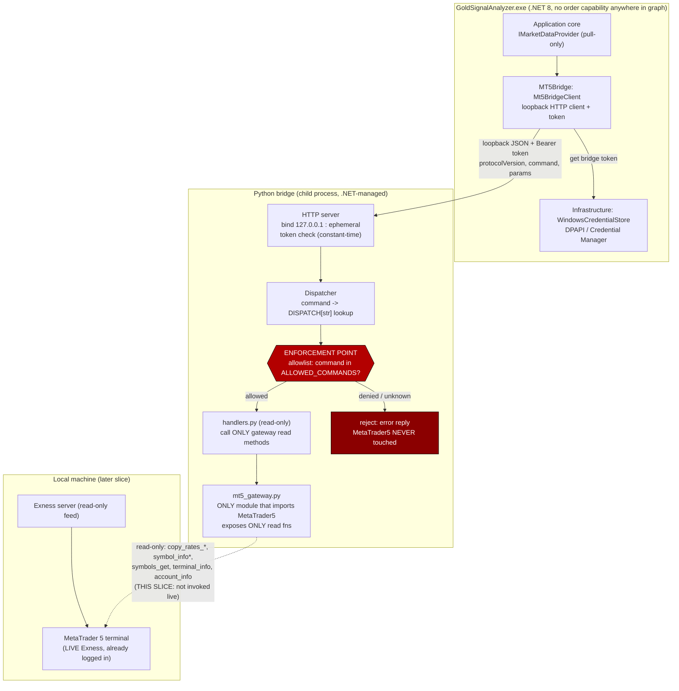
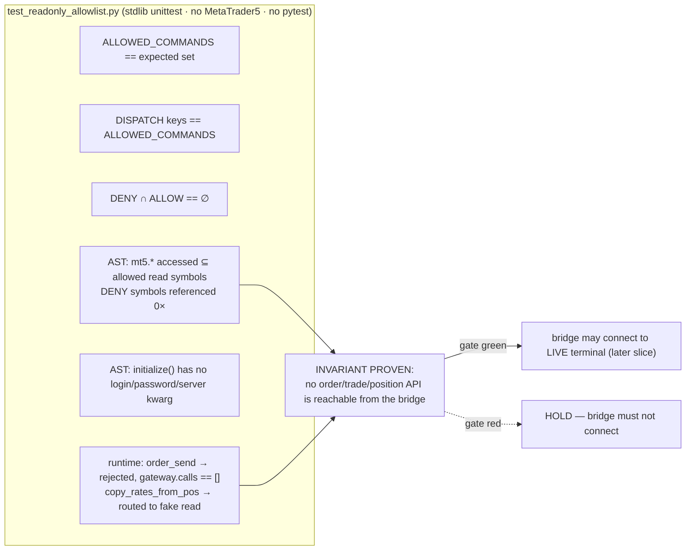

# Phase 2 — Architecture · Cycle 2, Slice 1 (Read-Only Bridge Seam)

**Project:** gold-signal-analyzer
**Cycle:** Cycle 2 — first buildable slice. Cycle 1 (Foundation) is CEO-approved and CLOSED; this document does **not** re-architect the foundation.
**Author:** Solution Architect, AI-Cognitive-Lab
**Date:** 2026-07-24
**Feeds:** Phase 3 (build) and the Phase 4/5/6 gates.
**Inputs read (verbatim):** `phase-6-ceo.md` (binding Cycle-2 conditions), `brief.md` (FR/NFR IDs), `phase-2-arch.md` §8 + §14 (the seam + the open `[NEEDS CLARIFICATION]`), and the on-disk ground truth: `IMarketDataProvider.cs`, `ICredentialStore.cs`, `AppConfiguration.cs`, `ConnectionMode.cs`, `SecretDenylist.cs`, `MT5Bridge/Marker.cs`, `MT5Bridge/DependencyInjection.cs`.

> **LIVE-ACCOUNT RISK BANNER (read this first).** The user's binding choice is a **LIVE / REAL Exness account** (XAUUSD; H1/H4/M15/D1). The Python MT5 bridge is `order_send`-capable and is **NOT** bound by the .NET no-order-port graph. **RM2 — a structurally-enforced read-only allowlist plus a passing no-order-API test — is the literal precondition for the bridge to touch this account at all.** It is not a should-fix, not a backlog item, not a review-catch. In this slice the bridge scaffold is built and the allowlist is enforced and tested, but the bridge does **NOT** call a live terminal. The first live `initialize()` is a later slice, gated on the allowlist test being green and on explicit user confirmations (§9 literal text, account inputs, go-ahead).

---

## 1. Cycle-2 scope, sequencing, and slice boundary

### 1.1 This slice (Cycle 2 — Slice 1: "Read-Only Bridge Seam")

Confirmed as the correct, safe, buildable slice for this session:

| # | Item | New req | Rationale for inclusion now |
|---|------|---------|------------------------------|
| a | **§9 `IMarketDataProvider` reconciliation** — close the open `[NEEDS CLARIFICATION]`, ratify the read-only shape, resolve `SubscribeTicks`. | FR-36 | CEO's single named "first Cycle-2 step." One-file edit in the Application core; nothing was built against its exact shape, so it is the correct low-risk first move before the bridge is designed on top of it. |
| b | **MT5 bridge scaffold** — the .NET `Mt5BridgeClient` + the Python bridge skeleton (transport, handshake, dispatcher), importing **no** MetaTrader5 package. | FR-37, FR-39 | The physical boundary where RM2 is enforced. Must exist before the allowlist can be structural rather than aspirational. |
| c | **RM2 read-only allowlist + no-order-API test** — structural enforcement in the bridge dispatcher/gateway, plus a stdlib-`unittest` test that asserts NO order/trade API is reachable, **without importing MetaTrader5**. | FR-38 | **The blocking gate.** Per `phase-6-ceo.md` condition #1: no allowlist test, no bridge. |
| d | **`WindowsCredentialStore` (DPAPI-backed `ICredentialStore`) + bridge-token flow** — replaces the throwing `NotImplementedCredentialStore`. | FR-37 (RM1/RM3) | The bridge token has nowhere safe to live otherwise. RM1/RM3 are binding for the bridge. DPAPI round-trips headless on Windows, so it yields real command-output evidence this session. |
| e | **Connection Wizard input + validation model** (view-model + validators; non-secret inputs only). | FR-40 | Included: it defines *what the bridge is allowed to be told* (non-secret path/server/account) and hard-blocks any password field at the model layer. It is the RM1/RM3 intake surface. UI polish deferred. |

### 1.2 Explicitly deferred to later Cycle-2 slices (with reasons)

| Deferred | Why it is NOT in this slice |
|---|---|
| **Live `MetaTrader5MarketDataProvider`** (real `mt5.initialize()` + real reads against a terminal) | Environment has **no** MetaTrader5 package and cannot install one (needs a live terminal). It is untestable here, and it must not touch the LIVE account until the RM2 gate is green and user confirmations land. The real gateway *source* is written and its read-only property is source-tested; the *live invocation* is next slice. |
| **Indicators (FR-13/FR-14)** | Consume real candles; strictly downstream of a working read path. No value before data flows. |
| **Scoring / regime / veto / confidence / explanation (FR-16..FR-24)** | Downstream of indicators. Independent-Buy/Sell and audit rules are Cycle-2 later slices. |
| **Live symbol detection (FR-9 live half)** | Needs a terminal to enumerate broker variants. The wizard's mapping *model* lands (FR-40); the live `symbols_get` call is next slice. |
| **Freshness/stale veto (FR-12), reconnect loop wiring (NFR-4 runtime)** | Depend on a live tick stream. The *contract* (health/heartbeat command, status observation) is designed here; the runtime loop lands with the live adapter. |

**Slice boundary in one line:** *wire and prove the read-only seam and its guard; do not connect to the live account yet.*



### 1.3 Spec-first — new IDed requirements for this slice

Numbering extends the brief (FR-1..FR-35, NFR-1..NFR-10). RM-gate IDs (RM1/RM2/RM3) are the Cycle-1 risk register carried in.

| ID | Requirement | Priority | Traces | Acceptance criteria (IDed) |
|----|-------------|----------|--------|----------------------------|
| **FR-36** | Reconcile `IMarketDataProvider` to the read-only §9 shape; close the `[NEEDS CLARIFICATION]`; resolve `SubscribeTicks`. | Must | phase-2 §8, FR-10, RM2 | **AC-36.1** Port exposes zero order/trade/position method (structural read-only). **AC-36.2** `SubscribeTicks` is **absent** from the port (see §2 decision); a reflection test asserts no member returns `IObservable<>`/`IAsyncEnumerable<>` and no member name matches `/order|trade|position|send|modify|close|deal/i`. **AC-36.3** The `[NEEDS CLARIFICATION]` marker is replaced by a resolved note carrying the confirm-with-user flag for byte-exact §9. |
| **FR-37** | MT5 bridge scaffold: .NET `Mt5BridgeClient` (loopback HTTP client, token auth) + Python bridge skeleton (child process, loopback HTTP server, token check), token stored only via `ICredentialStore`/DPAPI. | Must | FR-8, NFR-1, NFR-2, RM1, RM3 | **AC-37.1** `Mt5BridgeClient` implements `IMarketDataProvider`; DI resolves it; unit tests run with a fake transport, no live terminal. **AC-37.2** Bridge binds `127.0.0.1` on an OS-assigned ephemeral port; a test asserts the bind address is never `0.0.0.0`/a public interface. **AC-37.3** Every bridge request carries a bearer token sourced from `ICredentialStore`; an unauthenticated/wrong-token request is rejected (401), asserted by a test against the Python server with a fake gateway. **AC-37.4** `WindowsCredentialStore` round-trips a secret via DPAPI (`Set`→`Get`→`Delete`); the token never appears in config, DB, args, or logs (denylist gains `bridgetoken`). |
| **FR-38** | RM2 read-only allowlist: the bridge dispatcher can **structurally** reach only allowlisted read functions; a no-order-API test asserts no order/trade/position API is reachable, **without importing MetaTrader5**. | Must (**blocking gate**) | phase-6-ceo cond#1, NFR-2, RM2 | **AC-38.1** `ALLOWED_COMMANDS` equals the exact expected read-only set (§4.2); test locks the set. **AC-38.2** `DISPATCH` keys ≡ `ALLOWED_COMMANDS` (no orphan handler, no unhandled command). **AC-38.3** Intersection of the DENY set with `ALLOWED_COMMANDS` and with `DISPATCH` keys is empty. **AC-38.4** AST inspection of `mt5_gateway.py` proves the set of `mt5.*` attributes accessed ⊆ the allowed SDK-symbol set; every denied SDK symbol (`order_send`, `order_check`, `order_calc_margin`, `order_calc_profit`, `positions_get`, `positions_total`, `history_orders_get`, `history_deals_get`, …) is accessed **zero** times. **AC-38.5** AST inspection proves the `initialize(...)` call site passes no `login`/`password`/`server` keyword. **AC-38.6** Runtime dispatch test: with a fake gateway, `command="order_send"` returns an error and the fake gateway receives **no** call; `command="copy_rates_from_pos"` routes to the fake read method. **AC-38.7** The whole test file imports neither `MetaTrader5` nor `pytest`; it runs on Python 3.9 and 3.14 stdlib `unittest`. |
| **FR-39** | Versioned bridge wire protocol: loopback JSON request/response with `protocolVersion`, `command`, `params`, and a discriminated `ok`/`error` reply; no field ever carries a broker credential. | Must | FR-8, versioning principle | **AC-39.1** A round-trip contract test (fake gateway) covers one allow command, one deny command, one malformed request → each maps to the specified reply shape. **AC-39.2** `protocolVersion` is asserted present and validated; a mismatched version is rejected. **AC-39.3** No request/response schema field name matches `SecretDenylist`. |
| **FR-40** | Connection Wizard input + validation model (non-secret only): collects MT5 terminal path, Exness server name, account number (identifier), connection mode, gold symbol, timeframes; fail-loud validation; **no password field of any kind exists in the model**. | Should | FR-7, NFR-1, NFR-3, RM1, RM3, §44 | **AC-40.1** A reflection test asserts the wizard model exposes no property whose name matches `SecretDenylist` **except** the account *identifier*, which is present but rendered masked (last-2) via `MaskingHelper`. **AC-40.2** Validation rejects a missing/invalid terminal path, empty server, out-of-range threshold, before any connect is attempted. **AC-40.3** No password/investor/OTP field is present; a test asserts the model has no member matching `/password|pwd|investor|otp|withdraw/i`. |

| NFR (slice ACs) | Requirement | Traces |
|---|---|---|
| **NFR-2** (bridge) | Bridge binds loopback only, token-authenticated, never publicly exposed. | AC-37.2, AC-37.3 |
| **NFR-4** (reliability) | Bridge exposes a `health`/heartbeat command and an observable `ConnectionStatus`; the *runtime* reconnect/backoff loop is designed here and built with the live adapter. | §3.4 |
| **NFR-1/7** (secrets) | Bridge token only in Credential Manager/DPAPI; masked in logs; never in config/DB/args. | AC-37.4 |
| **NFR-10** (testability) | Every artefact in this slice is testable with no live terminal, no MetaTrader5 package, no pytest. | AC-38.7, AC-37.1 |

---

## 2. §9 reconciliation decision (FR-36)

### 2.1 Recommended final interface shape

**Ratify the current on-disk 8-member port verbatim** — it is already the correct read-only shape — and formally **exclude `SubscribeTicks`**. Recommended `IMarketDataProvider`:

| Member | Keep? | Rationale |
|---|---|---|
| `string Name` | ✅ | Identifies the provider (MT5 / CSV / Test) for logging + the FR-10 production gate. Read-only. |
| `bool IsAvailableInProduction` | ✅ | The FR-10 gate — `TestMarketDataProvider` returns `false` so it cannot resolve in prod builds. |
| `Task<ConnectionStatus> ConnectAsync(ct)` | ✅ | Lifecycle. Returns the Domain `ConnectionStatus` enum. Attaches to a terminal; does **not** authenticate with a password (§5). |
| `Task<IReadOnlyList<SymbolInfo>> GetAvailableSymbolsAsync(ct)` | ✅ | FR-9 broker-variant detection. Maps to allowlisted `symbols_get`. |
| `Task<SymbolSpec> GetSymbolSpecAsync(symbol, ct)` | ✅ | FR-24 real contract specs. Scalar-or-throw (a default `SymbolSpec` is fabricated data — NFR-5). Maps to `symbol_info`. |
| `Task<IReadOnlyList<Candle>> GetCandlesAsync(symbol, tf, count, ct)` | ✅ | §8 candles. Maps to `copy_rates_from_pos` / `copy_rates_range`. |
| `Task<Tick> GetLatestTickAsync(symbol, ct)` | ✅ | §8 live fields. Scalar-or-throw. Maps to `symbol_info_tick`. |
| `Task DisconnectAsync(ct)` | ✅ | Lifecycle; maps to `shutdown`. |
| ~~`IObservable<Tick> SubscribeTicks(symbol)`~~ | ❌ **DROP** | See 2.2. |

### 2.2 `SubscribeTicks` — resolved: **exclude from the port**

**Decision: keep `SubscribeTicks` OUT of `IMarketDataProvider`.** This ratifies the drop the current on-disk port already made and reconciles the discrepancy with the Cycle-1 §8/§9 reconstruction, which listed it.

Rationale:
1. **The source is poll-only.** The MetaTrader5 Python package has **no** push/callback/subscription primitive — live data is obtained by *polling* `symbol_info_tick` / `copy_rates_*`. An `IObservable<Tick>` on the port would be a manufactured streaming illusion over a pull-only source, implemented by a hidden background poll loop inside the adapter. That is exactly the kind of dishonest abstraction NFR-5 warns against.
2. **The transport is request/response.** The loopback bridge (§3) is naturally pull. Modeling the port as push forces the adapter to own a scheduler/thread and fabricate an observable — more surface, harder to test, harder to reason about against the read-only invariant.
3. **Streaming belongs *above* the port, not on it.** If the dashboard needs a live-updating tick, that is synthesized by an **Application-layer `MarketDataPollingService`** (a later slice) that polls `GetLatestTickAsync` on a timer, applies NFR-4 duplicate/out-of-order protection and "stay Neutral while reconnecting," and exposes `IObservable<Tick>`/events to the presentation. The *port* stays a faithful mirror of the poll-only broker source; the streaming UX is a composed concern with a clear owner.
4. **Testability (NFR-10).** Pull `GetLatestTickAsync` is trivially unit-testable with a fake; a hot `IObservable` needs test schedulers and time control.

**Confirm-with-user flag (non-blocking):** binding condition #1 asks to reconcile to "the byte-exact §9 signature from `brief.md`," but **`brief.md` does not contain the literal §9 signature** — it only *references* "spec §9." The literal text lives in the user's 44-section source spec, which is **not in the repo**. This reconciliation is therefore against the best-available faithful reconstruction, preserving the read-only / no-order invariant. **A truly byte-exact pass requires the user to paste literal §9.** If literal §9 turns out to specify a streaming/subscribe member, the recommendation still stands: implement it *above* the port, keeping the port pull-only — but that is a confirm item, flagged here, not a blocker for this slice.

**ADR-7 (new) — §9 port is pull-only; streaming is composed above the port.** Status: Accepted (pending byte-exact confirmation). Consequence: `IMarketDataProvider` gains no `IObservable`/`IAsyncEnumerable` member; a Cycle-2 `MarketDataPollingService` owns any live-update UX.

---

## 3. MT5 bridge architecture (FR-37, FR-39)

### 3.1 The .NET ↔ Python boundary — transport decision

**Decision (ADR-8): a .NET-managed child Python process that serves JSON over loopback HTTP on an OS-assigned ephemeral `127.0.0.1` port, authenticated by a bearer token, with a stdout readiness handshake.**

Why this shape, weighed against the alternatives:

| Option | Verdict | Reasoning |
|---|---|---|
| **Loopback HTTP, child process, ephemeral port** (chosen) | ✅ | Request/response maps cleanly to the pull-only port; `health` GET gives NFR-4 heartbeat for free; **testable with stdlib `http.server` + `urllib` and no MetaTrader5**; child-process lifetime prevents orphans; ephemeral port + loopback-only bind + token = no fixed port to scan and no non-loopback reachability. |
| **stdio (JSON lines over child stdin/stdout)** | Considered | Strongest "no socket at all" posture, but heartbeat/reconnect and concurrent health-vs-data calls are awkward to frame by hand, and it is harder to give a clean versioned request/response contract. Rejected as primary; the readiness handshake still uses stdout. |
| **Raw loopback TCP** | Rejected | All the socket-exposure surface of HTTP with none of the mature framing/auth ergonomics; more hand-rolled code to audit. |
| **Named pipe** | Noted | Viable Windows-only alternative with no TCP port; deferred — HTTP wins on testability parity with the eventual live adapter and simpler cross-tool debugging. Revisit if a port-scan concern is raised. |

Hardening applied to the chosen transport (all testable this slice with a fake gateway):
- **Bind `127.0.0.1` only** — never `0.0.0.0`/hostname. Reject any request whose peer is not loopback (AC-37.2).
- **Ephemeral port** chosen by the OS at bridge start; handed to the .NET client via a one-line stdout JSON handshake `{"ready":true,"port":NNNNN}`. No well-known port to scan.
- **Bearer token required on every request** (AC-37.3); token generated by .NET (32 random bytes, base64), stored via `ICredentialStore`/DPAPI, passed to the child via an **environment variable set on the child process only** (never a command-line argument — args are visible in Task Manager) or via the initial stdin handshake. Constant-time compare on the Python side.
- **Child-process lifetime** owned by `Mt5BridgeClient`: started on `ConnectAsync`, killed on `DisconnectAsync`/app exit; no orphaned bridge holding a terminal handle.

### 3.2 Bridge boundary + allowlist enforcement point (C4 container view)



*The red diamond is the single structural choke point (FR-38). No path exists from `Http`/`Disp` to any order/trade/position function: the only code that names an `mt5.*` function is `mt5_gateway.py`, and it names read functions exclusively.*

### 3.3 Integration flow (sequence) — handshake, read call, denied-call rejection

```mermaid
sequenceDiagram
    participant App as Application core
    participant C as Mt5BridgeClient (.NET)
    participant Cred as WindowsCredentialStore (DPAPI)
    participant P as Python bridge (child)
    participant D as Dispatcher + allowlist
    participant GW as mt5_gateway (read-only)

    App->>C: ConnectAsync()
    C->>Cred: GetSecretAsync("gsa:mt5-bridge-token")
    Cred-->>C: token (or generate+SetSecret if absent)
    C->>P: spawn child, token via env; wait stdout {ready,port}
    P-->>C: {"ready":true,"port":NNNNN}
    C->>P: GET /health  (Bearer token)
    P->>P: constant-time token check
    P-->>C: {ok:true, protocolVersion, status:"Connected"}
    C-->>App: ConnectionStatus.Connected

    App->>C: GetCandlesAsync("XAUUSD", H1, 200)
    C->>P: POST / {protocolVersion, command:"copy_rates_from_pos", params}
    P->>D: dispatch("copy_rates_from_pos")
    D->>D: "copy_rates_from_pos" in ALLOWED_COMMANDS ✅
    D->>GW: read candles (LIVE only in later slice)
    GW-->>D: rows
    D-->>P: {ok:true, data:[...]}
    P-->>C: candles JSON
    C-->>App: IReadOnlyList<Candle>

    Note over C,P: Adversarial / defensive path
    C->>P: POST / {command:"order_send", params}
    P->>D: dispatch("order_send")
    D->>D: "order_send" NOT in ALLOWED_COMMANDS ❌
    D-->>P: {ok:false, error:"command_not_allowed"}
    P-->>C: 4xx error — MetaTrader5 NEVER touched
    Note over D,GW: gateway has no order function to reach even if dispatch were bypassed
```

### 3.4 Mode A vs Mode B, LIVE-account handling, heartbeat/reconnect (FR-7, NFR-4)

- **Mode A (default, recommended for LIVE):** attach to an **already-running, already-logged-in** terminal via `initialize(path=...)`. **No credential is collected or held** — the user logs into MT5 themselves; the bridge rides the existing session. This is the only fully password-free mode and the safest posture for a real-money account.
- **Mode B (configured, read-only):** point at a specific installed terminal path whose account session the terminal already remembers. **Still no password is collected.** If the terminal is not logged in, the wizard directs the user to log in manually in MT5 first — the tool never authenticates on the user's behalf. Structurally, `mt5_gateway.py` **never calls `login()`** and **never passes `login`/`password`/`server` to `initialize()`** (AC-38.5). The bridge therefore *cannot* establish a new authenticated session even if asked.
- **Account cross-check (read-only):** the wizard's account *number* is used only to verify (via read-only `account_info`) that the attached terminal is the expected account, and is displayed masked. It never authenticates.
- **Heartbeat/reconnect (NFR-4):** the `health` command is the heartbeat. The runtime reconnect loop (exponential backoff, "stay Neutral while reconnecting," duplicate/out-of-order tick protection) is **designed here, built with the live adapter** — this slice lands the `health` contract and an observable `ConnectionStatus` seam only.

---

## 4. RM2 read-only allowlist design (FR-38) — the blocking gate

### 4.1 Structural enforcement (the code physically cannot reach a denied function)

Three modules, one choke point, dependency inversion so the SDK import is isolated:

| Module | Imports MetaTrader5? | Role |
|---|---|---|
| `bridge/commands.py` | **No** | Declares `ALLOWED_COMMANDS` (frozenset) and `DISPATCH` (dict: command → handler callable). The **only** routing table. |
| `bridge/handlers.py` | **No** | One handler per allowed command. Each takes an injected `gateway` and calls **only** read methods on it. Names no `mt5.*` symbol directly. |
| `bridge/mt5_gateway.py` | **Yes, lazily** | The **single** module that does `import MetaTrader5 as mt5`, inside `connect()` (not at module top). Exposes **only** read methods; **no method names any order/trade/position SDK function.** |

Why this is structural, not policy:
- The HTTP dispatcher resolves a request by `DISPATCH[command]` — a **dict lookup on a fixed table**, not `getattr(mt5, command)`. There is no reflection path from a request string to an arbitrary SDK function. An unknown/denied command misses the dict and returns an error; **MetaTrader5 is never touched** on that path.
- The only place an `mt5.*` function is *named* is `mt5_gateway.py`, and it names read functions exclusively. Even if the dispatcher were somehow bypassed, there is **no order function anywhere in the process to call** (AC-38.4). This mirrors the .NET invariant (no order port) on the Python side.
- The SDK import being lazy and isolated in one module means `commands.py`, `handlers.py`, and the tests import cleanly **with no MetaTrader5 installed** — which is exactly the environment we have.

### 4.2 The ALLOW set vs the DENY set

**ALLOW (read-only) — `ALLOWED_COMMANDS`:**

| Command | MT5 SDK symbol | Purpose |
|---|---|---|
| `health` | *(none)* | heartbeat / readiness (no SDK) |
| `terminal_info` | `terminal_info` | terminal state (read) |
| `account_info` | `account_info` | read-only account fields (number masked, balance gated) |
| `symbols_get` | `symbols_get` | FR-9 broker-variant detection |
| `symbol_info` | `symbol_info` | FR-24 contract specs |
| `symbol_info_tick` | `symbol_info_tick` | §8 latest tick |
| `copy_rates_from_pos` | `copy_rates_from_pos` | candles by position |
| `copy_rates_range` | `copy_rates_range` | candles by time range |

Allowed non-command SDK symbols the gateway may also touch: `initialize` (path-only), `shutdown`, `last_error`, `version` — plus `TIMEFRAME_*` constants. `login`, `copy_ticks_*`, and any tick-history calls are **deliberately excluded** this slice; adding one is a reviewed edit to the expected-set test.

**DENY (must be unreachable — asserted zero references) — `DENIED_SDK_SYMBOLS`:**

`order_send`, `order_check`, `order_calc_margin`, `order_calc_profit`, `positions_get`, `positions_total`, `history_orders_get`, `history_orders_total`, `history_deals_get`, `history_deals_total`, `market_book_add`, `market_book_get`, `market_book_release`, plus the `login`/`password`/`server` kwargs on `initialize`. (MT5 has no `order_modify`/`order_delete` function — modification/close all route through `order_send` with a `TRADE_ACTION_*`; blocking `order_send` closes the whole mutation surface, and the AST test additionally forbids any `TRADE_ACTION_*` constant reference.)

### 4.3 The no-order-API test — exactly what it asserts (stdlib `unittest`, no MetaTrader5, no pytest)

File: `bridge/tests/test_readonly_allowlist.py`. Runs on Python 3.9 and 3.14. Imports `commands`, `handlers`, `ast`, `unittest`, and reads `mt5_gateway.py` as **text** (never imports it, so no SDK needed).

1. **Exact allowlist (AC-38.1):** `assertEqual(ALLOWED_COMMANDS, EXPECTED_READONLY_SET)`. Any addition/removal fails until the expected set is updated in review — the allowlist cannot silently grow.
2. **Dispatch closure (AC-38.2):** `assertEqual(set(DISPATCH.keys()), ALLOWED_COMMANDS)` — no orphan handler reachable outside the allowlist, no allowed command without a handler.
3. **Deny disjointness (AC-38.3):** `assertEqual(DENIED_COMMAND_NAMES & ALLOWED_COMMANDS, set())` and `... & set(DISPATCH) == set()`.
4. **Source structural proof (AC-38.4) — the strong one:** `ast.parse(open('mt5_gateway.py').read())`; walk the tree; collect every `Attribute` access whose value resolves to the `mt5` alias (`mt5.<name>`); assert `accessed_mt5_symbols ⊆ ALLOWED_SDK_SYMBOLS` **and** `accessed_mt5_symbols ∩ DENIED_SDK_SYMBOLS == ∅`. Using `ast` (not substring grep) avoids false hits in comments/strings and catches real calls precisely. Also assert no `TRADE_ACTION_*` `Name`/`Attribute` node appears.
5. **`initialize` has no auth kwargs (AC-38.5):** find the `initialize(...)` `Call` node; assert its keyword set ⊆ `{path, portable, timeout}` and contains none of `{login, password, server}`.
6. **Runtime dispatch is closed (AC-38.6):** build the dispatcher with a **FakeGateway** (records method calls). Send `command="order_send"` → assert reply `ok is False`, `error == "command_not_allowed"`, and `FakeGateway.calls == []`. Send `command="copy_rates_from_pos"` → assert it invoked the fake's read method exactly once. Proves denied strings never reach the gateway at runtime.
7. **Environment guard (AC-38.7):** the module docstring/test asserts (by construction) that neither `MetaTrader5` nor `pytest` is imported; the suite runs green under `python -m unittest`.



---

## 5. RM1/RM3 credential + config posture

### 5.1 Token storage (RM1/RM3)

- **Bridge token** = our own generated secret (32 random bytes, base64), **not** a broker credential. Stored **only** via `ICredentialStore` → `WindowsCredentialStore` (DPAPI `ProtectedData` per-user, or Credential Manager `CredWrite`). Key: `gsa:mt5-bridge-token`.
- Passed to the child process via an **env var set on that child only** or the stdin handshake — **never a command-line argument** (visible in process listings) and **never** config/DB.
- `SecretDenylist` gains **`bridgetoken`** so the Serilog enricher masks it everywhere; the token is never logged, even partially.
- `WindowsCredentialStore` replaces the throwing `NotImplementedCredentialStore` binding; DPAPI round-trips headless, so `Set`→`Get`→`Delete` is real command-output evidence this session (AC-37.4).

### 5.2 What the Connection Wizard collects vs never collects (FR-40, §44)

**Collected in-app (non-secret; never guessed, never committed):**

| Field | Classification | Handling |
|---|---|---|
| MT5 terminal / install path | non-secret operational | validated (path exists, is a terminal), bound to `ConnectionOptions.Mt5TerminalPath` |
| Exness server name | non-secret operational | validated non-empty, bound to `ConnectionOptions.ServerName` |
| Account number (login) | non-secret **identifier** | stored for read-only cross-check; **masked** (last-2) in UI/logs via `MaskingHelper`; never used to authenticate |
| Connection mode (A / B) | non-secret | `ConnectionMode` enum; default **A** for LIVE |
| Gold symbol + mappings | non-secret | FR-9 model; live enumeration is a later slice |
| Enabled timeframes, thresholds | non-secret | validated ranges (fail-loud) |

**NEVER collected or stored — any cycle (permanent, re-affirmed):** Exness Personal Area password, MT5 **trading** password, MT5 **investor** (read-only) password, email password, OTP / 2FA codes, investor-withdrawal credential. The wizard model has **no property** matching `/password|pwd|investor|otp|withdraw/i` (AC-40.3). The "never request a trading password" invariant is absolute across both modes; the structural consequence (the bridge cannot `login()`) is enforced by AC-38.5.

---

## 6. Architecture Decision Records (new this slice)

- **ADR-7 — §9 port is pull-only; streaming composed above it.** (§2.2) Accepted, pending byte-exact §9 confirmation. `IMarketDataProvider` gains no `IObservable`/`IAsyncEnumerable`; a `MarketDataPollingService` owns live-update UX later.
- **ADR-8 — Bridge transport: .NET-managed child Python process, loopback HTTP, ephemeral port, token auth, stdout readiness handshake.** (§3.1) Accepted. Alternatives (stdio / raw TCP / named pipe) considered; HTTP chosen for heartbeat + testability parity with the eventual live adapter. Revisit named-pipe if a port-scan concern is raised.
- **ADR-9 — RM2 enforced structurally via a fixed `DISPATCH` table + an isolated read-only gateway; SDK import lazy in one module.** (§4.1) Accepted. No `getattr(mt5, command)` reflection path exists; the no-order property is provable by `ast` over source with no SDK installed.
- **ADR-10 — No MT5 password of any kind is collected or held; Mode A (attach to logged-in terminal) is the LIVE default; the bridge cannot `login()`.** (§3.4, §5.2) Accepted. Consequence: the user must log into the MT5 terminal themselves — a deliberate UX cost paid for an absolute credential-safety posture on a real-money account. **User-facing consequence — confirm.**

---

## 7. Build task list (Phase 3) — machine-checkable

Format: `[role] <verb> <what> | <file paths> | <acceptance>. Run: <command>`. No implementation code is written in this Phase-2 doc; the below is the Phase-3 contract. All paths absolute under `...\projects\gold-signal-analyzer\`.

**Baseline before starting:** `dotnet build` 0/0, `dotnet test` 36/36. Run: `dotnet build` and `dotnet test` from `...\gold-signal-analyzer\src`.

1. `[backend] reconcile §9 port: drop nothing to add, ratify 8 members, replace [NEEDS CLARIFICATION] with resolved note + confirm-flag | src\GoldSignalAnalyzer.Application\Ports\IMarketDataProvider.cs | port has zero order/trade/position member; no IObservable/IAsyncEnumerable member; comment resolved. Run: dotnet build`
2. `[qa] add port-shape reflection test | src\GoldSignalAnalyzer.Tests\Architecture\MarketDataPortShapeTests.cs | asserts no member name matches /order|trade|position|send|modify|close|deal/i and no member returns IObservable<>/IAsyncEnumerable<> (AC-36.1/36.2). Run: dotnet test --filter MarketDataPortShapeTests`
3. `[backend] implement WindowsCredentialStore (DPAPI) replacing NotImplementedCredentialStore; register in DI | src\GoldSignalAnalyzer.Infrastructure\Security\WindowsCredentialStore.cs, src\GoldSignalAnalyzer.Infrastructure\DependencyInjection.cs | ICredentialStore Set/Get/Delete round-trips via DPAPI (AC-37.4). Run: dotnet test --filter CredentialStoreTests`
4. `[backend] add "bridgetoken" to SecretDenylist | src\GoldSignalAnalyzer.Application\Security\SecretDenylist.cs | denylist contains bridgetoken; masking enricher masks it. Run: dotnet test --filter MaskingTests`
5. `[backend] define versioned bridge wire protocol DTOs (request/response, protocolVersion, ok/error) | src\GoldSignalAnalyzer.MT5Bridge\Protocol\*.cs | no DTO property name matches SecretDenylist (AC-39.3). Run: dotnet test --filter BridgeProtocolTests`
6. `[backend] implement Mt5BridgeClient : IMarketDataProvider (loopback HTTP client, token from ICredentialStore, child-process lifetime) with an injectable transport for tests | src\GoldSignalAnalyzer.MT5Bridge\Mt5BridgeClient.cs, src\GoldSignalAnalyzer.MT5Bridge\Transport\*.cs, src\GoldSignalAnalyzer.MT5Bridge\DependencyInjection.cs | DI resolves client; unit tests pass with a fake transport, no live terminal (AC-37.1). Run: dotnet test --filter Mt5BridgeClientTests`
7. `[backend-python] create Python bridge skeleton: commands.py (ALLOWED_COMMANDS + DISPATCH), handlers.py (read-only, gateway-injected), mt5_gateway.py (lazy import, read-only methods, initialize path-only), http server (bind 127.0.0.1 ephemeral, constant-time token check, stdout handshake) | src\GoldSignalAnalyzer.MT5Bridge\python\bridge\*.py | server binds 127.0.0.1 only; rejects wrong/absent token with 401 (AC-37.2/37.3). Run: python -m unittest discover -s src\GoldSignalAnalyzer.MT5Bridge\python`
8. `[qa] write the RM2 no-order-API test (stdlib unittest, no MetaTrader5, no pytest) | src\GoldSignalAnalyzer.MT5Bridge\python\bridge\tests\test_readonly_allowlist.py | asserts AC-38.1..38.7 incl. AST proof that mt5.* accessed ⊆ allowed read symbols and DENY symbols referenced 0×, initialize has no login/password/server kwarg, runtime order_send rejected with gateway.calls==[]. Run: python -m unittest bridge.tests.test_readonly_allowlist (on 3.9 and 3.14)`
9. `[qa] write bridge server auth + protocol round-trip test with a fake gateway | src\GoldSignalAnalyzer.MT5Bridge\python\bridge\tests\test_server_protocol.py | allow-command round-trip, deny-command 4xx, malformed request, wrong-token 401, protocolVersion mismatch rejected (AC-39.1/39.2, AC-37.3). Run: python -m unittest bridge.tests.test_server_protocol`
10. `[frontend] add Connection Wizard input + validation model (VM + validators, non-secret only) | src\GoldSignalAnalyzer.Desktop\ViewModels\ConnectionWizardViewModel.cs, src\GoldSignalAnalyzer.Desktop\Validation\ConnectionInputValidator.cs | model has no /password|pwd|investor|otp|withdraw/i member; account identifier masked; fail-loud validation (AC-40.1/40.2/40.3). Run: dotnet test --filter ConnectionWizardTests`
11. `[qa] full-suite regression + Python suite | (all) | dotnet build 0/0; dotnet test all green (36 + new); python unittest green on 3.9 and 3.14. Run: dotnet build && dotnet test && python -m unittest discover -s src\GoldSignalAnalyzer.MT5Bridge\python`
12. `[devops] ensure .gitignore covers python artefacts + no token path | .gitignore | __pycache__/, *.pyc, .venv/ ignored; git check-ignore passes; no secret path introduced. Run: git status --porcelain and git check-ignore -v src\GoldSignalAnalyzer.MT5Bridge\python\__pycache__`

**Gate order (blocking, per constitution standard 5):** task 8 (RM2 test) is the blocking gate — it must be green before any later slice writes a live `initialize()`/read against the terminal. Sequence: 1-2 (§9) → 3-4 (credential/token) → 5-7 (scaffold) → **8-9 (RM2 + auth gate)** → 10 (wizard) → 11-12 (regression + hygiene).

---

## 8. Genuine architectural forks for the user to decide

1. **Byte-exact §9 (confirm, non-blocking):** `brief.md` does not contain literal §9; the repo lacks the 44-section source spec. This reconciliation used a faithful reconstruction and preserved read-only/no-order. **To make a truly byte-exact pass, paste the literal §9 text.** If it names a streaming member, we keep the port pull-only and compose streaming above it (ADR-7).
2. **`SubscribeTicks` (recommendation, confirm):** recommended **excluded** from the port; live-update UX synthesized by a later `MarketDataPollingService`. Confirm you accept push-UX-above-a-pull-port rather than a push member on the port.
3. **No-password / Mode A default (confirm — UX consequence):** the safest posture for a LIVE account is that the tool never holds any MT5 password and cannot `login()`; you log into the MT5 terminal yourself and the bridge attaches (Mode A). Confirm this is acceptable, or tell us if you need Mode B to manage multiple terminal installs (still password-free).
4. **Transport (informational, decided):** child-process loopback HTTP on an ephemeral port with token auth (ADR-8). Flag if you want a no-TCP-socket named-pipe/stdio variant for an even tighter exposure posture.

---

*End of Phase 2 — Cycle 2 Slice 1. This authorizes the Phase 3 build of the read-only bridge seam, the RM2 allowlist + its blocking no-order-API test, the DPAPI credential store, and the Connection Wizard input model only. It does NOT authorize connecting the bridge to the LIVE terminal, live market data, scoring, or trading — those return through the phase gates after the RM2 test is green and the §8 confirm items are resolved with the user.*
