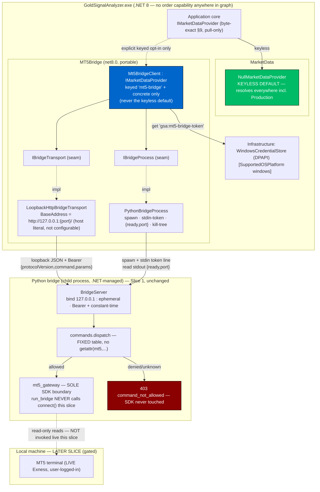
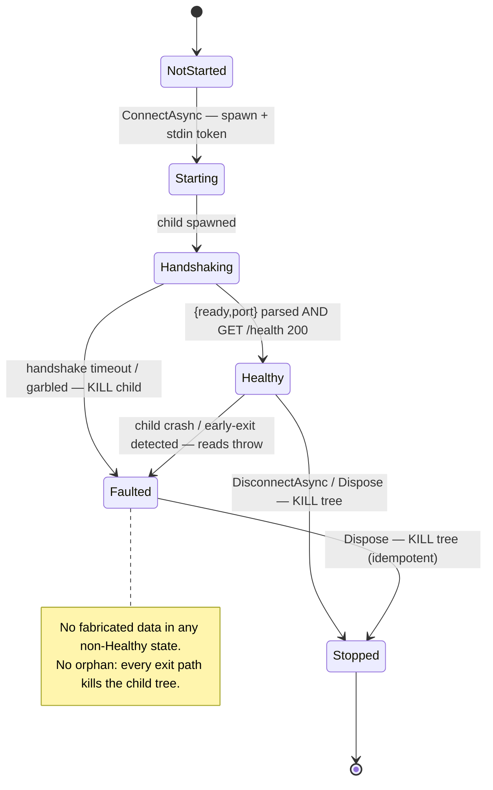

# Phase 2 — Architecture · Cycle 2, Slice 2 (MT5 Connectivity & Bridge — .NET client)

**Project:** gold-signal-analyzer
**Cycle / Slice:** Cycle 2 — Slice 2. Cycle 1 (Foundation) and Cycle 2 Slice 1 (Read-Only Bridge Seam) are CEO-approved and CLOSED. This document does **not** re-architect either; it consumes their on-disk artefacts verbatim.
**Author:** Solution Architect, AI-Cognitive-Lab
**Date:** 2026-07-28
**Feeds:** Phase 3 (build) and the Phase 4/5/6 gates.

**Inputs read (verbatim, on-disk):** `phase-2-cycle2-arch.md` (Slice-1 §3 boundary, ADR-8 transport, §3.4 Mode A/B, §5 credential posture), `phase-6-cycle2-ceo.md` (binding conditions), `CYCLE2-RESUME.md`, `.claude/memory/lessons-learned.md` (all gold-signal-analyzer entries), and the code ground truth: `IMarketDataProvider.cs` (byte-exact §9), `ProviderConnectionResult.cs`, `ConnectionStatus.cs`, `MarketSymbol.cs`, `ICredentialStore.cs`, Domain `{AccountSnapshot,Candle,MarketTick}.cs`, `SymbolSpecification.cs`, `Timeframe.cs`, `NullMarketDataProvider.cs`, `MarketData/DependencyInjection.cs`, `MT5Bridge/DependencyInjection.cs`, `SecretDenylist.cs`, `MaskingHelper.cs`, `ConnectionMode.cs`, `DiCompositionTests.cs`, `ConnectionWizardViewModel.cs`, and the Python bridge `{run_bridge,server,commands,handlers,mt5_gateway}.py` + `test_server_protocol.py`.

---

## 0. LIVE-ACCOUNT RISK BANNER (read first)

The eventual target is a **LIVE / REAL Exness account** (XAUUSD + BTCUSD; M15/H1/H4/D1). This slice builds the **.NET half of the connectivity** — the `Mt5BridgeClient` that spawns and drives the Python bridge over loopback — and the **FR-40 Connection Wizard input model**. Neither item attaches to a live MT5 terminal.

**Structural guarantee re-confirmed against source:** `run_bridge.py` deliberately **never calls `gateway.connect()`** (verified: `main()` constructs the gateway and server but calls neither `connect()` nor any read); `ALLOWED_COMMANDS` contains **no `connect`/`login`/`initialize` command**; the only allowlisted command that touches no gateway at all is `health`. Therefore **`Mt5BridgeClient.ConnectAsync` (spawn child → write token to stdin → parse `{ready,port}` → `GET /health`) touches ZERO MetaTrader5** — it cannot attach a terminal even if asked, because there is no command that reaches `gateway.connect()`. This is asserted by test (AC-47.6). The live `MetaTrader5MarketDataProvider` (real `mt5.initialize()`/reads) is **OUT of this slice** and remains gated (§8).

---

## 1. Scope (exactly two items)

| # | Item | New req | In-scope this slice |
|---|------|---------|---------------------|
| 1 | **.NET `Mt5BridgeClient : IMarketDataProvider`** — loopback HTTP client to the Python bridge; owns the child-process lifetime (spawn `run_bridge`, write token to stdin, parse ready/port handshake, monitor, kill on Disconnect/dispose — no orphans); rejects non-loopback host **by construction**; token from `ICredentialStore`; injectable transport/process seams so unit tests need no Python and no live terminal. Byte-exact to §9. | FR-47, FR-48, FR-49, NFR-12 | Yes |
| 2 | **FR-40 Connection Wizard input + validation model** (a "Should") — VM + validators, **non-secret inputs only**; fail-loud validation; no property matching `/password\|pwd\|investor\|otp\|withdraw/i` by construction. | FR-50 | Yes |

Everything else (live provider, indicators, scoring, reconnect runtime loop) is explicitly deferred (§7).

---

## 2. Spec-first — new IDed requirements

> **ID provenance (grepped, not trusted to summary):** whole-repo `grep -rhoE 'FR-[0-9]+' / 'NFR-[0-9]+' / 'ADR-[0-9]+'` → true max **FR-46, NFR-11, ADR-11** (BTC addendum consumed FR-41..46 / NFR-11 / ADR-11; Slice-1 consumed FR-36..40). This slice therefore continues from **FR-47, NFR-12, ADR-12**. RM1/RM2/RM3 are the carried risk-gate IDs.

| ID | Requirement | Priority | Traces | Acceptance criteria (IDed) |
|----|-------------|----------|--------|----------------------------|
| **FR-47** | `Mt5BridgeClient` implements the byte-exact §9 `IMarketDataProvider` as a loopback-HTTP client over an **injectable transport seam** (`IBridgeTransport`) and **injectable process seam** (`IBridgeProcess`); every request carries a Bearer token sourced from `ICredentialStore`; the client never reshapes the interface. | Must | §9, FR-37, FR-39, NFR-1, RM1, RM3 | **AC-47.1** `Mt5BridgeClient : IMarketDataProvider`; a reflection test asserts the byte-exact 1-property + 8-method shape is still satisfied and `MarketDataPortShapeTests` stays green (interface untouched). **AC-47.2** All 8 methods route through `IBridgeTransport.SendAsync(command, params, ct)`; unit tests inject a `FakeBridgeTransport` and pass with **no Python, no live terminal, no HttpClient to a real socket**. **AC-47.3** Every outbound request the client builds carries `Authorization: Bearer <token>` where the token is obtained via `ICredentialStore.GetSecretAsync("gsa:mt5-bridge-token")` (generated + `SetSecretAsync` if absent); a test with a fake `ICredentialStore` asserts the header is present and equals the stored token, and that the token never appears in any exception message, log, or DTO (denylist `bridgetoken`). **AC-47.4** Timeframe→bridge-label mapping is explicit (`M15/H1/H4/D1` supported this slice); an unsupported `Timeframe` (`M1/M5/M30`) throws `NotSupportedException` **client-side before any request** (fail-loud), asserted. **AC-47.5** `ProviderName` returns a constant (`"MT5 Bridge (read-only)"`) and issues no request. **AC-47.6** A test proves `ConnectAsync` issues **only** the process handshake + `GET /health` and invokes **no** gateway/read command: against the real Python `BridgeServer` with a `FakeGateway`, `FakeGateway.calls == []` after `ConnectAsync` completes. |
| **FR-48** | `Mt5BridgeClient` owns the bridge child-process lifetime via `IBridgeProcess`: spawn `run_bridge.py`, write the token as the **first stdin line only**, parse the `{"ready":true,"port":N}` stdout handshake under a timeout, monitor for crash/early-exit, and kill the child (whole process tree) on `DisconnectAsync` **and** on dispose — **no orphaned bridge**. | Must | FR-37, ADR-8, NFR-2, NFR-4, RM1 | **AC-48.1** Token is passed to the child **only** via stdin's first line — a test asserts the spawn descriptor sets **no** command-line argument and **no** environment variable carrying the token (args are visible in Task Manager; a child env block is same-user-readable and captured in WER dumps). **AC-48.2** A missing/garbled/late handshake (no `{ready,port}` within the timeout) causes `ConnectAsync` to kill the child and return `Faulted` (or throw a typed `BridgeStartException`), with the child provably terminated (`FakeBridgeProcess.Killed == true`). **AC-48.3** Only the integer `port` is consumed from the handshake; any `host` field in the handshake JSON is **ignored** (loopback is fixed by construction — §C). **AC-48.4** `DisconnectAsync` and `Dispose`/`DisposeAsync` both kill the child tree exactly once and are idempotent; a test asserts no orphan (`FakeBridgeProcess.Killed`), and that a second Disconnect/Dispose does not throw. **AC-48.5** Detected child crash/early-exit transitions the observable status to `Faulted` and subsequent reads throw, never fabricate. |
| **FR-49** | DI registration posture: `AddGsaMt5Bridge` registers `Mt5BridgeClient` + its transport/process seams as **concrete types and under an explicit key**, and does **not** rebind the keyless/default `IMarketDataProvider`. `NullMarketDataProvider` remains the auto-resolving default everywhere, including Production. | Must | FR-10, ADR-12, DiCompositionTests | **AC-49.1** After `AddGsaMarketData(env)` + `AddGsaMt5Bridge()`, `GetRequiredService<IMarketDataProvider>()` (keyless) resolves to `NullMarketDataProvider` in **every** environment incl. Production — the existing `DiCompositionTests` stays green. **AC-49.2** `Mt5BridgeClient` is resolvable only via its concrete type and/or the keyed registration `GetKeyedService<IMarketDataProvider>("mt5-bridge")`; a test asserts the keyed resolution yields `Mt5BridgeClient` and the keyless default does **not**. **AC-49.3** A test asserts `Mt5BridgeClient` is **never** registered as the keyless `IMarketDataProvider` (no service descriptor binds it to the default) — going live is an explicit opt-in resolution, never an ambient DI swap. |
| **FR-50** | Connection Wizard input + validation model (non-secret only): collects MT5 terminal path, Exness server name, account **identifier** (masked last-2), `ConnectionMode`, gold symbol, enabled timeframes, thresholds; fail-loud validation; **no password field of any kind exists in the model**. | Should | FR-7, FR-40, NFR-1, NFR-3, RM1, RM3, §44 | **AC-50.1** A reflection test asserts the model exposes **no** property whose name matches `/password\|pwd\|investor\|otp\|withdraw/i` (by construction). **AC-50.2** The account identifier is present but rendered masked last-2 via `MaskingHelper.MaskAccount`; a test asserts the displayed value is masked and the raw value is never surfaced to logs. **AC-50.3** Validation is fail-loud: missing/invalid terminal path, empty server, unknown/empty gold symbol, empty timeframe set, or out-of-range threshold each produce a specific validation error **before** any connect is attempted; a test drives each failure. **AC-50.4** No property name in the model matches `SecretDenylist` **except** the account *identifier* fields, which are present-but-masked (consistent with Slice-1 AC-40.1). |

| NFR (slice ACs) | Requirement | Traces |
|---|---|---|
| **NFR-12** (testability) | `Mt5BridgeClient` is fully unit-testable with a fake transport **and** a fake process — no Python interpreter, no MetaTrader5, no live terminal, no real socket, no terminal window. The only tests that touch the real Python `BridgeServer` use a `FakeGateway` (already shipped in Slice 1). | AC-47.2, AC-47.6, AC-48.* |
| **NFR-1/7** (secrets) | Bridge token only via `ICredentialStore`/DPAPI; passed to the child via stdin only; masked in logs; never in config/DB/args/env. | AC-47.3, AC-48.1 |
| **NFR-2** (exposure) | Client connects to `127.0.0.1` only, by construction (no configurable host). | AC-47.*, §C, AC-48.3 |

---

## 3. Component / boundary view (C4 container)



*The keyless `IMarketDataProvider` edge (solid) always lands on `NullMarketDataProvider`. The `Mt5BridgeClient` edge (dashed) is an explicit keyed opt-in — going live is never an ambient DI swap (ADR-12).*

---

## 4. Sequence — ConnectAsync spawn/handshake, read, deny, this-slice not-connected, disconnect

```mermaid
sequenceDiagram
    participant App as Application (explicit keyed opt-in)
    participant C as Mt5BridgeClient
    participant Cred as ICredentialStore (DPAPI)
    participant IP as IBridgeProcess
    participant IT as IBridgeTransport (loopback HTTP)
    participant P as Python bridge (child) + FakeGateway/real

    App->>C: ConnectAsync(ct)
    C->>Cred: GetSecretAsync("gsa:mt5-bridge-token")
    Cred-->>C: token (else generate 32B base64 + SetSecretAsync)
    C->>IP: Start(pythonExe, run_bridge.py)  %% no token in args/env
    C->>IP: WriteStdinLine(token)  %% FIRST stdin line = SOLE token transport
    IP-->>C: stdout {"ready":true,"port":N}  (timeout -> kill + Faulted, AC-48.2)
    Note over C,IP: only integer port consumed; any host field ignored (AC-48.3)
    C->>IT: bind BaseAddress = http://127.0.0.1:N/  %% host is a literal, not from handshake
    C->>IT: GET /health (Bearer)
    IT-->>C: 200 {ok:true, data:{status:"ok",protocolVersion:"1.0"}}
    C-->>App: ProviderConnectionResult(Connected, "bridge transport up; no live terminal (gated)")
    Note over C,P: ConnectAsync invoked NO gateway command — FakeGateway.calls == [] (AC-47.6)

    App->>C: GetHistoricalCandlesAsync("XAUUSD",H1,from,to,ct)
    C->>IT: POST / {protocolVersion,command:"copy_rates_range",params}
    IT->>P: dispatch("copy_rates_range")
    Note over P: THIS SLICE — run_bridge never called connect(); gateway mt5 is None
    P-->>IT: 400 {ok:false,error:"handler_error",detail:"AttributeError"}
    IT-->>C: ok:false handler_error
    C-->>App: THROW NotConnectedException ("bridge up, terminal not attached") — never honest-empty (ADR-17)

    App->>C: (adversarial) order_send
    C->>C: no such method on IMarketDataProvider — unreachable in .NET graph
    Note over C: even a raw POST order_send -> 403 command_not_allowed, SDK never touched (Slice-1 proven)

    App->>C: DisconnectAsync(ct) / Dispose
    C->>IP: Kill(entireProcessTree:true)  %% idempotent, no orphan (AC-48.4)
    IP-->>C: Killed
```

---

## 5. Child-process lifecycle (state) — Fork D made explicit



---

## 6. Architecture Decision Records (Forks A–F)

### ADR-12 — DI posture: keyless default stays `NullMarketDataProvider`; bridge is concrete + keyed opt-in (Fork A)
**Status:** Accepted.
**Context:** `NullMarketDataProvider` must remain the auto-resolving production default (locked by `DiCompositionTests`, which asserts `GetRequiredService<IMarketDataProvider>()` is `NullMarketDataProvider`). If `Mt5BridgeClient` were bound as the keyless `IMarketDataProvider`, resolving the app in Production would silently become an implicit "go live."
**Decision:** `AddGsaMt5Bridge()` registers `Mt5BridgeClient`, `IBridgeTransport`→`LoopbackHttpBridgeTransport`, and `IBridgeProcess`→`PythonBridgeProcess` as **concrete/interface seams**, and additionally exposes the client via a **.NET 8 keyed registration** `AddKeyedSingleton<IMarketDataProvider, Mt5BridgeClient>("mt5-bridge")`. It does **not** call `AddSingleton<IMarketDataProvider, Mt5BridgeClient>()`. `AddGsaMarketData(env)` is untouched — keyless default remains `NullMarketDataProvider` in every environment.
**Consequence:** Live connectivity is an explicit, opt-in resolution by the connectivity feature (`GetKeyedService<IMarketDataProvider>("mt5-bridge")`), never an ambient swap. The existing composition test stays green (AC-49.1); no environment gating is needed because the default is safe everywhere.
**Rejected:** (a) keyless bind in non-Production only — still risks a dev/test surprise and leaves Production resolution ambiguous; (b) config-flag keyless bind — a flipped flag silently reroutes the whole app. Explicit keyed opt-in is the least-surprising, most auditable.

### ADR-13 — `GetAccountSnapshotAsync` returns `null` under the monetary-suppressing bridge (Fork B)
**Status:** Accepted. **Confirm-item C2.**
**Context (real tension):** §9 `AccountSnapshot` carries `Balance/Equity/FreeMargin` (`decimal`, non-nullable). The Slice-1 `handlers.handle_account_info` **strips every monetary field** (`_MONETARY_FIELDS`) and **masks `login`** to last-2. A fully-populated `AccountSnapshot` therefore **cannot be honestly sourced read-only through this bridge** — `Balance/Equity/FreeMargin` are structurally unavailable, and filling them with `0m` would be fabricated data (NFR-5 violation).
**Decision:** `Mt5BridgeClient.GetAccountSnapshotAsync` returns **`null`** — the honest "no complete snapshot is sourceable read-only," exactly matching `NullMarketDataProvider`'s nullable-null posture and the AccountSnapshot doc-comment ("nullable return honestly represents 'no account / not connected' without fabricating a zero-valued account"). The `account_info` command remains available for a future **connectivity cross-check** (masked login + currency, non-monetary), but the client does **not** synthesize an `AccountSnapshot` from a monetary-stripped payload.
**Consequence:** No fabricated balances ever exist. If a future slice needs real balances, that is a deliberate, separately-approved relaxation of the bridge's monetary suppression (a governance change), not a client hack. Recorded as confirm-item C2.
**Rejected:** (a) return a partial `AccountSnapshot` with `0m` balances — fabrication, forbidden; (b) reshape `AccountSnapshot` to nullable-monetary — a Domain change outside this slice's scope and not required to be honest (null already is).

### ADR-14 — Loopback by construction: hardcoded `127.0.0.1`, no configurable host (Fork C)
**Status:** Accepted.
**Decision:** `LoopbackHttpBridgeTransport` builds its `BaseAddress` from a **compile-time host literal** `"127.0.0.1"` and the handshake **port** only: `new Uri($"http://127.0.0.1:{port}/")`. There is **no** public constructor parameter, property, setter, or config binding that accepts a host, hostname, or full URI. The `{ready,port}` handshake is parsed for its **integer `port` only**; any `host`/other field in the handshake JSON is ignored (AC-48.3), so a compromised child cannot redirect the client off loopback.
**Test that proves impossibility (AC-49/47):** a reflection test asserts the transport type exposes no member of type `Uri`/`string` that sets host, and that no public API accepts a host; a behavioural test asserts `BaseAddress.Host == "127.0.0.1"` and `IsLoopback == true` for every constructed instance, including when a malicious handshake supplies `{"ready":true,"port":N,"host":"169.254.0.1"}` (the extra field is ignored). Non-loopback is therefore not merely rejected — it is **unrepresentable**.

### ADR-15 — Child-process lifetime; token via stdin only; kill-tree on every exit path (Fork D)
**Status:** Accepted.
**Decision:** `PythonBridgeProcess` (behind `IBridgeProcess`) spawns `run_bridge.py` with `ProcessStartInfo{ UseShellExecute=false, CreateNoWindow=true, RedirectStandardInput=true, RedirectStandardOutput=true }`. The bearer token is written as the **first stdin line only** — **never** a command-line argument (visible in Task Manager / `wmic process`) and **never** an environment variable (a child env block is same-user-readable and captured in WER crash dumps; the Slice-1 `run_bridge.py` docstring codifies this). Readiness handshake (`{"ready":true,"port":N}`) is read from stdout under a bounded timeout; timeout/garble ⇒ kill child + `Faulted`/`BridgeStartException`. Crash/early-exit is detected via the process exit signal and transitions to `Faulted`. `DisconnectAsync`, `Dispose`, and `DisposeAsync` each call `Kill(entireProcessTree: true)` idempotently; the client implements `IAsyncDisposable`. **No orphan** on any path (spawn-fail, handshake-timeout, crash, normal disconnect, process exit).
**Consequence:** Testable end-to-end with `FakeBridgeProcess` (records `Killed`, scripts handshake/exit) — no real Python needed for the lifetime tests (NFR-12).

### ADR-16 — `[SupportedOSPlatform("windows")]` is NOT required on `Mt5BridgeClient` (Fork E)
**Status:** Accepted.
**Decision & justification:** `Mt5BridgeClient`, `LoopbackHttpBridgeTransport`, and `PythonBridgeProcess` use only **portable** BCL surface — `HttpClient`, `System.Diagnostics.Process`, `System.Text.Json`, and the `ICredentialStore` **abstraction**. None call a Windows-only API. The `MT5Bridge` project targets `net8.0` (not `-windows`), confirmed from the csproj. The only Windows-only dependency (DPAPI `ProtectedData`) lives behind `WindowsCredentialStore` in `Infrastructure`, which is **already** annotated `[SupportedOSPlatform("windows")]` on the type **and** its composing DI method (Slice-1 lesson). Therefore **no** `[SupportedOSPlatform]` attribute is added here and **no** CA1416 can arise from this assembly. Verified by `dotnet build --no-incremental` reporting 0 warnings (not a stale incremental "0"). *(If a future slice adds Windows-only process/job-object hardening, that member gets the attribute then — honestly, not pre-emptively.)*

### ADR-17 — `ConnectAsync` = bridge-transport liveness only; reads throw on `handler_error`, never honest-empty (Fork F)
**Status:** Accepted. **Confirm-item C1.**
**Context:** Because `run_bridge` never calls `connect()`, the gateway's `mt5` alias is `None`, so any live read (`terminal_info`, `symbols_get`, `symbol_info`, `copy_rates_*`, `symbol_info_tick`) raises inside the handler and `commands.dispatch` returns `{ok:false, error:"handler_error"}` (HTTP 400). `health` succeeds (no gateway). So the bridge can be **up and healthy while no terminal is attached**.
**Decision:**
- `ConnectAsync` means **"the bridge transport is live"** (child spawned, handshake parsed, `/health` 200). It returns `ProviderConnectionResult(ConnectionStatus.Connected, "Bridge transport up (loopback, authenticated). No live MT5 terminal attached — market reads are gated to a later slice.")`. It **structurally cannot** attach a terminal: there is no allowlisted `connect`/`initialize` command, and `run_bridge` never connects — proven by AC-47.6 (`FakeGateway.calls == []` after `ConnectAsync`). This satisfies the mandate that *ConnectAsync must not imply a live terminal attach.*
- **Read methods do NOT return honest-empty on error.** A live channel returning an *error* is not "no data." So:
  - **Scalars** (`GetSymbolSpecificationAsync`) and **collections** (`GetAvailableSymbolsAsync`, `GetHistoricalCandlesAsync`) map `{ok:false,error:"handler_error"}` → **throw** `NotConnectedException` (message: bridge up, terminal not attached). Empty is returned **only** on a genuine `ok:true, data:[]`.
  - **Streams** (`StreamTicksAsync`, `StreamCandlesAsync`) poll (`symbol_info_tick` / `copy_rates_from_pos` for the latest closed bar) and `yield return` each real value; on `handler_error` the enumerator **throws** (surfacing the not-connected condition) rather than yielding a fabricated tick or silently completing.
  - `GetAccountSnapshotAsync` returns `null` (ADR-13), the one honest-nullable case.
**Contrast with `NullMarketDataProvider`:** the Null provider returns empty for collections **by deliberate design** (a safe null-object that is *definitionally* "not connected, nothing to report"). `Mt5BridgeClient` has a **real error channel**, so swallowing an error as empty would hide a fault — throwing is the honest choice and is consistent with NFR-5's no-fabrication posture.
**Confirm-item C1:** whether the user prefers `ConnectAsync` to report a not-ready status until a terminal is genuinely attached. Recommendation: keep transport-liveness "Connected" (the client's job this slice is to prove the bridge is drivable) — the explicit `Message` + throwing reads make the no-terminal reality unambiguous, and no downstream consumer of market data exists yet to be misled.

---

## 7. Deferred / NOT in this slice

| Deferred item | Why not in this slice | Gate to enter |
|---|---|---|
| **Live `MetaTrader5MarketDataProvider`** (real `mt5.initialize()` + real reads) | No MetaTrader5 SDK / no live terminal in-environment; must not touch the LIVE account. `Mt5BridgeClient` drives the bridge but the bridge never attaches a terminal (`run_bridge` never `connect()`s). | RM2 green **in an armed CI** + user confirmation of branch-protection arming (phase-6-cycle2 cond #1/#2) + return through phase gates. |
| Making `run_bridge` call `gateway.connect()` (terminal attach) | Crosses the live gate. | Same as above. |
| Bridge monetary un-suppression for full `AccountSnapshot` | Deliberate governance control; relaxing it is a security decision, not a client change (ADR-13). | Explicit user + auditor approval. |
| Indicators (FR-13/14), scoring/regime/veto/confidence (FR-16..24) | Downstream of a live read path. | After live reads flow. |
| Reconnect/backoff **runtime** loop, freshness/stale veto (NFR-4, FR-12) | Depend on a live tick stream; the `health` contract + observable status seam exist, the loop lands with the live adapter. | Live adapter slice. |
| Live symbol/gold-variant enumeration (FR-9 live half) | Needs a terminal. The wizard's mapping *model* lands here (FR-50). | Live adapter slice. |

### Live-gate reaffirmation
This slice **builds and unit-tests `Mt5BridgeClient` with fakes**, and exercises the real Python `BridgeServer` only with the shipped `FakeGateway`. `Mt5BridgeClient` **touches zero MetaTrader5** (structurally: no `connect`/`initialize`/`login` command exists; `run_bridge` never connects — AC-47.6). Per **phase-6-cycle2 condition #2**, the .NET `Mt5BridgeClient` is named as shipping only with **RM2 green in an armed CI**; RM2 is green, but **branch protection remains an owner-only toggle** (MET-WITH-CONDITION in Slice-1). **Arming branch protection before merging this slice to the protected branch is a MERGE precondition to escalate to the user** (governance wrapper is inert until armed — market-compass / ott-app lessons). No live connectivity, scoring, or trading capability is authorized by this slice.

---

## 8. Phase-3 build task list (machine-checkable)

Format: `[role] <verb> <what> | <file paths> | <acceptance>. Run: <command>`. All paths relative to `C:\gsa-f\projects\gold-signal-analyzer\`. **Baseline (verify first):** `dotnet build --no-incremental` 0/0; `dotnet test` 47/47; `python -m unittest discover -s src\GoldSignalAnalyzer.MT5Bridge\python` 19/19 (×3.9/3.14). Run from `src`.

### [backend] — `Mt5BridgeClient`, DTOs, seams, DI, tests

- **T1** `[backend] define versioned wire DTOs (BridgeRequest{protocolVersion,command,@params}, BridgeResponse{ok,data,error,detail}, health data) with JSON attributes | src\GoldSignalAnalyzer.MT5Bridge\Protocol\BridgeRequest.cs, ...\Protocol\BridgeResponse.cs | no DTO property name matches SecretDenylist; protocolVersion constant "1.0" (FR-39, AC-47). Run: dotnet build --no-incremental`
- **T2** `[backend] define transport seam IBridgeTransport + LoopbackHttpBridgeTransport (BaseAddress from 127.0.0.1 literal + handshake port ONLY; Bearer header from token) | src\GoldSignalAnalyzer.MT5Bridge\Transport\IBridgeTransport.cs, ...\Transport\LoopbackHttpBridgeTransport.cs | BaseAddress.Host=="127.0.0.1" & IsLoopback; no public API accepts a host (ADR-14, AC-47.3). Run: dotnet test --filter LoopbackTransportTests`
- **T3** `[backend] define process seam IBridgeProcess + PythonBridgeProcess (spawn run_bridge; token=first stdin line only; parse {ready,port} w/ timeout; kill-tree; detect exit) | src\GoldSignalAnalyzer.MT5Bridge\Process\IBridgeProcess.cs, ...\Process\PythonBridgeProcess.cs | no token in args/env; kill-tree on dispose; handshake timeout kills child (ADR-15, AC-48.1/48.2/48.4). Run: dotnet test --filter BridgeProcessTests`
- **T4** `[backend] implement Mt5BridgeClient : IMarketDataProvider over the two seams; token via ICredentialStore; Timeframe->label map; reads throw on handler_error; GetAccountSnapshotAsync->null; ConnectAsync=spawn+handshake+/health only | src\GoldSignalAnalyzer.MT5Bridge\Mt5BridgeClient.cs | implements byte-exact §9; unit tests pass with FakeBridgeTransport+FakeBridgeProcess, no Python/terminal (FR-47/48, ADR-13/16/17, AC-47.1..47.6). Run: dotnet test --filter Mt5BridgeClientTests`
- **T5** `[backend] wire DI: AddGsaMt5Bridge registers Mt5BridgeClient + seams (concrete) + keyed IMarketDataProvider("mt5-bridge"); does NOT rebind keyless default | src\GoldSignalAnalyzer.MT5Bridge\DependencyInjection.cs | keyless IMarketDataProvider stays NullMarketDataProvider (DiCompositionTests green); keyed "mt5-bridge"->Mt5BridgeClient (ADR-12, AC-49.1/49.2/49.3). Run: dotnet test --filter "DiCompositionTests|Mt5BridgeDiTests"`
- **T6** `[qa] backend test suite: fake transport/process, loopback-by-construction (incl. malicious host field ignored), connect-touches-no-gateway (real BridgeServer+FakeGateway), reads-throw-on-handler_error, account-snapshot-null, timeframe fail-loud, kill-on-dispose/no-orphan, token-in-stdin-only, keyed-vs-keyless DI | src\GoldSignalAnalyzer.Tests\Bridge\*.cs | all ACs FR-47/48/49 + NFR-12 mapped to named passing tests. Run: dotnet test --filter "Bridge"`

### [frontend] — Connection Wizard input + validation model

- **T7** `[frontend] add ConnectionWizardInputModel (ObservableObject; non-secret fields: TerminalPath, ServerName, AccountIdentifier(masked), ConnectionMode, GoldSymbol, EnabledTimeframes, thresholds) reusing existing ConnectionMode + MaskingHelper | src\GoldSignalAnalyzer.Desktop\Presentation\Screens\ConnectionWizardInputModel.cs | model has NO member matching /password|pwd|investor|otp|withdraw/i; account identifier masked last-2 (FR-50, AC-50.1/50.2/50.4). Run: dotnet build --no-incremental`
- **T8** `[frontend] add ConnectionInputValidator (fail-loud: missing/invalid path, empty server, empty/unknown gold symbol, empty timeframe set, out-of-range threshold) | src\GoldSignalAnalyzer.Desktop\Validation\ConnectionInputValidator.cs | each invalid input yields a specific error before any connect (AC-50.3). Run: dotnet build --no-incremental`
- **T9** `[qa] Connection Wizard tests: reflection no-secret-member, account masked, each validation failure path | src\GoldSignalAnalyzer.Tests\ConnectionWizardModelTests.cs | AC-50.1..50.4 mapped to named passing tests. Run: dotnet test --filter ConnectionWizard`

### [qa] — regression + hygiene

- **T10** `[qa] full regression: .NET build+suite green, Python suite unchanged | (all) | dotnet build --no-incremental 0/0; dotnet test all green (47 + new); MarketDataPortShapeTests still green (interface untouched); python 19/19 ×2 unchanged. Run: dotnet build --no-incremental && dotnet test && python -m unittest discover -s src\GoldSignalAnalyzer.MT5Bridge\python`

**Gate order (blocking):** T1→T2→T3→T4→T5 (backend seams+client+DI) → **T6 (backend AC gate)** → T7→T8→T9 (wizard) → **T10 (regression)**. The keyless-default-stays-Null assertion (AC-49.1, in T5/T6) is blocking: if it goes red, the slice does not proceed — an ambient live swap is a stop-the-line defect.

---

## 9. Confirm-items for the user

1. **C1 (ADR-17) — `ConnectAsync` semantics:** recommend "Connected" = bridge-transport liveness (child up + `/health`), with reads throwing until a terminal is attached in a later slice. Confirm, or request a not-ready status until true terminal attach.
2. **C2 (ADR-13) — `AccountSnapshot` = `null`:** the bridge suppresses all monetary fields, so a complete `AccountSnapshot` is not honestly sourceable read-only; `GetAccountSnapshotAsync` returns `null`. Confirm acceptable (the alternative — real balances — is a governed relaxation of the bridge's monetary suppression, not a client change).
3. **C3 — Branch-protection arming (MERGE gate):** per phase-6-cycle2 cond #2 the .NET `Mt5BridgeClient` ships only with RM2 green in an **armed** CI. RM2 is green; arming branch protection is an owner-only repo-Settings toggle. Confirm before merging this slice to the protected branch.

*End of Phase 2 — Cycle 2 Slice 2. Authorizes the Phase-3 build of `Mt5BridgeClient` (loopback client + transport/process seams + non-default keyed DI) and the FR-40 Connection Wizard input model only. It does NOT authorize attaching to a live terminal, live market data, scoring, or trading — those return through the phase gates after the live-gate conditions (§7) are met with the user.*
