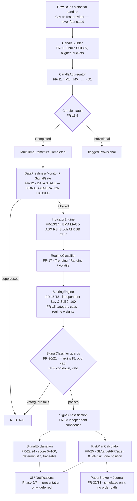

# Cycle 2 — Technical Phase Doc (Analytical Core)

**Project:** gold-signal-analyzer · **Branch:** `agents/mt5-connectivity-bridge-gold-signal`
**Date:** 2026-07-30 · **Spec:** `cycle2-spec.md` · **Builds on:** Cycle 1 (`phase-3-tech.md`)

Extends the Cycle-1 read-only scaffold with the full local analytical pipeline.
All logic runs on `CsvHistoricalMarketDataProvider` / `TestMarketDataProvider`
and deterministic fixtures — never fabricated "live" values, never any order path.

## End-to-end signal pipeline (diagram-first, Constitution §6)



## What was built this cycle

### Phase 3 — Market Data Normalization (FR-11.3/11.4/11.5, FR-12.4) — DONE
- `Domain/CandleStatus`, `Candle.Status` (+`WithStatus`).
- `Application/MarketData/`: `TimeFrameBoundary` (epoch-anchored integer-tick
  alignment: D1→UTC midnight, H4→00/04/…), `CandleBuilder` (ticks→OHLCV,
  provisional tail, no gap-fabrication), `CandleAggregator` (multiple-of check,
  completeness rule), `MultiTimeFrameSet` (completed-only view).
- Freshness/veto reused unchanged from Cycle 1.

### Phase 4 — Indicator Engine (FR-13/14/15) — DONE
- `Application/Indicators/Indicators`: SMA, EMA, MACD, RSI (Wilder), ATR
  (Wilder), Bollinger (decimal Newton sqrt), ADX/±DI (Wilder), Stochastic, OBV,
  Volume-SMA — each verified against a hand-computed fixed dataset.
- `IndicatorEngine` + `IndicatorReading`/`IndicatorSnapshot`: category tagging
  (FR-15), provisional propagation (FR-14), omits (never fabricates) indicators
  lacking data.

### Phase 5 — Regime, Scoring & Veto (FR-16…FR-25) — DONE
- `RegimeClassifier`, `ScoringEngine` (independent Buy/Sell pools proven ≠
  100−each-other; visible category caps; regime weights), `SignalClassifier`
  (hard vetoes → Neutral; margin/opposite/HTF/cooldown/dedupe guards; confidence
  independent of score), `SignalExplanation` (labels "score (0-100)", never
  "% probability"; deterministic), `Risk/RiskPlanCalculator` (0.5% risk, min R:R
  1.5, single position, size floored to lot step).

### Phase 8 — Backtesting (FR-31) — DONE
- `Backtesting/`: `LookAheadSafeWindow` (future-bar access throws — structural,
  AC-31.1), `BacktestEngine` (chronological, cost-modelled), `BacktestMetrics`
  (net P/L, win rate, profit factor, max drawdown, expectancy), `DataSplitter`
  (chronological train/val/OOS + walk-forward + overfitting warning).

### Phase 9 — Paper Trading (FR-32/33) — DONE (in-memory + durable SQLite store)
- `PaperTrading/`: `JournalEntry` (full fields), `IJournalStore` +
  `InMemoryJournalStore`, `PaperBroker` (simulated fills, single-position,
  P&L from real symbol spec). FR-33 proven by reflection: `IMt5BridgeClient`
  exposes no order/trade surface and `PaperBroker` has no reference to it.
- **C-2 closed:** `Infrastructure/Persistence/SqliteJournalStore` — durable
  `IJournalStore` on `Microsoft.Data.Sqlite.Core` + the `e_sqlite3` bundle
  (== the metapackage). Decimals stored as invariant TEXT (not REAL) so monetary
  values round-trip exactly; enums as INTEGER; timestamps as round-trip ISO-8601;
  insertion order held via `rowid`. 6 new tests (`SqliteJournalStoreTests`) prove
  durability by reopening a **second store on the same file** and reading back
  every field, incl. an exact many-digit decimal, an Update(close) persisting +
  clearing the open position, insertion-order, duplicate/missing guards, and a
  full `PaperBroker`-over-SQLite round trip. No order surface added (grep clean).

## Verification evidence (Constitution §2 — test-before-claim)
```
dotnet test GoldSignalAnalyzer.sln -c Release
  → Passed! Failed: 0, Passed: 143, Skipped: 0, Total: 143   (137 + 6 SQLite journal)
python -m unittest discover -s tests -p "test_*.py"   (run from src/bridge)
  → Ran 19 tests … OK
Gating invariant: Testing.dll absent from Infrastructure Release output + deps.json (0)
  — re-verified after adding the SQLite dependency.
INV-1 grep (OrderSend/order_send/PlaceOrder/sendorder/…) over Infrastructure → 0 matches
```
Net new tests this cycle: 61 xUnit (82 → 143).

## Not built this cycle (honest status)
- **Phase 6 — Dashboard/Charts/Wizard (FR-26/27/28):** no WPF shell exists on
  this branch (Cycle 1 was headless). Presentation logic can be built as pure,
  testable view-models; the XAML shell is deferred. UNTOUCHED.
- **Phase 7 — Notifications (FR-30):** UNTOUCHED. The pure dedupe/cooldown gate
  logic already exists in `SignalClassifier` and can be reused.
- **Phase 10 — Packaging & Release (FR-34/35):** UNTOUCHED.
