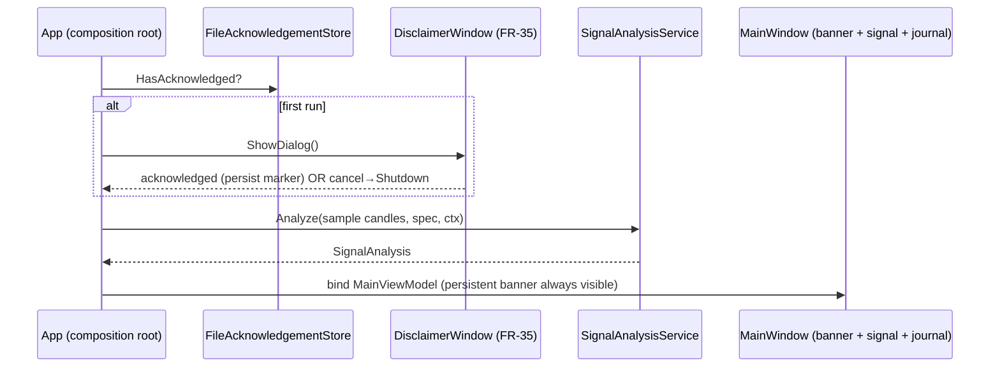

# Cycle 3 — Technical Phase Doc (UI / Dashboard Shell)

**Project:** gold-signal-analyzer · **Branch:** `agents/mt5-connectivity-bridge-gold-signal`
**Date:** 2026-07-30 · **Spec:** `cycle3-spec.md` · **Builds on:** Cycle 2 analytical core

Adds a presentation layer that displays the analytical core's output and gives the
C-1 "not investment advice" disclaimer a home. **Read-only display only** — no order
or paper-execution surface anywhere in the shell.

## What was built

### Application facade (FR-26) — `Application/Analysis/SignalAnalysisService`
Pure, headless-reusable composition of the existing stages
`IndicatorEngine → RegimeClassifier → ScoringEngine → SignalClassifier (+ RiskPlanCalculator)`.
Returns a `SignalAnalysis` record (signal + explanation lines + risk plan + last close
+ regime + data status). Deterministic per call (fresh `SignalClassifier` each call —
cooldown is a Phase-7 notification concern, not display). Risk plan is built only for
an actionable signal with a real ATR; otherwise a rejection carrying the real reason —
never fabricated levels. Also an `AnalyzeLatestAsync(IMarketDataProvider, …)` convenience.

### Presentation layer (`GoldSignalAnalyzer.Presentation`, net8.0 — TESTABLE)
No WPF reference — MVVM built on base-framework `INotifyPropertyChanged` +
`ICommand`, so the existing net8.0 test project exercises all UI logic headlessly.
- `Mvvm/ViewModelBase`, `Mvvm/RelayCommand` (used only for the non-trading
  disclaimer acknowledgement).
- `DisclaimerText` — the single audited source of the "not investment advice"
  wording; both the banner and the first-run gate draw from it.
- `IAcknowledgementStore` + `InMemoryAcknowledgementStore` + `FileAcknowledgementStore`
  (pure file I/O, testable with a temp path).
- `DisclaimerViewModel` (FR-35 gate), `SignalViewModel` (FR-26/FR-22 labels),
  `JournalViewModel` + `JournalRowViewModel` (FR-26.2, display-only, no mutation
  command), `MainViewModel` (persistent banner + children).

### WPF shell (`GoldSignalAnalyzer.Wpf`, net8.0-windows, UseWPF — DUMB)
- `App.xaml(.cs)` composition root: first-run disclaimer gate → durable
  `SqliteJournalStore` → `SignalAnalysisService` over deterministic non-live sample
  candles → bind `MainViewModel`. No `StartupUri`; startup is code-driven so the
  gate runs before the dashboard.
- `DisclaimerWindow.xaml(.cs)` first-run gate (FR-35); `MainWindow.xaml(.cs)`
  persistent red banner (FR-35.2) + signal card + read-only journal `ListView`.
- Code-behind carries no logic (thin shell).

## Diagram — startup / disclaimer gate



## Verification evidence (Constitution §2 — test-before-claim)
```
dotnet build GoldSignalAnalyzer.sln -c Release
  → Build succeeded. 0 Warning(s), 0 Error(s)   (all 7 projects incl. Wpf net8.0-windows)
dotnet test GoldSignalAnalyzer.sln -c Release
  → Passed! Failed: 0, Passed: 158, Skipped: 0, Total: 158   (143 → 158, +15 net)
dotnet build GoldSignalAnalyzer.Wpf/... -c Release   (explicit — test run does NOT build it)
  → Build succeeded; GoldSignalAnalyzer.Wpf.exe produced
python -m unittest discover -s tests -p "test_*.py"   (from src/bridge)
  → Ran 19 tests … OK   (unregressed)
```
Safety checks (Phase 5): INV-1 order-surface grep over Presentation+Wpf = 0;
FR-22 percent/probability score-format grep = 0 (only a doc comment); Testing.dll
absent from Wpf Release output; Presentation refs = Domain + Application only.

## Net new tests this cycle: 15 xUnit (143 → 158)
Facade (4), SignalViewModel (4), JournalViewModel (3), Disclaimer text/gate/persist (4).

## Not built this cycle (honest status — deferred)
FR-27 (interactive/candlestick charts), FR-28 (setup wizard), FR-30 (notifications),
FR-34 (installer/packaging), and any paper-execution ACTION surface — all out of
scope this slice. C-3 (live MT5 attach / orders) remains gated behind the named
approver, untouched.
