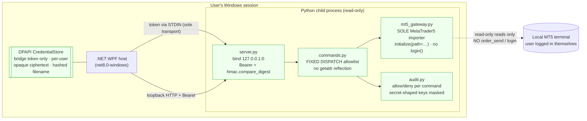

# Phase 5 — Audit · Cycle 2, Slice 1 (Read-Only Bridge Seam)

**Project:** gold-signal-analyzer · **Date:** 2026-07-26
**Lens:** this slice gates connectivity to the user's **live Exness money account**.
Audited against RM1 (credential handling), RM2 (no-order allowlist), RM3 (bridge
auth token posture), and the governance wrapper. **Verdict: PASS-WITH-CONDITIONS.**

---

## Trust boundary (diagram-first, Constitution art. 6)

The order path (`order_send`, `login`, `positions_*`, `history_*`, `market_book_*`,
`TRADE_ACTION_*`) is **structurally absent**, proven by the RM2 AST gate — not merely
unused.

## RM1 — credential handling · PASS

- `WindowsCredentialStore` (DPAPI, `DataProtectionScope.CurrentUser`): secrets are
  per-user opaque ciphertext files; the logical key is SHA-256-hashed into the
  filename (no raw key on disk); temp-write-then-move avoids half-written blobs.
  Tests prove Set→Get→Delete round-trip, that the plaintext never appears in the
  on-disk bytes, and that `mt5-bridge-token` never appears in a filename.
- **The store holds the tool's own generated bridge token and nothing else.** No MT5
  trading/investor password is ever collected; the bridge cannot `login()` (`login`
  is in `DENIED_SDK_SYMBOLS`, referenced 0×). The permanent prohibition on storing
  Exness PA / email / OTP / withdrawal credentials (Cycle-1 Phase-6 cond #2) holds.
- `account_info` handler **suppresses all monetary fields** (balance/equity/margin/
  profit/…) and **masks the login to last-2** before anything crosses the wire.

## RM2 — no-order allowlist · PASS

10-assertion AST proof over the **whole** bridge package, green on Python 3.9 and
3.14, with the reflection / subprocess / second-importer / bare-import / positional-
auth holes all closed (see Phase 4 mapping). Deny set is disjoint from allow; dispatch
is a fixed table with no `getattr(mt5, cmd)` path; denied commands are rejected before
any gateway call.

## RM3 — bridge auth token posture · PASS

- **Token transport is STDIN, sole transport** (`run_bridge.py`): never a command-line
  arg, never a child env var (readable by same-user processes / captured in WER crash
  dumps — Phase 2.5 cond C1). Auditor-mandated posture is implemented as designed.
- **Constant-time compare** (`hmac.compare_digest`), asserted by AST to contain no
  `==`/`!=` on the token.
- **Loopback-only** bind (`127.0.0.1`), ephemeral port, introspection-asserted.
- **Secrets-by-construction:** `bridgetoken` on the shared `SecretDenylist` (exact,
  case-insensitive) + Serilog masking enricher masks a `BridgeToken` property; the
  Python `audit.py` masks secret-shaped param keys and **never** receives or logs the
  token. Handler errors return only `type(exc).__name__`, never secret-bearing text.
- **Per-command audit log** (allow/deny, who-less local, masked params) — cond C4.

## Governance wrapper — PARTIAL (the binding condition)

| Control | State |
|---|---|
| `.gitignore` covers `__pycache__/` `*.pyc` `.venv/` | **DONE** — `git check-ignore` confirms; no `.pyc` ever committed. |
| `CODEOWNERS` on `commands.py` / `mt5_gateway.py` / RM2 test (+ transport + secrets surface) | **DONE** — file created, paths match tree. |
| CI runs RM2 on 3.9 + 3.14, fails if **red or missing** | **DONE** — workflow created with a `test -f` presence guard. |
| **Branch protection** ("Require Code Owner review" + "Require status checks") | **NOT DONE — owner-only repo toggle.** Until armed, CODEOWNERS + CI are declared, not binding: a direct push could still merge an allowlist edit. **The switch without the wrapper is theatre; the wrapper without arming is also theatre** (ott-app + market-compass lessons). |

## Residual risks (honest)

1. **[BLOCKER for the live-connect slice, not for this read-only seam]** Branch
   protection must be enabled before any live-connect PR merges; otherwise the RM2
   change-control is bypassable. Owner action.
2. **[MINOR]** `EXPECTED_READONLY_SET` is duplicated in the test; a coordinated edit to
   both files passes CI and is caught only by Code-Owner review — reinforces #1.
3. **[INFO]** `account_info` still emits non-secret broker identity fields (server,
   currency, leverage). Not credentials; acceptable for a local read-only tool.
4. **[INFO]** All Cycle-2 work is uncommitted working-tree state; the first commit must
   carry the verified `.gitignore` so no `.pyc` is ever introduced (doh-flight-checker
   lesson). No history scrub needed — nothing secret was ever committed.

**Phase 5 verdict: PASS-WITH-CONDITIONS.** The three read-only invariants (RM1/RM2/RM3)
are met and structurally enforced; the sole outstanding item is arming branch
protection, which is required before the *next* (live-connect) slice, not before
closing this one.
