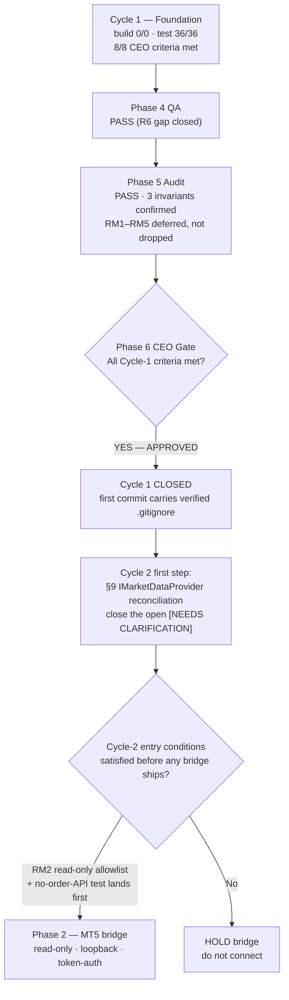

# Phase 6 — CEO Final Decision · Cycle 1 (Foundation)

**Project:** gold-signal-analyzer · **Date:** 2026-07-24
**Decision:** **APPROVED — Cycle 1 (Foundation) is closed; the project proceeds to Cycle 2.**

---

## Business objective (what Cycle 1 was for)

Cycle 1 was never about producing a gold signal — it was about buying a spine that makes the honest, safe path the *only* path before any live data, scoring, or broker credential exists. A tool that will eventually emit directional calls on a real security and touch broker credentials must be provably testable, auditable, and leak-proof at the skeleton stage, not retrofitted under pressure later. This decision judges only that skeleton against the eight Phase-1 success criteria — not the full ten-phase product.

## Success criteria — verified against real command output

| # | Phase-1 criterion | Evidence | Verdict |
|---|---|---|---|
| 1 | Builds green | `dotnet build` 0 warnings / 0 errors | MET |
| 2 | Tests green | `dotnet test` 36 passed / 0 failed | MET |
| 3 | 12 projects, inward-only dependency direction (FR-1) | R1 `ArchitectureTests` parses `.csproj <ProjectReference>` for Domain + 11 inner; on-disk coverage guard added | MET |
| 4 | DI resolves composition root (FR-2) | `DiCompositionTests` on validated host (`ValidateOnBuild`+`ValidateScopes`) | MET |
| 5 | Migration applies to scratch DB (FR-4) | B1 `MigrationTests` end-to-end on OS-temp path, asserts scratch ≠ AppData, reads actual tables | MET |
| 6 | MVVM shell navigates §30 screens (FR-5/FR-29) | R2/R3 + `NavigationTests`: 17 VMs 1:1 to checked-in §30 list; `DataTemplate` coverage STA-tested | MET |
| 7 | Secrets hygiene (NFR-1/7) | B2 masking; B3 no-secret source + write-time denylist; B4 recurring committed-config grep; R4 `.gitignore` via `git check-ignore` | MET |
| 8 | Credible diagrammed roadmap phases 2–10 | Phase-1 Mermaid roadmap + phase-3 §6 honest deferral list; no live code | MET |

All eight met, each traced to a named passing test. The two live Cycle-1 KPIs read correctly: **zero live orders possible** (no MT5 package, no order port, no execution path) and **zero credential leakage** (no secret field, column, or committed config exists). The one real downstream gap — R6's untested credential-store binding — was caught by QA, closed with a genuine behavioral test, and re-confirmed by Audit. Process working as designed, not a waiver.

## Decision flow

## Conditions attached to Cycle-2 start (binding)

1. **RM2 is a blocking gate, not a backlog item.** The future Python MT5 bridge is `order_send`-capable and is NOT bound by the .NET no-order-port. Before any bridge code connects to a live terminal, Cycle 2 MUST land the read-only MT5 API allowlist (quotes / candles / symbol-info only) **with a passing test asserting no order/trade API is reachable from the bridge.** No allowlist test, no bridge.
2. **RM3 / RM1 carried in with the bridge:** bridge auth token lives only in Windows Credential Manager / DPAPI (never config or DB); both connection modes stay read-only and never request a trading password; the permanent prohibition on storing Exness PA / email / OTP / withdrawal credentials is re-affirmed in the Cycle-2 architecture.
3. **No live-connectivity, scoring, or trading capability is authorized by this approval** — only Cycle-1 close and Cycle-2 planning. The next capability increment returns through the normal phase gates.
4. **Collect the deferred §44 environment inputs** (MT5 demo/real, install path, Exness server, account number, exact gold symbol, connection mode, timeframes, thresholds) at Cycle-2 intake — non-secret, never guessed.

## Single next Cycle-2 first step

Reconcile the `IMarketDataProvider` interface to the **byte-exact spec §9 signature** and close the one open `[NEEDS CLARIFICATION]` marker. Nothing in Cycle 1 was built against its exact shape, so this is the correct, low-risk first move before the read-only bridge (and its mandatory no-order-API test) is designed on top of it.

---

**Final decision: APPROVED.** Cycle 1 closed; proceed to Cycle 2 under the binding conditions above.
