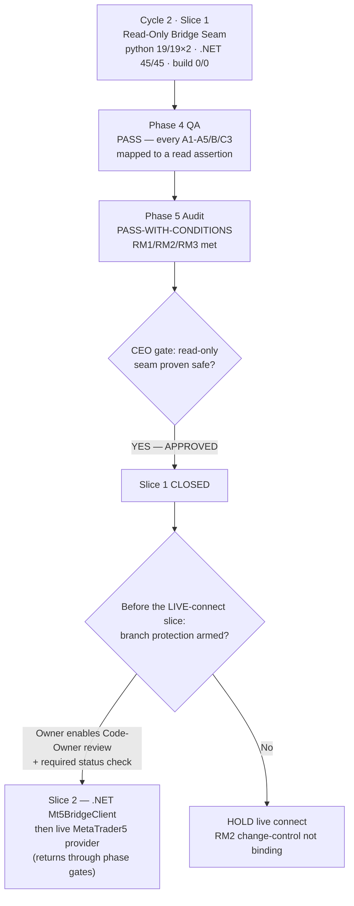

# Phase 6 — CEO Final Decision · Cycle 2, Slice 1 (Read-Only Bridge Seam)

**Project:** gold-signal-analyzer · **Date:** 2026-07-26
**Decision:** **APPROVED — Slice 1 (Read-Only Bridge Seam) is closed.** Live
connectivity remains unauthorized and gated on the binding condition below.

---

## What this slice was for

Cycle-1 bought the safe spine. This slice buys the **one seam** where the tool will
eventually touch a live money account — and makes "read-only, no order, no login"
a *structural* property proven by test, before any byte of live connectivity exists.
The Cycle-1 gate was explicit: **"No allowlist test, no bridge."** This decision
judges only whether that gate is satisfied and the read-only posture is real — not
the full product.

## Success criteria — verified against real command output

| # | Slice-1 criterion (from Cycle-1 Phase-6 binding conditions) | Evidence | Verdict |
|---|---|---|---|
| 1 | RM2 no-order allowlist test lands and is green (the launch gate) | 10 AST assertions, whole-package, **19/19 on Python 3.9 + 3.14**; each mapped to a Phase 2.5 blocker (Phase 4) | MET |
| 2 | Bridge is read-only + loopback + token-auth | server suite: `127.0.0.1` introspected, 401 on wrong/absent token, constant-time compare, protocol-version reject | MET |
| 3 | RM1/RM3 credential posture (DPAPI, token stdin-only, no broker password) | `WindowsCredentialStore` round-trip + opaque-blob tests; token via STDIN sole transport; `bridgetoken` denylisted + masked | MET |
| 4 | §9 `IMarketDataProvider` reconciled; `[NEEDS CLARIFICATION]` closed | `grep` → no marker; `MarketDataPortShapeTests` locks the 8-member read-only shape (4/4) | MET |
| 5 | No live connectivity / order execution introduced | `test_10` no load-time SDK call; `run_bridge` never calls `connect()`; no order port | MET |
| 6 | Build + full suites green | `dotnet build --no-incremental` **0/0** (after the CA1416 fix that a clean rebuild exposed); `dotnet test` **45/45**; python **19/19 ×2** | MET |
| 7 | Governance wrapper present (CODEOWNERS / CI / gitignore) | all three files created + verified; **branch protection remains an owner-only toggle — not done** | MET-WITH-CONDITION |

Seven criteria; six fully met and traced to named passing tests, one (the
governance wrapper) met in code with a single owner action outstanding.

## Decision flow

## Conditions attached (binding on the NEXT increment)

1. **Arm the governance wrapper before any live-connect PR merges.** Enable GitHub
   branch protection on the default branch: *Require review from Code Owners* **and**
   *Require status checks to pass* (the `rm2-gate` job). Code created the wrapper;
   only the owner can make it binding (market-compass + ott-app lessons). Until armed,
   the RM2 allowlist change-control is bypassable.
2. **RM2 stays the gate.** The live `MetaTrader5MarketDataProvider` and the .NET
   `Mt5BridgeClient` (deferred, honestly, to later slices) ship only with RM2 green in
   an armed CI, and return through the normal phase gates.
3. **No live connectivity, scoring, or trading capability is authorized by this
   approval** — only Slice-1 close. The permanent no-live-order-execution invariant
   and the no-broker-credential prohibition are re-affirmed.

## Two non-blocking confirm-items carried to the user (did not gate this decision)

1. **Byte-exact §9:** `brief.md` references but does not contain literal spec §9 (the
   44-section source isn't in the repo). The reconciliation used a faithful
   reconstruction that preserves the read-only / no-order invariant. To make it
   byte-exact, paste the literal §9 text; if it names a streaming member, the standing
   recommendation is to compose it *above* the pull-only port.
2. **No-password / Mode A default:** the tool holds no MT5 password and cannot
   `login()` — the user logs into the MT5 terminal themselves and the bridge attaches
   read-only. Please confirm this posture is acceptable.

---

**Final decision: APPROVED.** Slice 1 closed. Live connectivity held behind the
binding branch-protection condition above.
