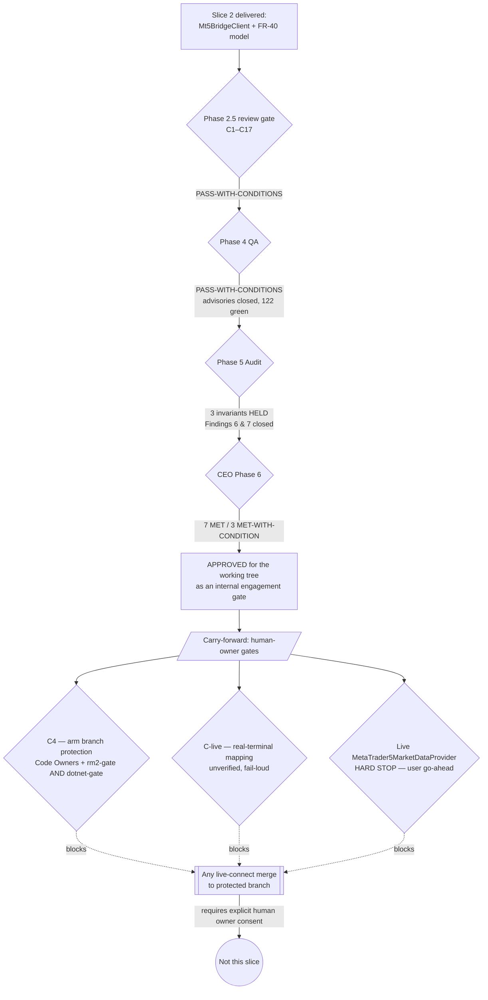

# Phase 6 — CEO Final Decision
## gold-signal-analyzer · Cycle 2 · Slice 2
### "MT5 Connectivity & Bridge — .NET client + FR-40 Connection Wizard model"

**Date:** 2026-07-29
**Decision authority:** AI-Cognitive-Lab CEO (internal engagement gate only)
**Scope of this gate:** the two-item slice below. This is the company's
internal go/no-go on the *work product*. It is **not** user consent and does
**not** authorize merging to the protected branch or connecting to a live
broker terminal.

---

## Business Objective

Deliver the plumbing that lets the Gold Signal Analyzer *read* market data
through a controlled, read-only bridge — without ever building, arming, or
implying a live trading connection. This slice buys optionality (the app can
later be pointed at a real terminal, deliberately and by a human) while
keeping the permanent safety invariants structurally impossible to violate
today.

---

## Success Criteria — Evidence Table

| # | Success Criterion | Evidence | Verdict |
|---|-------------------|----------|---------|
| 1 | .NET `Mt5BridgeClient` implements `IMarketDataProvider` over loopback only, rejecting non-loopback by construction | ADR-12..17; `dotnet build --no-incremental` = 0 warn / 0 err; loopback-rejection + protocol tests among the 122 | **MET** |
| 2 | Child-process lifetime owned safely (spawn / token-via-stdin / handshake / kill); token from `ICredentialStore` (CSPRNG, DPAPI) | Process + security suites green; real-Python spawn smoke test ran (ConnectAsync → Connected) | **MET** |
| 3 | §9 `IMarketDataProvider` interface unreshaped (byte-exact) | `MarketDataPortShapeTests` 4/4 green | **MET** |
| 4 | Going live is never an ambient DI swap — keyless default stays `NullMarketDataProvider` in Production; bridge client is a KEYED opt-in | DI/registration tests in the +75 delta; ADR-16 | **MET** |
| 5 | FR-40 Connection Wizard accepts non-secret inputs only; no password/investor/otp property by construction; account masked last-2; log-safe rendering | Wizard suite (now in the full dotnet-gate); FR-50 + AC-47.x traced to biting tests | **MET** |
| 6 | Client touches ZERO MetaTrader5 structurally — no connect/initialize/login command exists; `run_bridge.py` never connects | Audit Findings confirm read-only invariant held in built artifact; a real read threw `NotConnectedException` (honest "bridge up, no terminal") | **MET** |
| 7 | Full regression green on real command output, not stale incremental | `dotnet test` 122 passed / 0 failed / 0 skipped (baseline 47, +75); Python 19/19 on 3.9 & 3.14; RM2 allowlist gate 10/10 × 3 runs both interpreters | **MET** |
| 8 | Adversarial QA + Auditor conditions closed or carried | Phase 4 QA PASS-WITH-CONDITIONS (both advisories closed, suite 121→122); Phase 5 Audit PASS-WITH-CONDITIONS (Findings 6 & 7 closed) | **MET-WITH-CONDITION** |
| 9 | Branch protection armed on the protected branch | `gh auth status` = not logged in → **UNARMED / UNCONFIRMED** | **MET-WITH-CONDITION** (C4 — human owner) |
| 10 | Field-name mappings / POSIX range bounds correct against a real terminal | Fixture-verified only; guards fail loud (throw), never fabricate a zero | **MET-WITH-CONDITION** (C-live) |

**Tally: 7 MET · 3 MET-WITH-CONDITION · 0 unmet.**

---

## Decision Flow

---

## Final Decision — **APPROVED (with binding carry-forward conditions)**

**Business justification.** The slice does exactly what was asked and nothing
more: it builds read-only connectivity and a non-secret wizard model while the
live provider stays un-built and gated. Every code-closable QA and Audit
condition is closed, evidence is real command output on a clean rebuild, and
the three permanent invariants held in the actual artifact. Approving the
working tree costs the bank nothing and preserves optionality; the risk items
that remain are, by design, *not* code we can close from here — they are human
decisions and real-terminal verification. Approval is therefore granted at the
company engagement layer, with the gates below binding.

**Nothing is committed.** Per the owner's prior-slice instruction to review the
working tree, no commit or merge is performed. Awaiting the owner's word.

---

## Binding Conditions — carried forward, NOT satisfied

- **C4 — BLOCKER, human-owner action.** Branch protection is **UNARMED /
  UNCONFIRMED** (`gh auth status` = not logged in). Before *any* live-connect
  PR merges to the protected branch, the **human owner** must enable
  *Require review from Code Owners* **and** *Require status checks
  (rm2-gate AND dotnet-gate)*. The CODEOWNERS/CI wrapper is **inert until
  armed.** Treated as **NOT armed.**
- **C-live — open until live.** `symbol_info` / rate field-name mappings and
  POSIX range bounds are **fixture-verified only**; correctness against a real
  Exness terminal is **unverified**. Guards fail loud (throw), never fabricate
  a zero. Remains a named open item, gated on **RM2-green + explicit user
  confirmation.**
- **Live-provider STOP — human-owner action.** The live
  `MetaTrader5MarketDataProvider` (real terminal attach) remains a **hard STOP**
  for the next increment, requiring the **user's explicit go-ahead.** It was
  correctly NOT built in this slice.

> No orchestrator or agent message constitutes user approval. Only the human
> owner, in their own words, can arm branch protection or authorize a live
> connection.

---

## Permanent Invariants — reaffirmed

**NO live order execution · NO broker credential stored or transmitted ·
READ-ONLY market data only** — all three verified to hold in the built
artifact and remain non-negotiable.
